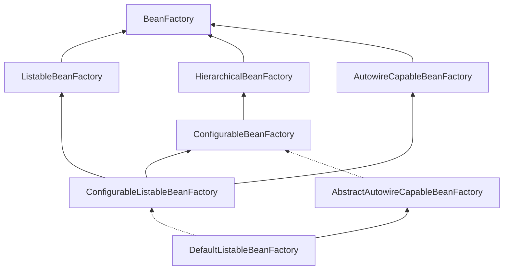
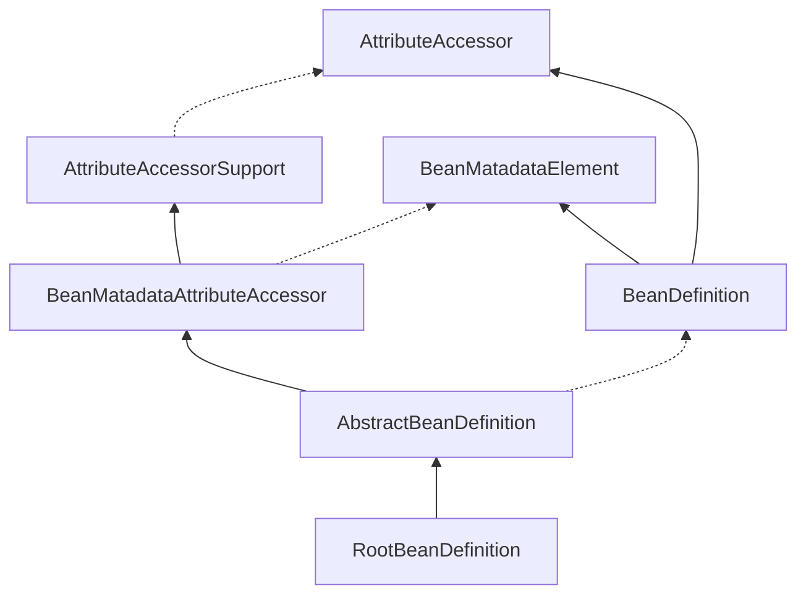
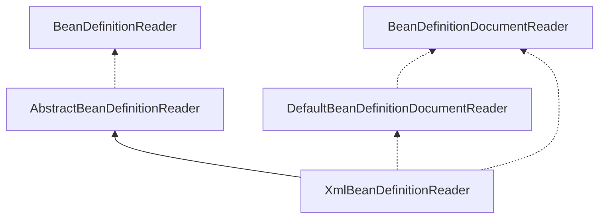
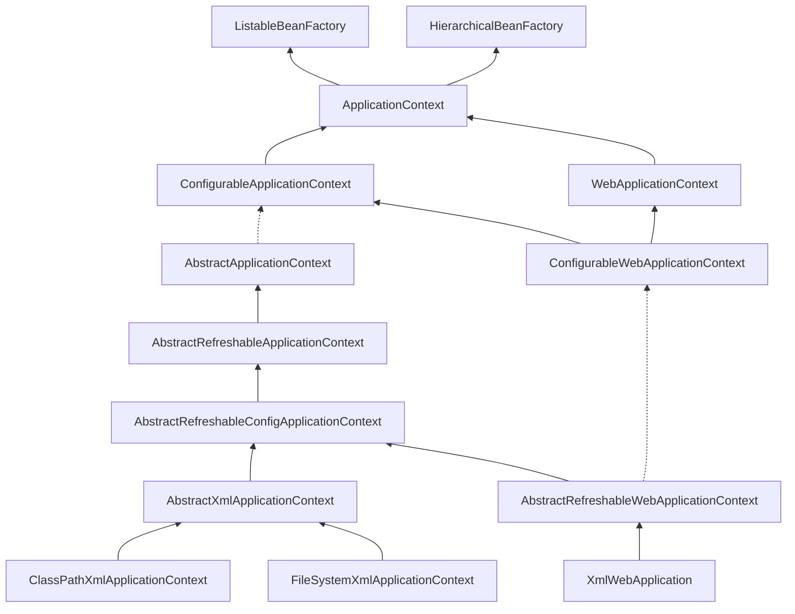
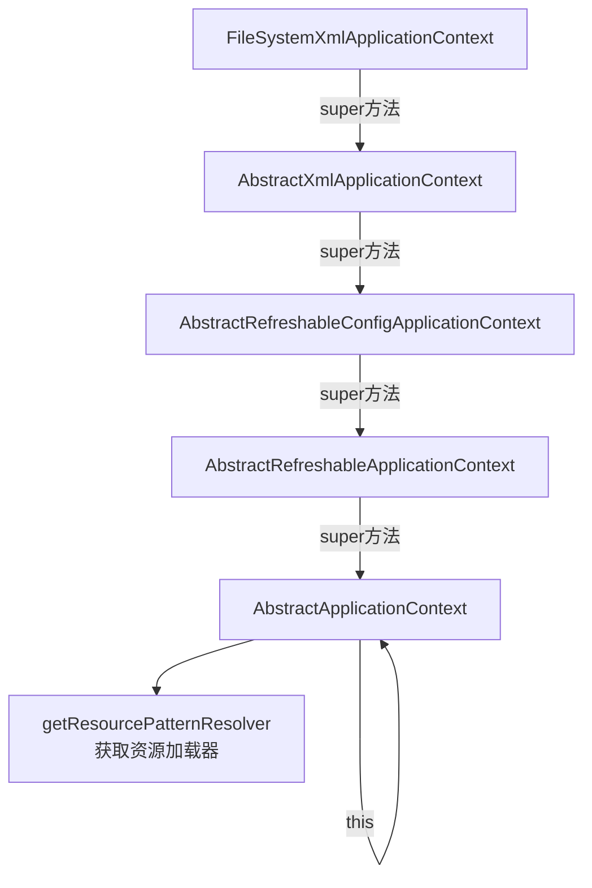

# Spring Framework5.x

### Bean定义

Bean定义对象包括如下几个属性：

| Property  | 描述  |
| --------   | -----:   |
| Class        | [bean实例](https://docs.spring.io/spring-framework/docs/current/spring-framework-reference/core.html#beans-factory-class)     |
| Name        | [Bean名称](https://docs.spring.io/spring-framework/docs/current/spring-framework-reference/core.html#beans-beanname)      |
| Scope      | [Bean类型（单例、原型..)](https://docs.spring.io/spring-framework/docs/current/spring-framework-reference/core.html#beans-factory-scopes)    |
|  构造函数参数   | [Dependency Injection](https://docs.spring.io/spring-framework/docs/current/spring-framework-reference/core.html#beans-factory-collaborators) |
|	Properties	|	[Dependency Injection](https://docs.spring.io/spring-framework/docs/current/spring-framework-reference/core.html#beans-factory-collaborators)	|
|	Autowirging mode	|	[自动注入模型](https://docs.spring.io/spring-framework/docs/current/spring-framework-reference/core.html#beans-factory-autowire)	|
|	Lazy initizlization	|	[懒加载模型](https://docs.spring.io/spring-framework/docs/current/spring-framework-reference/core.html#beans-factory-lazy-init) |
|	Iniitialization method	|	[初始化方法](https://docs.spring.io/spring-framework/docs/current/spring-framework-reference/core.html#beans-factory-lifecycle-initializingbean)	|
|	Destruction method	|	[销毁方法](https://docs.spring.io/spring-framework/docs/current/spring-framework-reference/core.html#beans-factory-lifecycle-disposablebean)	|

### Spring IoC体系结构

#### BeanFactory

Spring Bean的创建是典型的工厂模式，这一系列的Bean工厂也就是IoC容器为开发者管理对象间的依赖关系提供了很多的便利和基础服务，在Spring中有许多的实现提供用户选择和使用。最核心的类结构如下：



其中`BeanFactory`作为顶层的接口，它定义了IoC容器的基本功能实现，比如`getBean()`方法就是这个接口定义的。
它有三个子类（或者是实现类），它们是：`ListableBeanFactory`、`HierarchicalBeanFactory`和`AutowireCapableBeanFactory`。但是从上图可以看到最终的默认实现类是`DefaultListableBeanFactory`。它实现了所有的接口，这样做的目的是什么呢？
查阅相关的资料可以发现，这些几个接口的实现都是有特定的使用场景的，它们主要是在Spring内部操作对象的传递和转换的过程中，对对象的数据访问所做的限制。比如`ListableBeanFactory`接口表示这些bean是可列表的；`HierarchicalBeanFactory`表示这些bean是有继承关系的，也就是说这些bean是可能有父类bean；`AutowireCapableBeanFactory`接口定义了bean的自动装配规则。这四个接口共同定义了Bean的集合，Bean之间的关系，Bean的行为，从而组成了IoC容器的基本结构。

```java
public interface BeanFactory {

	/**
	 * 对FactoryBean的转义定义，如果使用beanName获取到的是FactoryBean接口中getObject()方法返回的实例
	 * 如果要拿到FactoryBean本身则需要加上&前缀，applicationContext.getBean(&beanName)
	 */
	String FACTORY_BEAN_PREFIX = "&";


	/**
	 * 根据beanName获取容器中实例化好的bean
	 */
	Object getBean(String name) throws BeansException;

	/**
	 * 根据bean的名字和Class类型来得到bean实例，增加了类型安全验证机制。
	 */
	<T> T getBean(String name, Class<T> requiredType) throws BeansException;

	/**
	 * 获取bean实例时可以传递构造方法的参数，args就是构造方法的参数。
	 */
	Object getBean(String name, Object... args) throws BeansException;

	/**
	 * 根据bean的类型获取bean实例。比如getBean(User.class)
	 */
	<T> T getBean(Class<T> requiredType) throws BeansException;

	/**
	 * 根据bean的类型和构造函数的参数获取bean实例。比如getBean(User.class, age, name)
	 */
	<T> T getBean(Class<T> requiredType, Object... args) throws BeansException;

	/**
	 * 获取一个提供器类型的bean，通常是Spring框架内部使用。
	 */
	<T> ObjectProvider<T> getBeanProvider(Class<T> requiredType);


	<T> ObjectProvider<T> getBeanProvider(ResolvableType requiredType);

	/**
	 * 提供对bean的检索，看看是否在IOC容器有这个名字的bean
	 */
	boolean containsBean(String name);


	boolean isSingleton(String name) throws NoSuchBeanDefinitionException;


	boolean isPrototype(String name) throws NoSuchBeanDefinitionException;


	boolean isTypeMatch(String name, Class<?> typeToMatch) throws NoSuchBeanDefinitionException;

	/**
	 * 得到bean实例的Class类型
	 */
	@Nullable
	Class<?> getType(String name) throws NoSuchBeanDefinitionException;


	@Nullable
	Class<?> getType(String name, boolean allowFactoryBeanInit) throws NoSuchBeanDefinitionException;

	/**
	 * 得到bean的别名，如果根据别名检索，那么其原名也会被检索出来    
	 */
	String[] getAliases(String name);
```

`FactoryBean`只定义了IoC容器的基本行为，它并不关心bean是如何定义，怎么加载的。
而具体是定义和加载是在其他的实现类中处理的，比如`XmlBeanFactory`、`ClasspathXmlApplicationContext`等。
`XmlBeanFactory`是容器的最基本实现，其他的加载类都是在此基础上的扩展。

#### BeanDefinition

Spring容器管理了我们定义的各种bean对象及其相互关系，bean在对象实现是以`BeanDefinition`类描述的。



Bean的解析过程非常复杂，功能被分的很细，因为这里需要被扩展的地方非常多，也提供了很多接口给开发者用于修改bean的定义。保证了足够的灵活性，以应对变化。Bean的解析主要是对Spring配置文件或者配置类的解析，解析过程如下：




#### IoC 容器的初始化

IoC容器的初始化包括`BeanDefinition`的`Resource`定位、载入和注册三个基本过程。我们以`ApplicationContext`为例，这个类是我们最常见也是最常用的。

主要类关系如下：



`ApplicationContext`运行上下文嵌套，通过保持父上下文可以维持一个上下文体系。对于bean的查找可以在这个上下文体系中发生，首先检查当前上下文，其次是父上下文，逐级向上，这样为不同的Spring应用提供了一个共享的bean定义环境。

下面分别演示两种IoC容器的创建过程。


##### `XmlApplicationContext`的创建

查看这个类的源码，截取其中讲到的部分如下：

```java
@Deprecated
@SuppressWarnings({"serial", "all"})
public class XmlBeanFactory extends DefaultListableBeanFactory {

	private final XmlBeanDefinitionReader reader = new XmlBeanDefinitionReader(this);

	public XmlBeanFactory(Resource resource) throws BeansException {
		this(resource, null);
	}

	public XmlBeanFactory(Resource resource, BeanFactory parentBeanFactory) throws BeansException {
		super(parentBeanFactory);
		this.reader.loadBeanDefinitions(resource);
	}

}

```

**注意**：这个类在Spring5.x已经声明为过时了。

通过一个简单的例子演示使用。

```xml
<?xml version="1.0" encoding="UTF-8"?>
<beans xmlns="http://www.springframework.org/schema/beans"
	   xmlns:xsi="http://www.w3.org/2001/XMLSchema-instance"
	   xsi:schemaLocation="http://www.springframework.org/schema/beans http://www.springframework.org/schema/beans/spring-beans.xsd">

	<bean id="testBean" class="com.ubuntuvim.spring.TestBean">
		<property name="name" value="ubuntuvim" />
		<property name="address" value="china" />
	</bean>

</beans>
```
在xml里面定义了一个简单的bean，然后通过XmlBeanDefinitionReader加载到Spring容器中。


```java
public static void main(String[] args) {
		// 从类路径读取包含bean定义的xml资源文件
		ClassPathResource classPathResource = new ClassPathResource("spring-env-test.xml");
		// 创建一个DefaultListableBeanFactory
		DefaultListableBeanFactory factory = new DefaultListableBeanFactory();
		// 创建XmlBeanDefinitionReader读取器，用于加载xml并转换成BeanDefinition，然后装在到容器defaultListableBeanFactory中
		XmlBeanDefinitionReader reader = new XmlBeanDefinitionReader(factory);
		// 执行解析并加载bean定义
		reader.loadBeanDefinitions(classPathResource);

		TestBean testBean = factory.getBean(TestBean.class);
		System.out.println(testBean);
	}
```

Spring的源码直接传`this`，这个`this`也就是`XmlBeanFactory`，而`XmlBeanFactory`又实现了`DefaultListableBeanFactory`。

```java
private final XmlBeanDefinitionReader reader = new XmlBeanDefinitionReader(this);
```

##### `FileSystemXmlApplicationContext`的创建

```java
public class FileSystemXmlApplicationContext extends AbstractXmlApplicationContext {

	public FileSystemXmlApplicationContext() {
	}

	
	public FileSystemXmlApplicationContext(ApplicationContext parent) {
		super(parent);
	}


	public FileSystemXmlApplicationContext(String configLocation) throws BeansException {
		this(new String[] {configLocation}, true, null);
	}


	public FileSystemXmlApplicationContext(String... configLocations) throws BeansException {
		this(configLocations, true, null);
	}


	public FileSystemXmlApplicationContext(String[] configLocations, ApplicationContext parent) throws BeansException {
		this(configLocations, true, parent);
	}


	public FileSystemXmlApplicationContext(String[] configLocations, boolean refresh) throws BeansException {
		this(configLocations, refresh, null);
	}


	public FileSystemXmlApplicationContext(
			String[] configLocations, boolean refresh, @Nullable ApplicationContext parent)
			throws BeansException {
		// 创建资源加载器
		super(parent);
		setConfigLocations(configLocations);
		if (refresh) {
			refresh();
		}
	}

	@Override
	protected Resource getResourceByPath(String path) {
		if (path.startsWith("/")) {
			path = path.substring(1);
		}
		return new FileSystemResource(path);
	}
```

这个类提供了非常多的扩展，可以使用不同类型的构造函数来创建容器。但是都最终会调用到这个构造方法。

```java
public FileSystemXmlApplicationContext(
			String[] configLocations, boolean refresh, @Nullable ApplicationContext parent)
			throws BeansException {

		super(parent);
		setConfigLocations(configLocations);
		if (refresh) {
			refresh();
		}
}
```

这个构造方法在执行的时候首先执行父类`AbstractXmlApplicationContext`的构造方法，父类构造方法会先设置bean资源加载器。然后再调用父类的`setConfigLocations(configLoacations)`方法，这个方法用于设置bean定义资源文件（xml文件）的路径。通过类层架追踪，xml资源的加载最终是在`FileSystemXmlApplicationContext`的父类再网上几层的父类`AbstractXmlApplicationContext`中实现的。



`AbstractApplicationContext`的资源加载过程如下：

```java
// FileSystemXmlApplicationContext不断的通过super()方法找到父类的父类的父类。。。
// 最终到达它真正的实现地方
public AbstractApplicationContext() {
  // 获取资源处理器（读取spring配置文件）
  this.resourcePatternResolver = getResourcePatternResolver();
}

protected ResourcePatternResolver getResourcePatternResolver() {
  // 因为AbstractApplicationContext继承了DefaultResourceLoader
  // DefaultResourceLoader实现了ResourceLoader接口，所以可以直接传this进去
  return new PathMatchingResourcePatternResolver(this);
}
```

资源加载器初始化完成之后，开始设置资源路径。`setConfigLocations(configLocations);`这个方法也是调用父类`AbstractRefreshableConfigApplicationContext`的方法完成的。

```java
public void setConfigLocations(@Nullable String... locations) {
		if (locations != null) {
			Assert.noNullElements(locations, "Config locations must not be null");
			this.configLocations = new String[locations.length];
			for (int i = 0; i < locations.length; i++) {
				this.configLocations[i] = resolvePath(locations[i]).trim();
			}
		}
		else {
			this.configLocations = null;
		}
	}
```

这个方法执行完毕之后，我们需要加载的bean资源文件都转成一个`String`数组，保存到变量`configLocations`中。

资源加载器准备好之后就是开始加载解析bean配置，然后根据bean定义执行各种操作，包括定义解析、bean初始化等等。

Spring IoC容器对bean定义的加载是从`refresh()`方法开始的，这个方法是一个模板方法，它的作用是：在创建IoC容器钱，如果已经有容器则把容器销毁关闭，然后再重新创建一个新的容器，然后再对容器做初始化。`FileSystemXmlApplicationContext`通过调用父类的`refresh()`方法实现容器的创建，加载，初始等一系列操作。回到这个类的构造方法，可以看到在构造方法内部调用了`refresh()`方法。

```java
public FileSystemXmlApplicationContext(
			String[] configLocations, boolean refresh, @Nullable ApplicationContext parent)
			throws BeansException {
		// 通过类层级，一直通过super()方法一层层往上找父类的父类的父类。。。。
		// 最终找到AbstractApplicationContext的构造方法，
		super(parent);
		setConfigLocations(configLocations);
		if (refresh) {
			refresh();
		}
	}
```

通过类层级往上找，他的父类`AbstractXmlApplicationContext`、`AbstractRefreshableConfigApplicationContext`、`AbstractRefreshableApplicationContext`都没有重写`refresh()`方法，这个方法的实现是在`AbstractApplicationContet`中实现的。

```java
public void refresh() throws BeansException, IllegalStateException {
		synchronized (this.startupShutdownMonitor) {
			// Prepare this context for refreshing.
			// 准备此上下文以进行刷新。
			prepareRefresh();

			// Tell the subclass to refresh the internal bean factory.
			// 获取beanFactory实例
			ConfigurableListableBeanFactory beanFactory = obtainFreshBeanFactory();

			// Prepare the bean factory for use in this context.
			// 准备上下文使用的BeanFactory
			prepareBeanFactory(beanFactory);

			try {
				// Allows post-processing of the bean factory in context subclasses.
				// 允许子类处理BeanFactory后置处理器
				postProcessBeanFactory(beanFactory);

				// Invoke factory processors registered as beans in the context.
				// 转到ConfigurationClassPostProcessor里面执行
				// 执行bean工厂的后置处理器，里面会有非常多的，非常复杂的BeanFactoryPostProcessor实现类的执行。
				invokeBeanFactoryPostProcessors(beanFactory);

				// Register bean processors that intercept bean creation.
				// 转到PostProcessorRegistrationDelegate
				// 注册bean工厂的后置处理器（仅仅是把Spring内部定义的和用户定义的BeanPostProcessor注册到容器中，后面的步骤才会真正执行），
				// 这些后置处理器在bean的构造方法执行之后，在执行init方法前后执行指定的逻辑
				registerBeanPostProcessors(beanFactory);

				// Initialize message source for this context.
				// 初始化上下文的消息资源，比如message-xxx.properties
				initMessageSource();

				// Initialize event multicaster for this context.
				// 初始化上下文多波器
				initApplicationEventMulticaster();

				// Initialize other special beans in specific context subclasses.
				// 在上下文中初始化其他的bean，子类实现
				onRefresh();

				// Check for listener beans and register them.
				// 检查并注册监听器
				registerListeners();

				// Instantiate all remaining (non-lazy-init) singletons.
				// 初始化剩下其他的单例bean，包括FactoryBean，（用户定义的大部分类都是在这里实例化的）
				// 非常非常重要的方法，是整个IOC容器核心部分
				finishBeanFactoryInitialization(beanFactory);

				// Last step: publish corresponding event.
				// 初始化上下文生命周期处理器，发布事件
				finishRefresh();
			}

			catch (BeansException ex) {
				if (logger.isWarnEnabled()) {
					logger.warn("Exception encountered during context initialization - " +
							"cancelling refresh attempt: " + ex);
				}

				// Destroy already created singletons to avoid dangling resources.
				destroyBeans();

				// Reset 'active' flag.
				cancelRefresh(ex);

				// Propagate exception to caller.
				throw ex;
			}

			finally {
				// Reset common introspection caches in Spring's core, since we
				// might not ever need metadata for singleton beans anymore...
				resetCommonCaches();
			}
		}
	}
```

这个方法就是Spring最最最核心的实现，整个Spring最核心的特性也是在这个方法实现的，包括后置处理器、事件发布、bean加载、`@Component @Autowired`等等注解、AOP等，下面逐个方法解析学习。

**ConfigurableListableBeanFactory beanFactory = obtainFreshBeanFactory();**


### 如何做到实时预览的？？


https://www.cnblogs.com/ittangtang/p/3978349.html


