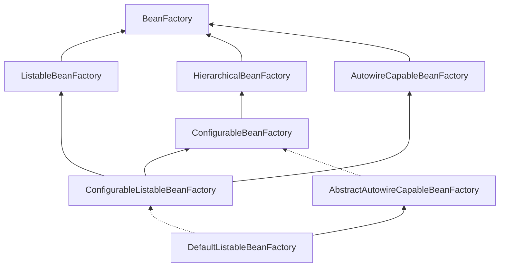
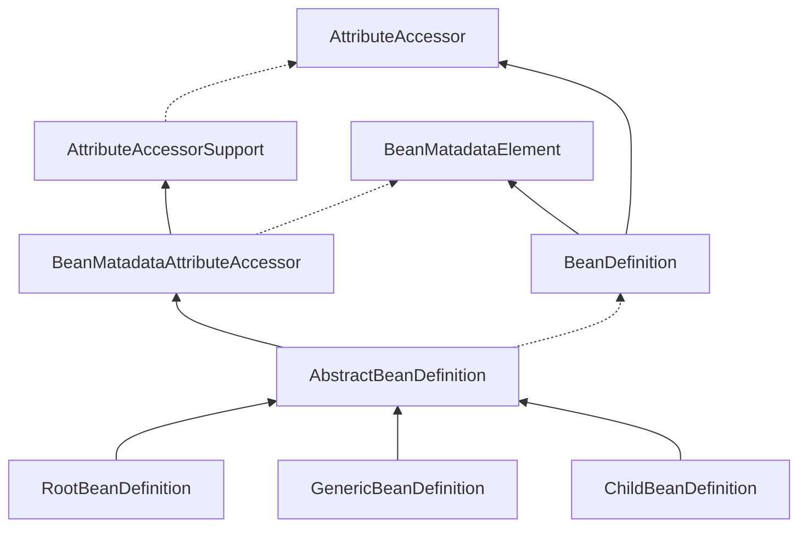
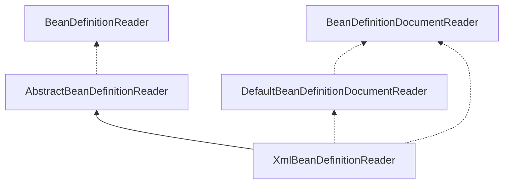

# Spring Framework5.x

## BeanDefinition对象

Bean定义主要对象包括如下几个属性：

| Property  | 描述  |
| --------   | -----:   |
| Class        | [bean实例](https://docs.spring.io/spring-framework/docs/current/spring-framework-reference/core.html#beans-factory-class)     |
| Name        | [Bean名称](https://docs.spring.io/spring-framework/docs/current/spring-framework-reference/core.html#beans-beanname)      |
| Scope      | [Bean类型（单例、原型..)](https://docs.spring.io/spring-framework/docs/current/spring-framework-reference/core.html#beans-factory-scopes)    |
|  构造函数参数   | [Dependency Injection](https://docs.spring.io/spring-framework/docs/current/spring-framework-reference/core.html#beans-factory-collaborators) |
|	Properties	|	[Dependency Injection](https://docs.spring.io/spring-framework/docs/current/spring-framework-reference/core.html#beans-factory-collaborators)	|
|	Autowirging mode	|	[自动注入模型](https://docs.spring.io/spring-framework/docs/current/spring-framework-reference/core.html#beans-factory-autowire)	|
|	Lazy initizlization	|	[懒加载模型](https://docs.spring.io/spring-framework/docs/current/spring-framework-reference/core.html#beans-factory-lazy-init) |
|	Iniitialization method	|	[初始化方法](https://docs.spring.io/spring-framework/docs/current/spring-framework-reference/core.html#beans-factory-lifecycle-initializingbean)	|
|	Destruction method	|	[销毁方法](https://docs.spring.io/spring-framework/docs/current/spring-framework-reference/core.html#beans-factory-lifecycle-disposablebean)	|

bean定义所有属性大概有上百个。就以最常用的`RootBeanDefinition`为例，这个类是bean定义最核心的实现类。类中定义非常多属性，这些属性都是bean的定义信息。

```java
/** Map with String keys and Object values. */
private final Map<String, Object> attributes = new LinkedHashMap<>();

@Nullable
private Object source;

/**
	 * Constant for the default scope name: {@code ""}, equivalent to singleton
	 * status unless overridden from a parent bean definition (if applicable).
	 * 默认bean作用域
	 */
public static final String SCOPE_DEFAULT = "";

/**
	 * Constant that indicates no external autowiring at all.
	 * 自动注入模式
	 * @see #setAutowireMode
	 */
public static final int AUTOWIRE_NO = AutowireCapableBeanFactory.AUTOWIRE_NO;

/**
	 * Constant that indicates autowiring bean properties by name.
	 * 自动注入通过bean名字
	 * @see #setAutowireMode
	 */
public static final int AUTOWIRE_BY_NAME = AutowireCapableBeanFactory.AUTOWIRE_BY_NAME;

/**
	 * Constant that indicates autowiring bean properties by type.
	 * 自动注入通过bean类型
	 * @see #setAutowireMode
	 */
public static final int AUTOWIRE_BY_TYPE = AutowireCapableBeanFactory.AUTOWIRE_BY_TYPE;

/**
	 * Constant that indicates autowiring a constructor.
	 * 自动注入通过构造函数
	 * @see #setAutowireMode
	 */
public static final int AUTOWIRE_CONSTRUCTOR = AutowireCapableBeanFactory.AUTOWIRE_CONSTRUCTOR;

/**
	 * Constant that indicates determining an appropriate autowire strategy
	 * through introspection of the bean class.
	 * @see #setAutowireMode
	 * @deprecated as of Spring 3.0: If you are using mixed autowiring strategies,
	 * use annotation-based autowiring for clearer demarcation of autowiring needs.
	 */
@Deprecated
public static final int AUTOWIRE_AUTODETECT = AutowireCapableBeanFactory.AUTOWIRE_AUTODETECT;

/**
	 * Constant that indicates no dependency check at all.
	 * @see #setDependencyCheck
	 */
public static final int DEPENDENCY_CHECK_NONE = 0;

/**
	 * Constant that indicates dependency checking for object references.
	 * @see #setDependencyCheck
	 */
public static final int DEPENDENCY_CHECK_OBJECTS = 1;

/**
	 * Constant that indicates dependency checking for "simple" properties.
	 * @see #setDependencyCheck
	 * @see org.springframework.beans.BeanUtils#isSimpleProperty
	 */
public static final int DEPENDENCY_CHECK_SIMPLE = 2;

/**
	 * Constant that indicates dependency checking for all properties
	 * (object references as well as "simple" properties).
	 * @see #setDependencyCheck
	 */
public static final int DEPENDENCY_CHECK_ALL = 3;

/**
	 * Constant that indicates the container should attempt to infer the
	 * {@link #setDestroyMethodName destroy method name} for a bean as opposed to
	 * explicit specification of a method name. The value {@value} is specifically
	 * designed to include characters otherwise illegal in a method name, ensuring
	 * no possibility of collisions with legitimately named methods having the same
	 * name.
	 * <p>Currently, the method names detected during destroy method inference
	 * are "close" and "shutdown", if present on the specific bean class.
	 */
public static final String INFER_METHOD = "(inferred)";


@Nullable
private volatile Object beanClass;

@Nullable
private String scope = SCOPE_DEFAULT;

private boolean abstractFlag = false;

@Nullable
private Boolean lazyInit;

private int autowireMode = AUTOWIRE_NO;

private int dependencyCheck = DEPENDENCY_CHECK_NONE;

@Nullable
private String[] dependsOn;

private boolean autowireCandidate = true;

private boolean primary = false;

private final Map<String, AutowireCandidateQualifier> qualifiers = new LinkedHashMap<>();

@Nullable
private Supplier<?> instanceSupplier;

private boolean nonPublicAccessAllowed = true;

private boolean lenientConstructorResolution = true;

@Nullable
private String factoryBeanName;

@Nullable
private String factoryMethodName;

@Nullable
private ConstructorArgumentValues constructorArgumentValues;

@Nullable
private MutablePropertyValues propertyValues;

private MethodOverrides methodOverrides = new MethodOverrides();

@Nullable
private String initMethodName;

@Nullable
private String destroyMethodName;

private boolean enforceInitMethod = true;

private boolean enforceDestroyMethod = true;

private boolean synthetic = false;

private int role = BeanDefinition.ROLE_APPLICATION;

@Nullable
private String description;

@Nullable
private Resource resource;

@Nullable
private BeanDefinitionHolder decoratedDefinition;

@Nullable
private AnnotatedElement qualifiedElement;

/** Determines if the definition needs to be re-merged. */
volatile boolean stale;

boolean allowCaching = true;

boolean isFactoryMethodUnique = false;

@Nullable
volatile ResolvableType targetType;

/** Package-visible field for caching the determined Class of a given bean definition. */
@Nullable
volatile Class<?> resolvedTargetType;

/** Package-visible field for caching if the bean is a factory bean. */
@Nullable
volatile Boolean isFactoryBean;

/** Package-visible field for caching the return type of a generically typed factory method. */
@Nullable
volatile ResolvableType factoryMethodReturnType;

/** Package-visible field for caching a unique factory method candidate for introspection. */
@Nullable
volatile Method factoryMethodToIntrospect;

/** Common lock for the four constructor fields below. */
final Object constructorArgumentLock = new Object();

/** Package-visible field for caching the resolved constructor or factory method. */
@Nullable
Executable resolvedConstructorOrFactoryMethod;

/** Package-visible field that marks the constructor arguments as resolved. */
boolean constructorArgumentsResolved = false;

/** Package-visible field for caching fully resolved constructor arguments. */
@Nullable
Object[] resolvedConstructorArguments;

/** Package-visible field for caching partly prepared constructor arguments. */
@Nullable
Object[] preparedConstructorArguments;

/** Common lock for the two post-processing fields below. */
final Object postProcessingLock = new Object();

/** Package-visible field that indicates MergedBeanDefinitionPostProcessor having been applied. */
boolean postProcessed = false;

/** Package-visible field that indicates a before-instantiation post-processor having kicked in. */
@Nullable
volatile Boolean beforeInstantiationResolved;

@Nullable
private Set<Member> externallyManagedConfigMembers;

@Nullable
private Set<String> externallyManagedInitMethods;

@Nullable
private Set<String> externallyManagedDestroyMethods;
```


## Spring IoC体系结构

### BeanFactory

Spring Bean的创建是典型的工厂模式，这一系列的Bean工厂也就是IoC容器为开发者管理对象间的依赖关系提供了很多的便利和基础服务，在Spring中有许多的实现提供用户选择和使用。最核心的类结构如下：



其中`BeanFactory`作为顶层的接口，它定义了IoC容器的基本功能实现，比如`getBean()`方法就是这个接口定义的。
它有三个子类（或者是实现类），它们是：`ListableBeanFactory`、`HierarchicalBeanFactory`和`AutowireCapableBeanFactory`。但是从上图可以看到最终的默认实现类是`DefaultListableBeanFactory`。它实现了所有的接口，这样做的目的是什么呢？
查阅相关的资料可以发现，这些几个接口的实现都是有特定的使用场景的，它们主要是在Spring内部操作对象的传递和转换的过程中，对对象的数据访问所做的限制。比如`ListableBeanFactory`接口表示这些bean是可列表的；`HierarchicalBeanFactory`表示这些bean是有继承关系的，也就是说这些bean是可能有父类bean；`AutowireCapableBeanFactory`接口定义了bean的自动装配规则。这四个接口共同定义了Bean的集合，Bean之间的关系，Bean的行为，从而组成了IoC容器的基本结构。

```java
public interface BeanFactory {
	/**
	 * 对FactoryBean的转义定义，如果使用beanName获取到的是FactoryBean接口中getObject()方法返回的实例
	 * 如果要拿到FactoryBean本身则需要加上&前缀，applicationContext.getBean(&beanName)
	 */
	String FACTORY_BEAN_PREFIX = "&";
	/**
	 * 根据beanName获取容器中实例化好的bean
	 */
	Object getBean(String name) throws BeansException;
	/**
	 * 根据bean的名字和Class类型来得到bean实例，增加了类型安全验证机制。
	 */
	<T> T getBean(String name, Class<T> requiredType) throws BeansException;
	/**
	 * 获取bean实例时可以传递构造方法的参数，args就是构造方法的参数。
	 */
	Object getBean(String name, Object... args) throws BeansException;
	/**
	 * 根据bean的类型获取bean实例。比如getBean(User.class)
	 */
	<T> T getBean(Class<T> requiredType) throws BeansException;
	/**
	 * 根据bean的类型和构造函数的参数获取bean实例。比如getBean(User.class, age, name)
	 */
	<T> T getBean(Class<T> requiredType, Object... args) throws BeansException;
	/**
	 * 获取一个提供器类型的bean，通常是Spring框架内部使用。
	 */
	<T> ObjectProvider<T> getBeanProvider(Class<T> requiredType);

	<T> ObjectProvider<T> getBeanProvider(ResolvableType requiredType);
	/**
	 * 提供对bean的检索，看看是否在IOC容器有这个名字的bean
	 */
	boolean containsBean(String name);

	boolean isSingleton(String name) throws NoSuchBeanDefinitionException;

	boolean isPrototype(String name) throws NoSuchBeanDefinitionException;

	boolean isTypeMatch(String name, Class<?> typeToMatch) throws NoSuchBeanDefinitionException;
	/**
	 * 得到bean实例的Class类型
	 */
	@Nullable
	Class<?> getType(String name) throws NoSuchBeanDefinitionException;

	@Nullable
	Class<?> getType(String name, boolean allowFactoryBeanInit) throws NoSuchBeanDefinitionException;
	/**
	 * 得到bean的别名，如果根据别名检索，那么其原名也会被检索出来    
	 */
	String[] getAliases(String name);
}
```

`FactoryBean`只定义了IoC容器的基本行为，它并不关心bean是如何定义，怎么加载的。
而具体是定义和加载是在其他的实现类中处理的，比如`XmlBeanFactory`、`ClasspathXmlApplicationContext`等。
`XmlBeanFactory`是容器的最基本实现（*但是目前这个类已经声明为过时*），其他的加载类都是在此基础上的扩展。

#### BeanDefinition（bean定义信息，IoC核心数据结构）

Spring容器管理了我们定义的各种bean对象及其相互关系，bean在对象实现是以`BeanDefinition`类描述的。



Bean的解析过程非常复杂，功能被分的很细，因为这里需要被扩展的地方非常多，也提供了很多接口给开发者用于修改bean的定义。保证了足够的灵活性，以应对变化。Bean的解析主要是对Spring配置文件或者配置类的解析，解析过程如下：




## IoC 容器初始化、bean实例化（核心内容）

这部分是非常非常复杂，在另外一篇《Spring IoC原理》中详细介绍。
