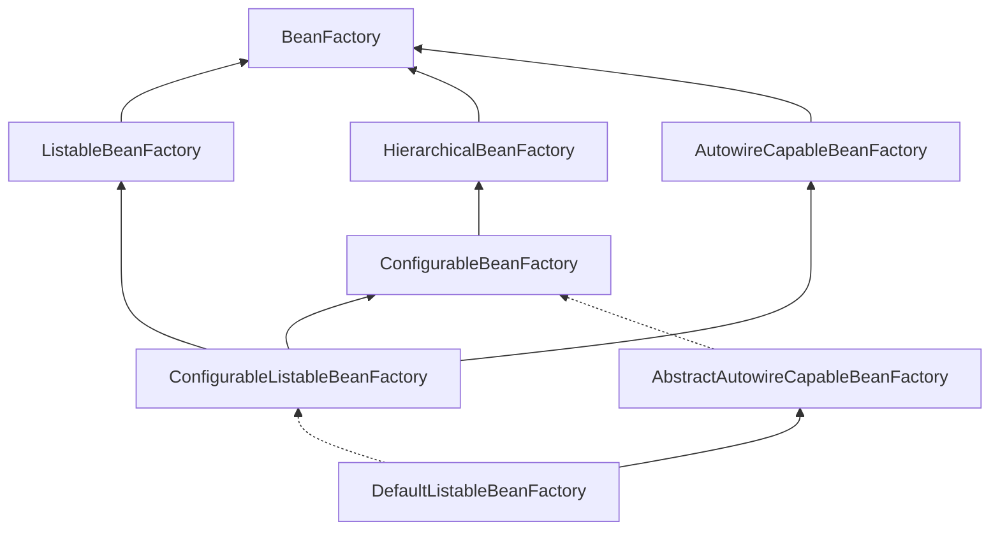
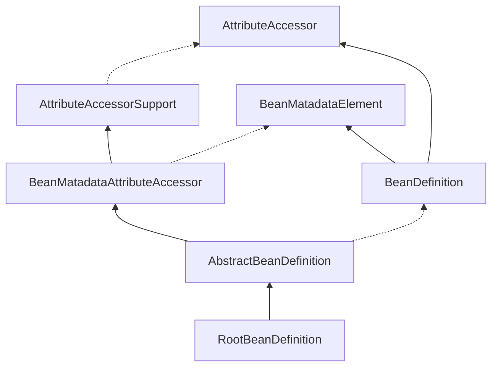
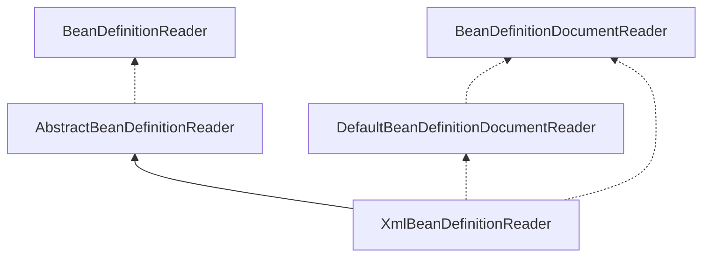

# Spring Framework5.x

### Bean定义

Bean定义对象包括如下几个属性：

| Property  | 描述  |
| --------   | -----:   |
| Class        | [bean实例](https://docs.spring.io/spring-framework/docs/current/spring-framework-reference/core.html#beans-factory-class)     |
| Name        | [Bean名称](https://docs.spring.io/spring-framework/docs/current/spring-framework-reference/core.html#beans-beanname)      |
| Scope      | [Bean类型（单例、原型..)](https://docs.spring.io/spring-framework/docs/current/spring-framework-reference/core.html#beans-factory-scopes)    |
|  构造函数参数   | [Dependency Injection](https://docs.spring.io/spring-framework/docs/current/spring-framework-reference/core.html#beans-factory-collaborators) |
|	Properties	|	[Dependency Injection](https://docs.spring.io/spring-framework/docs/current/spring-framework-reference/core.html#beans-factory-collaborators)	|
|	Autowirging mode	|	[自动注入模型](https://docs.spring.io/spring-framework/docs/current/spring-framework-reference/core.html#beans-factory-autowire)	|
|	Lazy initizlization	|	[懒加载模型](https://docs.spring.io/spring-framework/docs/current/spring-framework-reference/core.html#beans-factory-lazy-init) |
|	Iniitialization method	|	[初始化方法](https://docs.spring.io/spring-framework/docs/current/spring-framework-reference/core.html#beans-factory-lifecycle-initializingbean)	|
|	Destruction method	|	[销毁方法](https://docs.spring.io/spring-framework/docs/current/spring-framework-reference/core.html#beans-factory-lifecycle-disposablebean)	|

### Spring IoC体系结构

#### BeanFactory

Spring Bean的创建是典型的工厂模式，这一系列的Bean工厂也就是IoC容器为开发者管理对象间的依赖关系提供了很多的便利和基础服务，在Spring中有许多的实现提供用户选择和使用。最核心的类结构如下：




其中`BeanFactory`作为顶层的接口，它定义了IoC容器的基本功能实现，比如`getBean()`方法就是这个接口定义的。
它有三个子类（或者是实现类），它们是：`ListableBeanFactory`、`HierarchicalBeanFactory`和`AutowireCapableBeanFactory`。但是从上图可以看到最终的默认实现类是`DefaultListableBeanFactory`。它实现了所有的接口，这样做的目的是什么呢？
查阅相关的资料可以发现，这些几个接口的实现都是有特定的使用场景的，它们主要是在Spring内部操作对象的传递和转换的过程中，对对象的数据访问所做的限制。比如`ListableBeanFactory`接口表示这些bean是可列表的；`HierarchicalBeanFactory`表示这些bean是有继承关系的，也就是说这些bean是可能有父类bean；`AutowireCapableBeanFactory`接口定义了bean的自动装配规则。这四个接口共同定义了Bean的集合，Bean之间的关系，Bean的行为，从而组成了IoC容器的基本结构。

```java
public interface BeanFactory {

	/**
	 * 对FactoryBean的转义定义，如果使用beanName获取到的是FactoryBean接口中getObject()方法返回的实例
	 * 如果要拿到FactoryBean本身则需要加上&前缀，applicationContext.getBean(&beanName)
	 */
	String FACTORY_BEAN_PREFIX = "&";


	/**
	 * 根据beanName获取容器中实例化好的bean
	 */
	Object getBean(String name) throws BeansException;

	/**
	 * 根据bean的名字和Class类型来得到bean实例，增加了类型安全验证机制。
	 */
	<T> T getBean(String name, Class<T> requiredType) throws BeansException;

	/**
	 * 获取bean实例时可以传递构造方法的参数，args就是构造方法的参数。
	 */
	Object getBean(String name, Object... args) throws BeansException;

	/**
	 * 根据bean的类型获取bean实例。比如getBean(User.class)
	 */
	<T> T getBean(Class<T> requiredType) throws BeansException;

	/**
	 * 根据bean的类型和构造函数的参数获取bean实例。比如getBean(User.class, age, name)
	 */
	<T> T getBean(Class<T> requiredType, Object... args) throws BeansException;

	/**
	 * 获取一个提供器类型的bean，通常是Spring框架内部使用。
	 */
	<T> ObjectProvider<T> getBeanProvider(Class<T> requiredType);


	<T> ObjectProvider<T> getBeanProvider(ResolvableType requiredType);

	/**
	 * 提供对bean的检索，看看是否在IOC容器有这个名字的bean
	 */
	boolean containsBean(String name);


	boolean isSingleton(String name) throws NoSuchBeanDefinitionException;


	boolean isPrototype(String name) throws NoSuchBeanDefinitionException;


	boolean isTypeMatch(String name, Class<?> typeToMatch) throws NoSuchBeanDefinitionException;

	/**
	 * 得到bean实例的Class类型
	 */
	@Nullable
	Class<?> getType(String name) throws NoSuchBeanDefinitionException;


	@Nullable
	Class<?> getType(String name, boolean allowFactoryBeanInit) throws NoSuchBeanDefinitionException;

	/**
	 * 得到bean的别名，如果根据别名检索，那么其原名也会被检索出来    
	 */
	String[] getAliases(String name);
```

`FactoryBean`只定义了IoC容器的基本行为，它并不关心bean是如何定义，怎么加载的。
而具体是定义和加载是在其他的实现类中处理的，比如`XmlBeanFactory`、`ClasspathXmlApplicationContext`等。
`XmlBeanFactory`是容器的最基本实现，其他的加载类都是在此基础上的扩展。

#### BeanDefinition

Spring容器管理了我们定义的各种bean对象及其相互关系，bean在对象实现是以`BeanDefinition`类描述的。



Bean的解析过程非常复杂，功能被分的很细，因为这里需要被扩展的地方非常多，也提供了很多接口给开发者用于修改bean的定义。保证了足够的灵活性，以应对变化。Bean的解析主要是对Spring配置文件或者配置类的解析，解析过程如下：




#### IoC 容器的初始化


