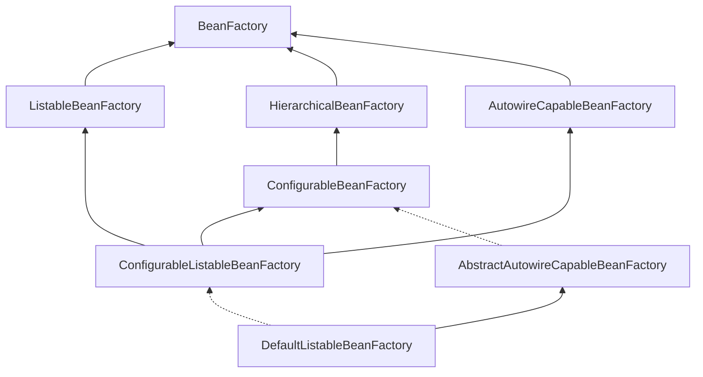
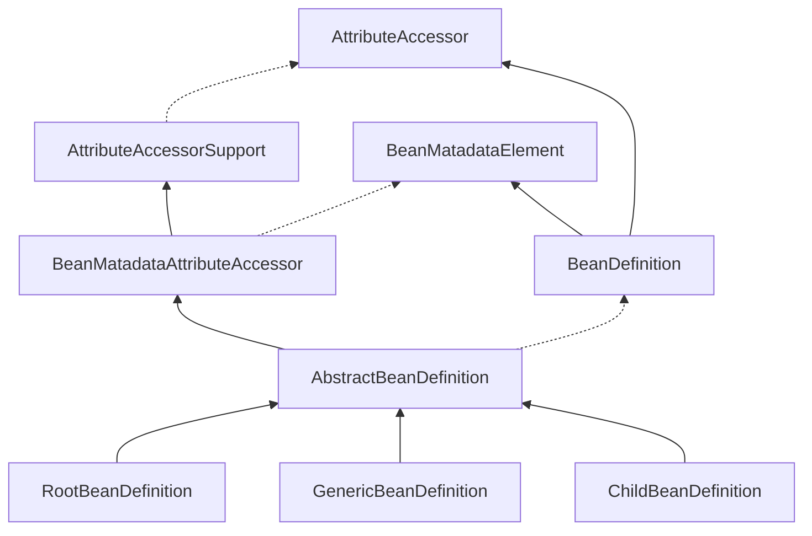
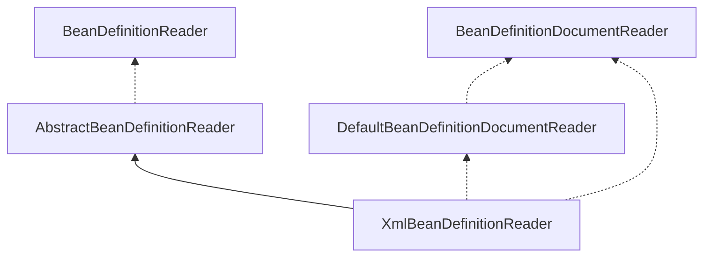
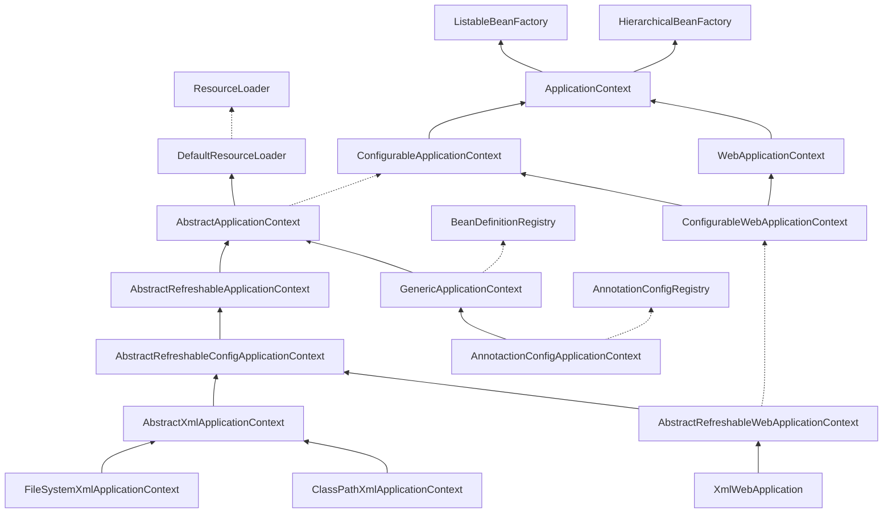
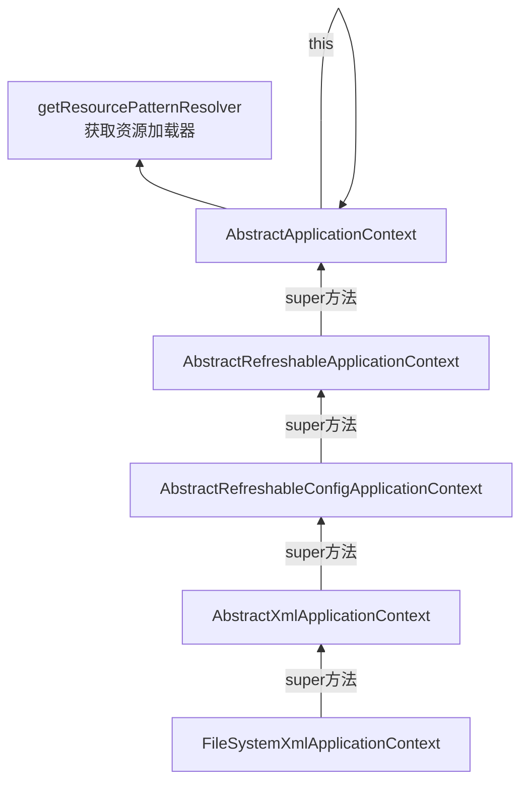
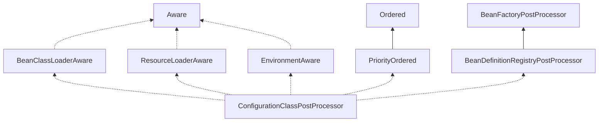

> 注意：本篇的源码使用Spring5.0以上版本。


## BeanDefinition对象

Bean定义主要对象包括如下几个属性：

| Property               |                                                         描述 |
| ---------------------- | -----------------------------------------------------------: |
| Class                  | [bean实例](https://docs.spring.io/spring-framework/docs/current/spring-framework-reference/core.html#beans-factory-class) |
| Name                   | [Bean名称](https://docs.spring.io/spring-framework/docs/current/spring-framework-reference/core.html#beans-beanname) |
| Scope                  | [Bean类型（单例、原型..)](https://docs.spring.io/spring-framework/docs/current/spring-framework-reference/core.html#beans-factory-scopes) |
| 构造函数参数           | [Dependency Injection](https://docs.spring.io/spring-framework/docs/current/spring-framework-reference/core.html#beans-factory-collaborators) |
| Properties             | [Dependency Injection](https://docs.spring.io/spring-framework/docs/current/spring-framework-reference/core.html#beans-factory-collaborators) |
| Autowirging mode       | [自动注入模型](https://docs.spring.io/spring-framework/docs/current/spring-framework-reference/core.html#beans-factory-autowire) |
| Lazy initizlization    | [懒加载模型](https://docs.spring.io/spring-framework/docs/current/spring-framework-reference/core.html#beans-factory-lazy-init) |
| Iniitialization method | [初始化方法](https://docs.spring.io/spring-framework/docs/current/spring-framework-reference/core.html#beans-factory-lifecycle-initializingbean) |
| Destruction method     | [销毁方法](https://docs.spring.io/spring-framework/docs/current/spring-framework-reference/core.html#beans-factory-lifecycle-disposablebean) |

bean定义所有属性大概有上百个。就以最常用的`RootBeanDefinition`为例，这个类是bean定义最核心的实现类。类中定义非常多属性，这些属性都是bean的定义信息。

```java
/** Map with String keys and Object values. */
private final Map<String, Object> attributes = new LinkedHashMap<>();

@Nullable
private Object source;

/**
	 * Constant for the default scope name: {@code ""}, equivalent to singleton
	 * status unless overridden from a parent bean definition (if applicable).
	 * 默认bean作用域
	 */
public static final String SCOPE_DEFAULT = "";

/**
	 * Constant that indicates no external autowiring at all.
	 * 自动注入模式
	 * @see #setAutowireMode
	 */
public static final int AUTOWIRE_NO = AutowireCapableBeanFactory.AUTOWIRE_NO;

/**
	 * Constant that indicates autowiring bean properties by name.
	 * 自动注入通过bean名字
	 * @see #setAutowireMode
	 */
public static final int AUTOWIRE_BY_NAME = AutowireCapableBeanFactory.AUTOWIRE_BY_NAME;

/**
	 * Constant that indicates autowiring bean properties by type.
	 * 自动注入通过bean类型
	 * @see #setAutowireMode
	 */
public static final int AUTOWIRE_BY_TYPE = AutowireCapableBeanFactory.AUTOWIRE_BY_TYPE;

/**
	 * Constant that indicates autowiring a constructor.
	 * 自动注入通过构造函数
	 * @see #setAutowireMode
	 */
public static final int AUTOWIRE_CONSTRUCTOR = AutowireCapableBeanFactory.AUTOWIRE_CONSTRUCTOR;

/**
	 * Constant that indicates determining an appropriate autowire strategy
	 * through introspection of the bean class.
	 * @see #setAutowireMode
	 * @deprecated as of Spring 3.0: If you are using mixed autowiring strategies,
	 * use annotation-based autowiring for clearer demarcation of autowiring needs.
	 */
@Deprecated
public static final int AUTOWIRE_AUTODETECT = AutowireCapableBeanFactory.AUTOWIRE_AUTODETECT;

/**
	 * Constant that indicates no dependency check at all.
	 * @see #setDependencyCheck
	 */
public static final int DEPENDENCY_CHECK_NONE = 0;

/**
	 * Constant that indicates dependency checking for object references.
	 * @see #setDependencyCheck
	 */
public static final int DEPENDENCY_CHECK_OBJECTS = 1;

/**
	 * Constant that indicates dependency checking for "simple" properties.
	 * @see #setDependencyCheck
	 * @see org.springframework.beans.BeanUtils#isSimpleProperty
	 */
public static final int DEPENDENCY_CHECK_SIMPLE = 2;

/**
	 * Constant that indicates dependency checking for all properties
	 * (object references as well as "simple" properties).
	 * @see #setDependencyCheck
	 */
public static final int DEPENDENCY_CHECK_ALL = 3;

/**
	 * Constant that indicates the container should attempt to infer the
	 * {@link #setDestroyMethodName destroy method name} for a bean as opposed to
	 * explicit specification of a method name. The value {@value} is specifically
	 * designed to include characters otherwise illegal in a method name, ensuring
	 * no possibility of collisions with legitimately named methods having the same
	 * name.
	 * <p>Currently, the method names detected during destroy method inference
	 * are "close" and "shutdown", if present on the specific bean class.
	 */
public static final String INFER_METHOD = "(inferred)";


@Nullable
private volatile Object beanClass;

@Nullable
private String scope = SCOPE_DEFAULT;

private boolean abstractFlag = false;

@Nullable
private Boolean lazyInit;

private int autowireMode = AUTOWIRE_NO;

private int dependencyCheck = DEPENDENCY_CHECK_NONE;

@Nullable
private String[] dependsOn;

private boolean autowireCandidate = true;

private boolean primary = false;

private final Map<String, AutowireCandidateQualifier> qualifiers = new LinkedHashMap<>();

@Nullable
private Supplier<?> instanceSupplier;

private boolean nonPublicAccessAllowed = true;

private boolean lenientConstructorResolution = true;

@Nullable
private String factoryBeanName;

@Nullable
private String factoryMethodName;

@Nullable
private ConstructorArgumentValues constructorArgumentValues;

@Nullable
private MutablePropertyValues propertyValues;

private MethodOverrides methodOverrides = new MethodOverrides();

@Nullable
private String initMethodName;

@Nullable
private String destroyMethodName;

private boolean enforceInitMethod = true;

private boolean enforceDestroyMethod = true;

private boolean synthetic = false;

private int role = BeanDefinition.ROLE_APPLICATION;

@Nullable
private String description;

@Nullable
private Resource resource;

@Nullable
private BeanDefinitionHolder decoratedDefinition;

@Nullable
private AnnotatedElement qualifiedElement;

/** Determines if the definition needs to be re-merged. */
volatile boolean stale;

boolean allowCaching = true;

boolean isFactoryMethodUnique = false;

@Nullable
volatile ResolvableType targetType;

/** Package-visible field for caching the determined Class of a given bean definition. */
@Nullable
volatile Class<?> resolvedTargetType;

/** Package-visible field for caching if the bean is a factory bean. */
@Nullable
volatile Boolean isFactoryBean;

/** Package-visible field for caching the return type of a generically typed factory method. */
@Nullable
volatile ResolvableType factoryMethodReturnType;

/** Package-visible field for caching a unique factory method candidate for introspection. */
@Nullable
volatile Method factoryMethodToIntrospect;

/** Common lock for the four constructor fields below. */
final Object constructorArgumentLock = new Object();

/** Package-visible field for caching the resolved constructor or factory method. */
@Nullable
Executable resolvedConstructorOrFactoryMethod;

/** Package-visible field that marks the constructor arguments as resolved. */
boolean constructorArgumentsResolved = false;

/** Package-visible field for caching fully resolved constructor arguments. */
@Nullable
Object[] resolvedConstructorArguments;

/** Package-visible field for caching partly prepared constructor arguments. */
@Nullable
Object[] preparedConstructorArguments;

/** Common lock for the two post-processing fields below. */
final Object postProcessingLock = new Object();

/** Package-visible field that indicates MergedBeanDefinitionPostProcessor having been applied. */
boolean postProcessed = false;

/** Package-visible field that indicates a before-instantiation post-processor having kicked in. */
@Nullable
volatile Boolean beforeInstantiationResolved;

@Nullable
private Set<Member> externallyManagedConfigMembers;

@Nullable
private Set<String> externallyManagedInitMethods;

@Nullable
private Set<String> externallyManagedDestroyMethods;
```


## Spring中Bean生命周期


这个图还缺少一个后置处理器，在最上面应该还有一个`BeanDefinitionRegistryPostProcess`，这个后置处理器在`BeanFactoryPostProcessor`之前执行。

## Spring IoC体系结构

### BeanFactory

Spring Bean的创建是典型的工厂模式，这一系列的Bean工厂也就是IoC容器为开发者管理对象间的依赖关系提供了很多的便利和基础服务，在Spring中有许多的实现提供用户选择和使用。最核心的类结构如下：



其中`BeanFactory`作为顶层的接口，它定义了IoC容器的基本功能实现，比如`getBean()`方法就是这个接口定义的。
它有三个子类（或者是实现类），它们是：`ListableBeanFactory`、`HierarchicalBeanFactory`和`AutowireCapableBeanFactory`。但是从上图可以看到最终的默认实现类是`DefaultListableBeanFactory`。它实现了所有的接口，这样做的目的是什么呢？
查阅相关的资料可以发现，这些几个接口的实现都是有特定的使用场景的，它们主要是在Spring内部操作对象的传递和转换的过程中，对对象的数据访问所做的限制。比如`ListableBeanFactory`接口表示这些bean是可列表的；`HierarchicalBeanFactory`表示这些bean是有继承关系的，也就是说这些bean是可能有父类bean；`AutowireCapableBeanFactory`接口定义了bean的自动装配规则。这四个接口共同定义了Bean的集合，Bean之间的关系，Bean的行为，从而组成了IoC容器的基本结构。

```java
public interface BeanFactory {
	/**
	 * 对FactoryBean的转义定义，如果使用beanName获取到的是FactoryBean接口中getObject()方法返回的实例
	 * 如果要拿到FactoryBean本身则需要加上&前缀，applicationContext.getBean(&beanName)
	 */
	String FACTORY_BEAN_PREFIX = "&";
	/**
	 * 根据beanName获取容器中实例化好的bean
	 */
	Object getBean(String name) throws BeansException;
	/**
	 * 根据bean的名字和Class类型来得到bean实例，增加了类型安全验证机制。
	 */
	<T> T getBean(String name, Class<T> requiredType) throws BeansException;
	/**
	 * 获取bean实例时可以传递构造方法的参数，args就是构造方法的参数。
	 */
	Object getBean(String name, Object... args) throws BeansException;
	/**
	 * 根据bean的类型获取bean实例。比如getBean(User.class)
	 */
	<T> T getBean(Class<T> requiredType) throws BeansException;
	/**
	 * 根据bean的类型和构造函数的参数获取bean实例。比如getBean(User.class, age, name)
	 */
	<T> T getBean(Class<T> requiredType, Object... args) throws BeansException;
	/**
	 * 获取一个提供器类型的bean，通常是Spring框架内部使用。
	 */
	<T> ObjectProvider<T> getBeanProvider(Class<T> requiredType);

	<T> ObjectProvider<T> getBeanProvider(ResolvableType requiredType);
	/**
	 * 提供对bean的检索，看看是否在IOC容器有这个名字的bean
	 */
	boolean containsBean(String name);

	boolean isSingleton(String name) throws NoSuchBeanDefinitionException;

	boolean isPrototype(String name) throws NoSuchBeanDefinitionException;

	boolean isTypeMatch(String name, Class<?> typeToMatch) throws NoSuchBeanDefinitionException;
	/**
	 * 得到bean实例的Class类型
	 */
	@Nullable
	Class<?> getType(String name) throws NoSuchBeanDefinitionException;

	@Nullable
	Class<?> getType(String name, boolean allowFactoryBeanInit) throws NoSuchBeanDefinitionException;
	/**
	 * 得到bean的别名，如果根据别名检索，那么其原名也会被检索出来    
	 */
	String[] getAliases(String name);
}
```

`FactoryBean`只定义了IoC容器的基本行为，它并不关心bean是如何定义，怎么加载的。
而具体是定义和加载是在其他的实现类中处理的，比如`XmlBeanFactory`、`ClasspathXmlApplicationContext`等。
`XmlBeanFactory`是容器的最基本实现（*但是目前这个类已经声明为过时*），其他的加载类都是在此基础上的扩展。

#### BeanDefinition（bean定义信息，IoC核心数据结构）

Spring容器管理了我们定义的各种bean对象及其相互关系，bean在对象实现是以`BeanDefinition`类描述的。



Bean的解析过程非常复杂，功能被分的很细，因为这里需要被扩展的地方非常多，也提供了很多接口给开发者用于修改bean的定义。保证了足够的灵活性，以应对变化。Bean的解析主要是对Spring配置文件或者配置类的解析，解析过程如下：




## IoC 容器初始化、bean实例化（核心内容）

IoC容器的初始化包括`BeanDefinition`的`Resource`定位、载入和注册三个基本过程。我们以`ApplicationContext`为例，这个类是我们最常见也是最常用的。

主要类关系如下：



`ApplicationContext`运行上下文嵌套，通过保持父上下文可以维持一个上下文体系。对于bean的查找可以在这个上下文体系中发生，首先检查当前上下文，其次是父上下文，逐级向上，这样为不同的Spring应用提供了一个共享的bean定义环境。

主要有三种方式可以使用容器：`ClassPathXmlApplicationContext`、`FileSystemXmlApplicationContext`、`AnnotactionConfigApplicationContext`、`XmlWebApplicationContext`，其中第三种是最常用的，也是使用最广泛、最简单的。对于3.0之前更多是使用的xml配置方式，但是现在使用最多的是基于注解的方式，特别是springboot，全部都是基于注解做到零配置。`XmlWebApplicationContext`基本都是在SpringMVC的项目中使用。

> 以`FileSystemXmlApplicationContext`为例讲解IoC容器从读取xml -> 解析xml配置信息 -> 转换成BeanDefinition -> 初始化bean对象 -> 设置bean属性（依赖） -> bean销毁 整个bean生命周期过程。

### bean定义资源准备（设置xml配置文件路径、设置资源加载器）

```java
public class FileSystemXmlApplicationContext extends AbstractXmlApplicationContext {

	public FileSystemXmlApplicationContext() {
	}

	public FileSystemXmlApplicationContext(ApplicationContext parent) {
		super(parent);
	}

	public FileSystemXmlApplicationContext(String configLocation) throws BeansException {
		this(new String[] {configLocation}, true, null);
	}

	public FileSystemXmlApplicationContext(String... configLocations) throws BeansException {
		this(configLocations, true, null);
	}

	public FileSystemXmlApplicationContext(String[] configLocations, ApplicationContext parent) throws BeansException {
		this(configLocations, true, parent);
	}

	public FileSystemXmlApplicationContext(String[] configLocations, boolean refresh) throws BeansException {
		this(configLocations, refresh, null);
	}

	public FileSystemXmlApplicationContext(
			String[] configLocations, boolean refresh, @Nullable ApplicationContext parent)
			throws BeansException {
		// 创建资源加载器
		super(parent);
		setConfigLocations(configLocations);
		if (refresh) {
			refresh();
		}
	}
  // 这个方法会在解析xml的子类AbstractBeanDefinitionReader中回调
	@Override
	protected Resource getResourceByPath(String path) {
		if (path.startsWith("/")) {
			path = path.substring(1);
		}
		return new FileSystemResource(path);
}
```

这个类提供了非常多的扩展，可以使用不同类型的构造函数来创建容器。但是都最终会调用到这个构造方法。

```java
public FileSystemXmlApplicationContext(
			String[] configLocations, boolean refresh, @Nullable ApplicationContext parent)
			throws BeansException {

		super(parent);
		setConfigLocations(configLocations);
		if (refresh) {
			refresh();
		}
}
```

这个构造方法在执行的时候首先执行父类`AbstractXmlApplicationContext`的构造方法，父类构造方法会先设置bean资源加载器。然后再调用父类的`setConfigLocations(configLoacations)`方法，这个方法用于设置bean定义资源文件（xml文件）的路径。通过类层架追踪，xml资源的加载最终是在`FileSystemXmlApplicationContext`的父类再网上几层的父类`AbstractXmlApplicationContext`中实现的。



`AbstractApplicationContext`的资源加载过程如下：

```java
// FileSystemXmlApplicationContext不断的通过super()方法找到父类的父类的父类。。。
// 最终到达它真正的实现地方
public AbstractApplicationContext() {
  // 获取资源处理器（读取spring配置文件）
  this.resourcePatternResolver = getResourcePatternResolver();
}

protected ResourcePatternResolver getResourcePatternResolver() {
  // 因为AbstractApplicationContext继承了DefaultResourceLoader
  // DefaultResourceLoader实现了ResourceLoader接口，所以可以直接传this进去
  return new PathMatchingResourcePatternResolver(this);
}
```

资源加载器初始化完成之后，开始设置资源路径。`setConfigLocations(configLocations);`这个方法也是调用父类`AbstractRefreshableConfigApplicationContext`的方法完成的。

```java
public void setConfigLocations(@Nullable String... locations) {
		if (locations != null) {
			Assert.noNullElements(locations, "Config locations must not be null");
			this.configLocations = new String[locations.length];
			for (int i = 0; i < locations.length; i++) {
				this.configLocations[i] = resolvePath(locations[i]).trim();
			}
		}
		else {
			this.configLocations = null;
		}
	}
```

这个方法执行完毕之后，我们需要加载的bean资源文件都转成一个`String`数组，保存到变量`configLocations`中。

资源加载器准备好之后就是开始加载解析bean配置，然后根据bean定义执行各种操作，包括定义解析、bean初始化等等。

### 加载、解析、转换XML定义，实例化bean

Spring IoC容器对bean定义的加载是从`refresh()`方法开始的，这个方法是一个模板方法，它的作用是：在创建IoC容器前，如果已经有容器则把容器销毁关闭，然后再重新创建一个新的容器，然后再对容器做初始化。`FileSystemXmlApplicationContext`通过调用父类的`AbstractApplicationContext.refresh()`方法实现容器的创建，加载，初始等一系列操作。回到这个类的构造方法，可以看到在构造方法内部调用了`refresh()`方法。

```java
public FileSystemXmlApplicationContext(
			String[] configLocations, boolean refresh, @Nullable ApplicationContext parent)
			throws BeansException {
		// 通过类层级，一直通过super()方法一层层往上找父类的父类的父类。。。。
		// 最终找到AbstractApplicationContext的构造方法，
		super(parent);
		setConfigLocations(configLocations);
		if (refresh) {
			refresh();
		}
	}
```

通过类层级往上找，他的父类`AbstractXmlApplicationContext`、`AbstractRefreshableConfigApplicationContext`、`AbstractRefreshableApplicationContext`都没有重写`refresh()`方法，这个方法的实现是在`AbstractApplicationContet`中实现的。

```java
public void refresh() throws BeansException, IllegalStateException {
		synchronized (this.startupShutdownMonitor) {
			// Prepare this context for refreshing.
			// 准备此上下文以进行刷新。
			prepareRefresh();

			// Tell the subclass to refresh the internal bean factory.
			// 获取beanFactory实例
			ConfigurableListableBeanFactory beanFactory = obtainFreshBeanFactory();

			// Prepare the bean factory for use in this context.
			// 准备上下文使用的BeanFactory
			prepareBeanFactory(beanFactory);

			try {
				// Allows post-processing of the bean factory in context subclasses.
				// 允许子类处理BeanFactory后置处理器
				postProcessBeanFactory(beanFactory);

				// Invoke factory processors registered as beans in the context.
				// 转到ConfigurationClassPostProcessor里面执行
				// 执行bean工厂的后置处理器，里面会有非常多的，非常复杂的BeanFactoryPostProcessor实现类的执行。
				invokeBeanFactoryPostProcessors(beanFactory);

				// Register bean processors that intercept bean creation.
				// 转到PostProcessorRegistrationDelegate
				// 注册bean工厂的后置处理器（仅仅是把Spring内部定义的和用户定义的BeanPostProcessor注册到容器中，后面的步骤才会真正执行），
				// 这些后置处理器在bean的构造方法执行之后，在执行init方法前后执行指定的逻辑
				registerBeanPostProcessors(beanFactory);

				// Initialize message source for this context.
				// 初始化上下文的消息资源，比如message-xxx.properties
				initMessageSource();

				// Initialize event multicaster for this context.
				// 初始化上下文多波器
				initApplicationEventMulticaster();

				// Initialize other special beans in specific context subclasses.
				// 在上下文中初始化其他的bean，子类实现
				onRefresh();

				// Check for listener beans and register them.
				// 检查并注册监听器
				registerListeners();

				// Instantiate all remaining (non-lazy-init) singletons.
				// 初始化剩下其他的单例bean，包括FactoryBean，（用户定义的大部分类都是在这里实例化的）
				// 非常非常重要的方法，是整个IOC容器核心部分
				finishBeanFactoryInitialization(beanFactory);

				// Last step: publish corresponding event.
				// 初始化上下文生命周期处理器，发布事件
				finishRefresh();
			}

			catch (BeansException ex) {
				if (logger.isWarnEnabled()) {
					logger.warn("Exception encountered during context initialization - " +
							"cancelling refresh attempt: " + ex);
				}

				// Destroy already created singletons to avoid dangling resources.
				destroyBeans();

				// Reset 'active' flag.
				cancelRefresh(ex);

				// Propagate exception to caller.
				throw ex;
			}

			finally {
				// Reset common introspection caches in Spring's core, since we
				// might not ever need metadata for singleton beans anymore...
				resetCommonCaches();
			}
		}
	}
```

`refresh()`方法的主要作用为了IoC容器bean的生命周期管理提供条件，Spring IoC容器载入bean定义资源文件从其子类`refreshBeanFactory()`方法启动。在创建IoC容器前，如果已经存在则把已经创建的容器销毁关闭，以保障`refresh()`之后是新建的、单例的容器。

这个方法就是Spring最最最核心的实现，整个Spring最核心的特性也是在这个方法实现的，包括后置处理器、事件发布、bean加载、`@Component @Autowired`等等注解、AOP等，下面逐个方法解析学习。

### `prepareRefresh()`

这个方法比较简单，就是为容器的创建做准备，标记容器的状态（激活状态为true，关闭状态为false），打印容器开始启动的时间。

### `obtainFreshBeanFactory();`

这个方法为容器的做了非常多的工作，设置bean定义的资源加载器，加载bean定义为`BeanDefinition`对象，并保存到容器的缓存中（保存在`ConfigurableListableBeanFactory`实例的Map成员属性中）。当然这一步仅仅是加载把定义信息转换成容器所需要的数据结构，并未做bean的实例化。目前的bean还没开始创建呢，还是在内存中的一些定义信息。

`AbstractApplicationContext`的`obtainFreshBeanFactory()`方法调用子类容器的`refreshBaenFactory()`方法，启动容器载入bean定义资源文件。

```java
protected ConfigurableListableBeanFactory obtainFreshBeanFactory() {
  // 调用子类AbstractRefreshableApplicationContext.refreshBeanFactory()方法
  // 此方法由子类实现，使用委派设计模式，父类定义了抽象refreshBeanFactory方法，具体实现调用子类的方法。
  refreshBeanFactory();  
  return getBeanFactory();
}
```

#### 创建容器、加载bean定义信息

通过调用`AbstractRefreshableApplicationContext.refreshBeanFactory()`创建一个新的容器（主要是创建了`DefaultListableBeanFactory`实例对象，准备好用于保存bean定义的缓存Map，然后加载bean定义到Map中（非常复杂的步骤）。

```java
/**
	 * This implementation performs an actual refresh of this context's underlying
	 * bean factory, shutting down the previous bean factory (if any) and
	 * initializing a fresh bean factory for the next phase of the context's lifecycle.
	 * 实现上下文刷新，如果已经有bean fatory则先关闭，再重新初始化一个bean factory。
	 * 此方法会在AbstractApplicationContext的refresh()方法中被调用
	 */
	@Override
	protected final void refreshBeanFactory() throws BeansException {
		// 先判断是否已经存在BeanFactory，如果当前线程已经初始化过了，则先销毁重新创建一个
		if (hasBeanFactory()) {
			destroyBeans();
			closeBeanFactory();
		}
		try {
			DefaultListableBeanFactory beanFactory = createBeanFactory();
			beanFactory.setSerializationId(getId());
			// 容器定制化，设置启动参数、开启注解自动装配等等。
			customizeBeanFactory(beanFactory);
			// 加载bean定义，非常重要的一个方法
			// 由子类AbstractXmlApplicationContext实现加载bean定义
			// 使用委派模式，父类定义抽象，具体实现由子类实现
			loadBeanDefinitions(beanFactory);
			synchronized (this.beanFactoryMonitor) {
				this.beanFactory = beanFactory;
			}
		}
		catch (IOException ex) {
			throw new ApplicationContextException("I/O error parsing bean definition source for " + getDisplayName(), ex);
		}
	}
```

##### 加载bean定义

`AbstractXmlApplicationContext.loadBeanDefinitions(beanFactory)`方法在一级子类`AbstractRefreshableApplicationContext`并没有实现，也是声明为`abstract`方法。

```java
protected abstract void loadBeanDefinitions(DefaultListableBeanFactory beanFactory) throws BeansException, IOException;
```

在他的二级子类`AbstractRefreshableConfigApplicationContext`也没有实现，而是在它的三级级子类`AbstractXmlApplicationContext`才实现。

```java
/**
	 * Loads the bean definitions via an XmlBeanDefinitionReader.
	 * 通过XmlBeanDefinitionReader加载所有的bean定义，
	 * 此方法在AbstractApplicationContext中定义了抽象，由子类实现。
	 *
	 * @see org.springframework.beans.factory.xml.XmlBeanDefinitionReader
	 * @see #initBeanDefinitionReader
	 * @see #loadBeanDefinitions
	 */
@Override
protected void loadBeanDefinitions(DefaultListableBeanFactory beanFactory) throws BeansException, IOException {
  // Create a new XmlBeanDefinitionReader for the given BeanFactory.
  // 创建bean定义读取器，通过回调设置到容器中，不同的子类设置不同的读取器（有些是读取xml配置，有的是读取java代码的bean定义）
  XmlBeanDefinitionReader beanDefinitionReader = new XmlBeanDefinitionReader(beanFactory);

  // Configure the bean definition reader with this context's
  // resource loading environment.
  // 加载上下文的环境配置，配置bean定义
  beanDefinitionReader.setEnvironment(this.getEnvironment());
  // 设置资源加载器，
  // 因为本类的最上层父类DefaultResourceLoader也继承了DefaultResourceLoader，所以可以直接传this。
  beanDefinitionReader.setResourceLoader(this);
  beanDefinitionReader.setEntityResolver(new ResourceEntityResolver(this));

  // Allow a subclass to provide custom initialization of the reader,
  // then proceed with actually loading the bean definitions.
  // 允许子类提供自定义的初始化读取器reader，然后处理加载bean定义
  initBeanDefinitionReader(beanDefinitionReader);
  // 加载bean定义
  loadBeanDefinitions(beanDefinitionReader);
}
```

##### 1. AbstractXmlApplicationContext.loadBeanDefinitions(beanDefinitionReader)

```java
protected void loadBeanDefinitions(XmlBeanDefinitionReader reader) throws BeansException, IOException {
  // 获取到工厂开始加载之前就设置的配置文件路径，
  // ApplicationContext applicationContext = new ClassPathXmlApplicationContext("spring-env-test.xml");
  // 由子类实现bean定义资源，子类实现getConfigResources()方法，比如ClassPathXmlApplicationContext的构造方法里就重写了setConfigLocations()
  Resource[] configResources = getConfigResources();
  if (configResources != null) {
    reader.loadBeanDefinitions(configResources);
  }
  // 子类实现bean定义资源路径，子类实现getConfigLocations()方法
  // 如果资源定位configResources为空，则获取子类的路径资源，
  // 比如，子类FileSystemXmlApplicationContext构造方法中实现了getConfigLocations()方法，指定的文件路径。
  String[] configLocations = getConfigLocations();
  if (configLocations != null) {
    // 调用AbstractBeanDefinitionReader.loadBeanDefinitions()方法
    reader.loadBeanDefinitions(configLocations);
  }
}
```

##### 2. AbstractBeanDefinitionReader.loadBeanDefinitions()方法

```java
public int loadBeanDefinitions(String location, @Nullable Set<Resource> actualResources) throws BeanDefinitionStoreException {
  // 拿到实例化的资源读取器。在构造方法里面已经做了初始化
  // 初始化：this.resourceLoader = new PathMatchingResourcePatternResolver();
  ResourceLoader resourceLoader = getResourceLoader();
  if (resourceLoader == null) {
    throw new BeanDefinitionStoreException(
      "Cannot load bean definitions from location [" + location + "]: no ResourceLoader available");
  }

  // resourceLoader就是PathMatchingResourcePatternResolve。
  // PathMatchingResourcePatternResolver实现了ResourcePatternResolver接口
  if (resourceLoader instanceof ResourcePatternResolver) {
    // Resource pattern matching available.
    try {
      // 把符合路径下配置封装成Resource
      Resource[] resources = ((ResourcePatternResolver) resourceLoader).getResources(location);
      // 加载bean定义比如ClassPathXmlApplicationContext中指定的classpath*:/application.xml
      int count = loadBeanDefinitions(resources);
      if (actualResources != null) {
        Collections.addAll(actualResources, resources);
      }
      if (logger.isTraceEnabled()) {
        logger.trace("Loaded " + count + " bean definitions from location pattern [" + location + "]");
      }
      return count;
    }
    catch (IOException ex) {
      throw new BeanDefinitionStoreException(
        "Could not resolve bean definition resource pattern [" + location + "]", ex);
    }
  }
  else {
    // Can only load single resources by absolute URL.
    // 通过绝对路径加载单个配置文件，比如FileSystemXmlApplicationContext中指定的
    Resource resource = resourceLoader.getResource(location);
    // 调用子类的XmlBeanDefinitionReader.loadBeanDefinitions(Resource)方法
    int count = loadBeanDefinitions(resource);
    if (actualResources != null) {
      actualResources.add(resource);
    }
    if (logger.isTraceEnabled()) {
      logger.trace("Loaded " + count + " bean definitions from location [" + location + "]");
    }
    return count;
  }
}
```

##### 3. DefaultResourceLoader.resourceLoader.getResource(location)

以`FileSystemXmlApplicationContext`为例，加载资源会跳转到`resourceLoader.getResource(location)`这行，进入后发现最终会交给`DefaultResourceLoader.getResource()`方法实现。

```java
@Override
public Resource getResource(String location) {
  Assert.notNull(location, "Location must not be null");

  // 协议类的路径
  for (ProtocolResolver protocolResolver : getProtocolResolvers()) {
    Resource resource = protocolResolver.resolve(location, this);
    if (resource != null) {
      return resource;
    }
  }
  // 文件系统方式
  if (location.startsWith("/")) {
    // getResourceByPath也被子类FileSystemXmlApplicationContext重写了，
    // 如果是使用FileSystemXmlApplicationContext来初始化容器，则会回调子类重写的方法。返回FileSystemResource对象
    return getResourceByPath(location);
  }
  // 类路径方式：classpath:*/application.xml
  else if (location.startsWith(CLASSPATH_URL_PREFIX)) {
    return new ClassPathResource(location.substring(CLASSPATH_URL_PREFIX.length()), getClassLoader());
  }
  else {
    try {
      // Try to parse the location as a URL...
      URL url = new URL(location);
      return (ResourceUtils.isFileURL(url) ? new FileUrlResource(url) : new UrlResource(url));
    }
    catch (MalformedURLException ex) {
      // No URL -> resolve as resource path.
      return getResourceByPath(location);
    }
  }
}
```

判断是加载本地文件系统资源之后，进入到`getResource`第二种情况`startWitch("/")`，然后执行`getResourceByPath()`方法，此方法被`FileSystemApplicationContext`重写了，所以执行的时候是执行子类重写了的方法体，拿到一个`FileSystemResource`对象。

拿到资源之后，回到`AbstractBeanDefinitionReader.loadBeanDefinitions()`。调用`loadBeanDefinitions()`方法开始加载资源文件里面的bean定义信息。

```java
public int loadBeanDefinitions(EncodedResource encodedResource) throws BeanDefinitionStoreException {
  // 其他无关主题代码省略
  
  // resourcesCurrentlyBeingLoaded是一个ThreadLocal，get()方法拿到的就是当前线程的资源
  Set<EncodedResource> currentResources = this.resourcesCurrentlyBeingLoaded.get();
  if (currentResources == null) {
    currentResources = new HashSet<>(4);
    this.resourcesCurrentlyBeingLoaded.set(currentResources);
  }
  // 把当前资源加入到currentResources中，如果已经存在add()方法返回false，说明此资源已经添加过，无需再次添加
  // 并提示开发者资源名称重复定义了。
  if (!currentResources.add(encodedResource)) {
    throw new BeanDefinitionStoreException(
      "Detected cyclic loading of " + encodedResource + " - check your import definitions!");
  }
  try {
    // 将xml定义文件转成IO流程
    InputStream inputStream = encodedResource.getResource().getInputStream();
    try {
      InputSource inputSource = new InputSource(inputStream);
      if (encodedResource.getEncoding() != null) {
        inputSource.setEncoding(encodedResource.getEncoding());
      }
      // 真正实现加载bean定义的方法
      return doLoadBeanDefinitions(inputSource, encodedResource.getResource());
    }
    finally {
      inputStream.close();
    }
  }
  catch (IOException ex) {
    throw new BeanDefinitionStoreException(
      "IOException parsing XML document from " + encodedResource.getResource(), ex);
  }
  finally {
    // 已经加载过的资源从加载列表中移除
    currentResources.remove(encodedResource);
    if (currentResources.isEmpty()) {
      // 已经加载完成的资源一定要从本地线程变量中删除，以防内存泄漏
      this.resourcesCurrentlyBeingLoaded.remove();
    }
  }
}
```

##### 4. AbstractBeanDefinitionReader.doLoadBeanDefinitions(inputSource, encodedResource.getResource())

```java
/**
	 * Actually load bean definitions from the specified XML file.
	 * 加载指定配置文件里的bean定义
	 * 比如最简单的bean定义：<bean id="testBean" class="com.ubuntuvim.spring.TestBean" />
	 */
	protected int doLoadBeanDefinitions(InputSource inputSource, Resource resource)
			throws BeanDefinitionStoreException {

		try {
			// 读取配置资源并封装成Docment对象
			Document doc = doLoadDocument(inputSource, resource);
			// 根据Document加载bean定义，非常重要的方法。
			int count = registerBeanDefinitions(doc, resource);
			if (logger.isDebugEnabled()) {
				logger.debug("Loaded " + count + " bean definitions from " + resource);
			}
			return count;
		}
		// 其他无关主题代码省略
		}
	}
```

通过`doLoadDocument()`方法将文件转成`document`对象，然后解析里面的内容，再根据内容做处理（处理过程非常复杂，根据bean定义的各种属性进行不同的操作。

##### 5. 创建一个document解析工厂

```java
@Override
public Document loadDocument(InputSource inputSource, EntityResolver entityResolver,
                             ErrorHandler errorHandler, int validationMode, boolean namespaceAware) throws Exception {

  // 根据校验模式、命名解析创建解析工厂
  DocumentBuilderFactory factory = createDocumentBuilderFactory(validationMode, namespaceAware);
  if (logger.isTraceEnabled()) {
    logger.trace("Using JAXP provider [" + factory.getClass().getName() + "]");
  }
  DocumentBuilder builder = createDocumentBuilder(factory, entityResolver, errorHandler);
  return builder.parse(inputSource);
}


protected DocumentBuilderFactory createDocumentBuilderFactory(int validationMode, boolean namespaceAware)
  throws ParserConfigurationException {

  // 创建document解析工厂
  DocumentBuilderFactory factory = DocumentBuilderFactory.newInstance();
  factory.setNamespaceAware(namespaceAware);

  // 设置工厂的属性
  if (validationMode != XmlValidationModeDetector.VALIDATION_NONE) {
    factory.setValidating(true);
    if (validationMode == XmlValidationModeDetector.VALIDATION_XSD) {
      // Enforce namespace aware for XSD...
      factory.setNamespaceAware(true);
      try {
        factory.setAttribute(SCHEMA_LANGUAGE_ATTRIBUTE, XSD_SCHEMA_LANGUAGE);
      }
      catch (IllegalArgumentException ex) {
        ParserConfigurationException pcex = new ParserConfigurationException(
          "Unable to validate using XSD: Your JAXP provider [" + factory +
          "] does not support XML Schema. Are you running on Java 1.4 with Apache Crimson? " +
          "Upgrade to Apache Xerces (or Java 1.5) for full XSD support.");
        pcex.initCause(ex);
        throw pcex;
      }
    }
  }

  return factory;
}
```

接着是根据Document对象解析里面的bean定义信息，这个解析过程非常复杂！！！！

`XmlBeanDefinitionReader`类中的`doLoadBeanDefinitions()`方法是从指定路径的xml加载bean定义成document对象。然后调用`registerBeanDefinitions()`方法启动bean定义的解析。

##### 6. 调用`registerBeanDefinitions()`方法启动bean定义解析

```java
public int registerBeanDefinitions(Document doc, Resource resource) throws BeanDefinitionStoreException {
  // 通过反射拿到DefaultBeanDefinitionDocumentReader
  BeanDefinitionDocumentReader documentReader = createBeanDefinitionDocumentReader();
  // 获取解析之前的bean数量
  int countBefore = getRegistry().getBeanDefinitionCount();
  documentReader.registerBeanDefinitions(doc, createReaderContext(resource));
  // bean总数 - 解析之前的数量，就是本次解析的bean数量
  return getRegistry().getBeanDefinitionCount() - countBefore;
}

protected BeanDefinitionDocumentReader createBeanDefinitionDocumentReader() {
  // this.documentReaderClass = DefaultBeanDefinitionDocumentReader
  return BeanUtils.instantiateClass(this.documentReaderClass);
}
```

##### 7.  <bean>标签转换成BeanDefinition

通过`BeanDefinitionDocumentReader.registerBeanDefinitions(doc, createReaderContext(resource))`把xml配置转换成容器内部的数据结构BeanDefinition对象。

```java
// ……省略其他代码

// 留给子类实现，在解析bean定义前做一些自定义的操作，可能用于后续框架的扩展
preProcessXml(root);
// 解析bean定义，从<beans>开始解析所有子标签<bean>
parseBeanDefinitions(root, this.delegate);
// 留个子类实现，在解析完bean定义之后做一些自定义逻辑，可能用于后续框架的扩展
postProcessXml(root);

this.delegate = parent;

// ……省略其他代码
```

```java
/**
	 * Parse the elements at the root level in the document:
	 * "import", "alias", "bean".
	 * 解析最顶层的元素，比如bean，import，alias标签
	 * @param root the DOM root element of the document
	 */
protected void parseBeanDefinitions(Element root, BeanDefinitionParserDelegate delegate) {
  if (delegate.isDefaultNamespace(root)) {
    NodeList nl = root.getChildNodes();
    for (int i = 0; i < nl.getLength(); i++) {
      Node node = nl.item(i);
      if (node instanceof Element) {
        Element ele = (Element) node;
        if (delegate.isDefaultNamespace(ele)) {
          // 处理普通的子元素，比如<bean>、<alise>
          parseDefaultElement(ele, delegate);
        }
        else {
          // 处理一些功能性配置，比如：<context:component-scan />
          // <aop:aspectj-autoproxy />
          delegate.parseCustomElement(ele);
        }
      }
    }
  }
  else {
    delegate.parseCustomElement(root);
  }
}
```

`parseDefaultElement(ele, delegate);`和`delegate.parseCustomElement(ele);`两个方法内部就是复杂而详细的解析过程。

包括`<Import/>`、`<bean/>`、`<Alias`、`<aop:aspectj-autoproxy />`等等标签的解析。详细代码如下：

```java
private void parseDefaultElement(Element ele, BeanDefinitionParserDelegate delegate) {
  // 处理<import>标签，import标签用于导入其他的配置文件
  if (delegate.nodeNameEquals(ele, IMPORT_ELEMENT)) {
    importBeanDefinitionResource(ele);
  }
  // 处理<alias>标签
  else if (delegate.nodeNameEquals(ele, ALIAS_ELEMENT)) {
    processAliasRegistration(ele);
  }
  // 处理<bean>标签，最重要的一个方法
  else if (delegate.nodeNameEquals(ele, BEAN_ELEMENT)) {
    processBeanDefinition(ele, delegate);
  }
  // 处理<beans>标签，递归调用
  else if (delegate.nodeNameEquals(ele, NESTED_BEANS_ELEMENT)) {
    // recurse
    doRegisterBeanDefinitions(ele);
  }
}

protected void processBeanDefinition(Element ele, BeanDefinitionParserDelegate delegate) {
  // 解析bean标签，解析完成后得到<bean>标签上面的属性信息，比如name、id、class等
  BeanDefinitionHolder bdHolder = delegate.parseBeanDefinitionElement(ele);
  if (bdHolder != null) {
    bdHolder = delegate.decorateBeanDefinitionIfRequired(ele, bdHolder);
    try {
      // Register the final decorated instance.
      // 解析完成后注册bean定义信息
      // 所谓的注册其实就是把bean定义信息put到工厂的beanDefinitionMap<beanName, BeanDefinition>中
      BeanDefinitionReaderUtils.registerBeanDefinition(bdHolder, getReaderContext().getRegistry());
    }
    catch (BeanDefinitionStoreException ex) {
      getReaderContext().error("Failed to register bean definition with name '" +
                               bdHolder.getBeanName() + "'", ele, ex);
    }
    // Send registration event.
    getReaderContext().fireComponentRegistered(new BeanComponentDefinition(bdHolder));
  }
}

// ……其他方法的详细实现不展开说明。直接查看DefaultBeanDefinitionDocumentReader源码实现即可。

```

通过上述Spring容器对载入的bean定义Document解析可以看出，我们在使用配置文件时可以使用`<Import>`标签直接导入另外一个资源文件。使用`<Alias>`标签定义别名时，容器首先将别名元素定义注册到容器中。

如果是`<beans>`元素则递归调用，解析标签下的最原子定义。

如果是`<bean>`直接解析并转换成`BeanDefinition`对象put到容器缓存中。通过如下这2行代码实现的：

```java
// xml定义转成容器的BeanDefinition
BeanDefinitionHolder bdHolder = delegate.parseBeanDefinitionElement(ele);
// 把BeanDefinition保存到容器缓存Map中
BeanDefinitionReaderUtils.registerBeanDefinition(bdHolder, getReaderContext().getRegistry());
```

xml转换成BeanDefinition。

```java
@Nullable
public BeanDefinitionHolder parseBeanDefinitionElement(Element ele, @Nullable BeanDefinition containingBean) {
  // 拿到<bean>定义的id属性值
  String id = ele.getAttribute(ID_ATTRIBUTE);
  // 拿到<bean>定义的name属性值
  String nameAttr = ele.getAttribute(NAME_ATTRIBUTE);

  List<String> aliases = new ArrayList<>();
  // 如果name属性定义别名，比如<bean name="beanA, beanB, beanC" class="com.ubuntuvim.service.impl.UserServiceImpl/>
  // 直接把一个class定义成三个bean名，等价于如下三个定义：
  //  <bean name="beanA" class="com.ubuntuvim.service.impl.UserServiceImpl/>
  //  <bean name="beanB" class="com.ubuntuvim.service.impl.UserServiceImpl/>
  //  <bean name="beanC" class="com.ubuntuvim.service.impl.UserServiceImpl/>
  if (StringUtils.hasLength(nameAttr)) {
    String[] nameArr = StringUtils.tokenizeToStringArray(nameAttr, MULTI_VALUE_ATTRIBUTE_DELIMITERS);
    aliases.addAll(Arrays.asList(nameArr));
  }

  // beanName默认使用id属性的值，如果id属性为空，则获取name属性，如果name属性有多个值直接用第一个值作为beanName
  String beanName = id;
  if (!StringUtils.hasText(beanName) && !aliases.isEmpty()) {
    beanName = aliases.remove(0);
    if (logger.isTraceEnabled()) {
      logger.trace("No XML 'id' specified - using '" + beanName +
                   "' as bean name and " + aliases + " as aliases");
    }
  }

  if (containingBean == null) {
    // 校验<beans>标签下是否有重复的<bean>定义
    checkNameUniqueness(beanName, aliases, ele);
  }

  // 进一步解析bean的其他所有属性并统一封装至GenericBeanDefinition类型实例中
  AbstractBeanDefinition beanDefinition = parseBeanDefinitionElement(ele, beanName, containingBean);
  if (beanDefinition != null) {
    if (!StringUtils.hasText(beanName)) {
      try {
        if (containingBean != null) {
          beanName = BeanDefinitionReaderUtils.generateBeanName(
            beanDefinition, this.readerContext.getRegistry(), true);
        }
        else {
          beanName = this.readerContext.generateBeanName(beanDefinition);
          // Register an alias for the plain bean class name, if still possible,
          // if the generator returned the class name plus a suffix.
          // This is expected for Spring 1.2/2.0 backwards compatibility.
          String beanClassName = beanDefinition.getBeanClassName();
          if (beanClassName != null &&
              beanName.startsWith(beanClassName) && beanName.length() > beanClassName.length() &&
              !this.readerContext.getRegistry().isBeanNameInUse(beanClassName)) {
            aliases.add(beanClassName);
          }
        }
        if (logger.isTraceEnabled()) {
          logger.trace("Neither XML 'id' nor 'name' specified - " +
                       "using generated bean name [" + beanName + "]");
        }
      }
      catch (Exception ex) {
        error(ex.getMessage(), ele);
        return null;
      }
    }
    String[] aliasesArray = StringUtils.toStringArray(aliases);
    // 所有属性解析、校验完成后封装成BeanDefinitionHolder实例并返回
    return new BeanDefinitionHolder(beanDefinition, beanName, aliasesArray);
  }

  return null;
}

@Nullable
public AbstractBeanDefinition parseBeanDefinitionElement(
  Element ele, String beanName, @Nullable BeanDefinition containingBean) {

  this.parseState.push(new BeanEntry(beanName));

  // 解析class属性值
  String className = null;
  if (ele.hasAttribute(CLASS_ATTRIBUTE)) {
    className = ele.getAttribute(CLASS_ATTRIBUTE).trim();
  }
  // 解析parent属性值
  String parent = null;
  if (ele.hasAttribute(PARENT_ATTRIBUTE)) {
    parent = ele.getAttribute(PARENT_ATTRIBUTE);
  }

  try {
    // 创建用于承载属性的AbstractBeanDefinition类型的GenericBeanDefinition
    AbstractBeanDefinition bd = createBeanDefinition(className, parent);

    // 解析<bean>标签的扩展属性，比如singleton/scope/abstract/lazy-init/autowire等属性
    parseBeanDefinitionAttributes(ele, beanName, containingBean, bd);
    // 解析描述信息
    bd.setDescription(DomUtils.getChildElementValueByTagName(ele, DESCRIPTION_ELEMENT));

    parseMetaElements(ele, bd);
    parseLookupOverrideSubElements(ele, bd.getMethodOverrides());
    parseReplacedMethodSubElements(ele, bd.getMethodOverrides());

    // 解析<constructor-arg>子元素
    parseConstructorArgElements(ele, bd);
    // 解析<property>子元素
    parsePropertyElements(ele, bd);
    // 解析<qualifier>子元素
    parseQualifierElements(ele, bd);

    bd.setResource(this.readerContext.getResource());
    bd.setSource(extractSource(ele));

    return bd;
  }
  catch (ClassNotFoundException ex) {
    error("Bean class [" + className + "] not found", ele, ex);
  }
  catch (NoClassDefFoundError err) {
    error("Class that bean class [" + className + "] depends on not found", ele, err);
  }
  catch (Throwable ex) {
    error("Unexpected failure during bean definition parsing", ele, ex);
  }
  finally {
    this.parseState.pop();
  }

  return null;
}
```

所有bean相关定义信息解析完毕之后并不是直接就实例化成对象，目前仅仅只是解析成BeanDefinition对象，会在后面依赖注入的时候才从BeanDefinition缓存中拿出来实例化。

这些方法，每个展开都是一下详细实现细节。就补贴源码了。直接看Spring源码类`BeanDefinitionParserDelegate`即可。主要就是对`<property>`、`<list>`、`<set>`、`<array>`等等标签的解析。

```java
// 解析<constructor-arg>子元素
parseConstructorArgElements(ele, bd);
// 解析<property>子元素
parsePropertyElements(ele, bd);
// 解析<qualifier>子元素
parseQualifierElements(ele, bd);
```

#### 保存转换后的BeanDefinition到容器缓存中

经过一系列的解析之后，得到容器需要的数据结构——BeanDefinition。然后通过`registerBeanDefinition()`方法设置到容器缓存中。

```java
public static void registerBeanDefinition(
  BeanDefinitionHolder definitionHolder, BeanDefinitionRegistry registry)
  throws BeanDefinitionStoreException {

  // Register bean definition under primary name.
  // 获取定义的bean名称
  String beanName = definitionHolder.getBeanName();
  // 往容器中注册bean（就是put到容器缓存Map中），最终会保存在DefaultListableBeanFactory实例的一个Map成员属性上。
  registry.registerBeanDefinition(beanName, definitionHolder.getBeanDefinition());

  // Register aliases for bean name, if any.
  // 如果有别名则注册bean的别名
  String[] aliases = definitionHolder.getAliases();
  if (aliases != null) {
    for (String alias : aliases) {
      registry.registerAlias(beanName, alias);
    }
  }
}
```

`registerBeanDefinition()`方法的调用层级：

- BeanDefinitionRegistry  (org.springframework.beans.factory.support)  
    - SimpleBeanDefinitionRegistry  (org.springframework.beans.factory.support)  
        - DefaultListableBeanFactory  (org.springframework.beans.factory.support)

```java
@Override
public void registerBeanDefinition(String beanName, BeanDefinition beanDefinition)
  throws BeanDefinitionStoreException {

  // ……其他无关代码省略

  BeanDefinition existingDefinition = this.beanDefinitionMap.get(beanName);
  if (existingDefinition != null) {
    // ……其他无关代码省略
    this.beanDefinitionMap.put(beanName, beanDefinition);
  }
  else {
    if (hasBeanCreationStarted()) {
      // Cannot modify startup-time collection elements anymore (for stable iteration)
      synchronized (this.beanDefinitionMap) {
        this.beanDefinitionMap.put(beanName, beanDefinition);
        List<String> updatedDefinitions = new ArrayList<>(this.beanDefinitionNames.size() + 1);
        updatedDefinitions.addAll(this.beanDefinitionNames);
        updatedDefinitions.add(beanName);
        this.beanDefinitionNames = updatedDefinitions;
        removeManualSingletonName(beanName);
      }
    }
    else {
      // Still in startup registration phase
      this.beanDefinitionMap.put(beanName, beanDefinition);
      this.beanDefinitionNames.add(beanName);
      removeManualSingletonName(beanName);
    }
    this.frozenBeanDefinitionNames = null;
  }

  if (existingDefinition != null || containsSingleton(beanName)) {
    resetBeanDefinition(beanName);
  }
}
```

至此，bean定义资源文件被解析后，已经注册到容器中，被管理起来，完成了容器的初始化工作。回到我们一开始的`AbstractApplicationContext.refresh()`方法，现在只是完成了这个方法的`obtainFreshBeanFactory()`调用。不过已经完成IoC容器的创建并且读取加载了所有bean定义到容器中，这些信息已经是可以使用的信息，可以被get出来（当然get出来的也只是定义信息，或者说是bean的原材料）。后续容器的所有功能都是对这些bean定义信息的操作。这些bean定义信息就是IoC容器的控制反转的基础，真是有了这些信息，容器才能做到依赖注入，包括aop等。

真是万里长征第一步啊，不过是非常重要的第一步。

### prepareBeanFactory(beanFactory)

这个方法比较简单，主要是进一步增强BeanFactory的功能。说白了就是往容器中set一些后续会使用的到功能类。

```java
protected void prepareBeanFactory(ConfigurableListableBeanFactory beanFactory) {
  // Tell the internal bean factory to use the context's class loader etc.
  // 设置类加载器，存在则直接设置（一般是ApplicationClassLoader)，不存在则创建一个新的默认加载器设置到容器中
  // 不存在会一直往上找，一直找到java根加载器BoostrapClassLoader
  beanFactory.setBeanClassLoader(getClassLoader());
  // 设置EL表达式解析器
  beanFactory.setBeanExpressionResolver(new StandardBeanExpressionResolver(beanFactory.getBeanClassLoader()));
  // 设置属性注册解析器
  beanFactory.addPropertyEditorRegistrar(new ResourceEditorRegistrar(this, getEnvironment()));

  // 将当前的ApplicationContext对象交给ApplicationContextAwareProcessor类来处理，
  // 从而在Aware接口实现类中的注入applicationContext
  // Configure the bean factory with context callbacks.
  beanFactory.addBeanPostProcessor(new ApplicationContextAwareProcessor(this));

  // 设置忽略的自动装配接口
  beanFactory.ignoreDependencyInterface(EnvironmentAware.class);
  beanFactory.ignoreDependencyInterface(EmbeddedValueResolverAware.class);
  beanFactory.ignoreDependencyInterface(ResourceLoaderAware.class);
  beanFactory.ignoreDependencyInterface(ApplicationEventPublisherAware.class);
  beanFactory.ignoreDependencyInterface(MessageSourceAware.class);
  beanFactory.ignoreDependencyInterface(ApplicationContextAware.class);

  // 注册自动装配使用到的类
  // BeanFactory interface not registered as resolvable type in a plain factory.
  // MessageSource registered (and found for autowiring) as a bean.
  beanFactory.registerResolvableDependency(BeanFactory.class, beanFactory);
  beanFactory.registerResolvableDependency(ResourceLoader.class, this);
  beanFactory.registerResolvableDependency(ApplicationEventPublisher.class, this);
  beanFactory.registerResolvableDependency(ApplicationContext.class, this);

  // 注册容器使用的监听器
  // Register early post-processor for detecting inner beans as ApplicationListeners.
  beanFactory.addBeanPostProcessor(new ApplicationListenerDetector(this));

  //如果当前BeanFactory包含loadTimeWeaver Bean，说明存在类加载期织入AspectJ，
  // 则把当前BeanFactory交给类加载期BeanPostProcessor实现类LoadTimeWeaverAwareProcessor来处理，
  // 从而实现类加载期织入AspectJ的目的。
  // Detect a LoadTimeWeaver and prepare for weaving, if found.
  if (beanFactory.containsBean(LOAD_TIME_WEAVER_BEAN_NAME)) {
    beanFactory.addBeanPostProcessor(new LoadTimeWeaverAwareProcessor(beanFactory));
    // Set a temporary ClassLoader for type matching.
    beanFactory.setTempClassLoader(new ContextTypeMatchClassLoader(beanFactory.getBeanClassLoader()));
  }

  //  注册当前容器环境environment组件Bean
  // Register default environment beans.
  if (!beanFactory.containsLocalBean(ENVIRONMENT_BEAN_NAME)) {
    beanFactory.registerSingleton(ENVIRONMENT_BEAN_NAME, getEnvironment());
  }
  // 注册当前电脑系统环境systemProperties组件Bean
  if (!beanFactory.containsLocalBean(SYSTEM_PROPERTIES_BEAN_NAME)) {
    beanFactory.registerSingleton(SYSTEM_PROPERTIES_BEAN_NAME, getEnvironment().getSystemProperties());
  }
  // 注册当前电脑系统的环境变量信息systemEnvironment
  if (!beanFactory.containsLocalBean(SYSTEM_ENVIRONMENT_BEAN_NAME)) {
    beanFactory.registerSingleton(SYSTEM_ENVIRONMENT_BEAN_NAME, getEnvironment().getSystemEnvironment());
  }
}
```

1. 设置类加载器
2. 设置EL表达式解析器（bean创建完成后填充属性使用比如@Value注解）、设置属性注册解析器
3. 利用BeanPostProcessor特性给各种Aware接口实现类注入ApplicationContext中对象的属性？？
4. 设置各种Aware接口实现类为忽略自自动装配
5. 设置自动装配类，包括`BeanFactory`,`ResourceLoader`,`ApplicationEventPublisher`,`ApplicationContext`
6. 如果BeanFactory中存在loadTimeWeave的bean，则添加动态织入功能
7. 注册各种可用组件（环境变量信息），比如`envrironment`,`systemProperties`,`systemEnvironment`

### postProcessBeanFactory(beanFactory)

这个方法是提供给子类定义一些后置处理器（也是往容器中set一些功能类）。比如子类`AbstractRefreshableWebApplicationContext`。这个是web项目中使用到初始化IoC容器的类，在容器启动之后增加了一些web项目用到的扩展。

```java
@Override
protected void postProcessBeanFactory(ConfigurableListableBeanFactory beanFactory) {
  beanFactory.addBeanPostProcessor(new ServletContextAwareProcessor(this.servletContext, this.servletConfig));
  beanFactory.ignoreDependencyInterface(ServletContextAware.class);
  beanFactory.ignoreDependencyInterface(ServletConfigAware.class);

  WebApplicationContextUtils.registerWebApplicationScopes(beanFactory, this.servletContext);
  WebApplicationContextUtils.registerEnvironmentBeans(beanFactory, this.servletContext, this.servletConfig);
}
```


### invokeBeanFactoryPostProcessors(beanFactory)

执行bean工厂的后置处理器，里面会有非常多的，非常复杂的BeanFactoryPostProcessor实现类的执行。

用于读取使用`@Component`、`@Service`等bean定义声明的类。

```java
protected void invokeBeanFactoryPostProcessors(ConfigurableListableBeanFactory beanFactory) {
  // 拿到当前应用上下文的BeanFactoryPostProcessor，
  // 1. 如果是使用FileSystemXmlApplicationContext启动容器默认情况getBeanFactoryPostProcessors()是空的。
  // 		当用户手动调set方法注册BeanFactory后置处理器才有值，默认情况下调这个方法不会对BeanDefinition做任何修改，因为还没有任何后置处理器
  // 2. 如果使用AnnotactionConfigApplicationContext启动容器，则有一个后置处理器：org.springframework.context.annotation.internalConfigurationAnnotationProcessor
  //      用于加载使用@Component/@Service/@Controller等bean定义注解的类，并把类信息转成BeanDefinition保存到容器中
  PostProcessorRegistrationDelegate.invokeBeanFactoryPostProcessors(beanFactory, getBeanFactoryPostProcessors());

  // Detect a LoadTimeWeaver and prepare for weaving, if found in the meantime
  // (e.g. through an @Bean method registered by ConfigurationClassPostProcessor)
  if (beanFactory.getTempClassLoader() == null && beanFactory.containsBean(LOAD_TIME_WEAVER_BEAN_NAME)) {
    beanFactory.addBeanPostProcessor(new LoadTimeWeaverAwareProcessor(beanFactory));
    beanFactory.setTempClassLoader(new ContextTypeMatchClassLoader(beanFactory.getBeanClassLoader()));
  }
}
```

详细的Bean定义后置处理器的执行委托给`PostProcessorRegistrationDelegate.invokeBeanFactoryPostProcessors()`处理。这个方法才是具体处理实现。

```java
/**
 * 执行bean实例化前的后置处理器，用于对BeanDefinition增强，加载使用注解声明的类
 * 调用来源：AbstractApplication.refresh() -> AbstractApplication.invokeBeanFactoryPostProcessors()
 * -> 当前类：invokeBeanFactoryPostProcessors()
 * @param beanFactory
 * @param beanFactoryPostProcessors
 */
public static void invokeBeanFactoryPostProcessors(
  ConfigurableListableBeanFactory beanFactory, List<BeanFactoryPostProcessor> beanFactoryPostProcessors) {

  // Invoke BeanDefinitionRegistryPostProcessors first, if any.
  // 如果有BeanDefinitionRegistryPostProcessor则先执行
  Set<String> processedBeans = new HashSet<>();

  // 1. 判断beanFactory是否是BeanDefinitionRegistry接口类型，
  // beanFactory为DefaultLitableBeanFactory实例，而DefaultListableBeanFactory实现了BeanDefinitionRegistry接口，
  if (beanFactory instanceof BeanDefinitionRegistry) {
    BeanDefinitionRegistry registry = (BeanDefinitionRegistry) beanFactory;
    // 存放普通的后置处理器
    List<BeanFactoryPostProcessor> regularPostProcessors = new ArrayList<>();
    // 存放BeanDefinitionRegistryPostProcessor，bean定义注册后置处理器
    List<BeanDefinitionRegistryPostProcessor> registryProcessors = new ArrayList<>();

    //2. 处理入参beanFactoryPostProcessor列表，遍历所有工厂后置处理器
    // 把BeanDefinitionRegistryPostProcessor和BeanFactoryPostProcessor区分，放在不同的List中
    for (BeanFactoryPostProcessor postProcessor : beanFactoryPostProcessors) {
      if (postProcessor instanceof BeanDefinitionRegistryPostProcessor) {
        BeanDefinitionRegistryPostProcessor registryProcessor =
          (BeanDefinitionRegistryPostProcessor) postProcessor;
        // 执行postProcessBeanDefinitionRegistry方法
        registryProcessor.postProcessBeanDefinitionRegistry(registry);
        registryProcessors.add(registryProcessor);
      }
      else {
        regularPostProcessors.add(postProcessor);
      }
    }

    // Do not initialize FactoryBeans here: We need to leave all regular beans
    // uninitialized to let the bean factory post-processors apply to them!
    // Separate between BeanDefinitionRegistryPostProcessors that implement
    // PriorityOrdered, Ordered, and the rest.
    List<BeanDefinitionRegistryPostProcessor> currentRegistryProcessors = new ArrayList<>();

    // First, invoke the BeanDefinitionRegistryPostProcessors that implement PriorityOrdered.
    // 默认情况下postProcessorNames是空数组。
    // 如果项目中使用<context:component-scan/>或者<context:annotation-config/>或者@ComponentScan注解
    // postProcessorNames会有一个后置处理器：ConfigurationAnnotationProcessor
    // 这个类的postProcessBeanDefinitionRegistry()方法被调用时，
    // 会把用户使用`@Component`/`@Service`/`@Controller`/`@Import`/`@Bean`等注解定义的类转换成`BeanDefinition`对象并保存到容器中。
    String[] postProcessorNames =
      beanFactory.getBeanNamesForType(BeanDefinitionRegistryPostProcessor.class, true, false);
    for (String ppName : postProcessorNames) {
      if (beanFactory.isTypeMatch(ppName, PriorityOrdered.class)) {
        // 执行BeanDefinitionRegistryPostProcessors后置处理器时bean实际上还没实例化，
        // 还是保存在内存中的BeanDefinition信息，所以显式调用getBean()方法，提前创建bean实例
        // 比如ConfigurationAnnotationProcessor这个类就是在getBean内部通过反射BeanUtils.instantiateClass(clazz)拿到实例
        currentRegistryProcessors.add(beanFactory.getBean(ppName, BeanDefinitionRegistryPostProcessor.class));
        processedBeans.add(ppName);
      }
    }
    sortPostProcessors(currentRegistryProcessors, beanFactory);
    registryProcessors.addAll(currentRegistryProcessors);
    // ConfigurationAnnotationProcessor实现了PriorityOrdered接口，
    // 在这里就会类的postProcessBeanDefinitionRegistry()方法，加载所有使用注解声明的类定义信息并注册到容器中
    invokeBeanDefinitionRegistryPostProcessors(currentRegistryProcessors, registry);
    currentRegistryProcessors.clear();

    // Next, invoke the BeanDefinitionRegistryPostProcessors that implement Ordered.
    // 默认情况下数组是空的
    postProcessorNames = beanFactory.getBeanNamesForType(BeanDefinitionRegistryPostProcessor.class, true, false);
    for (String ppName : postProcessorNames) {
      // 排除前面已经执行过的，实现了PriorityOrdered接口的PostProcessor
      if (!processedBeans.contains(ppName) && beanFactory.isTypeMatch(ppName, Ordered.class)) {
        currentRegistryProcessors.add(beanFactory.getBean(ppName, BeanDefinitionRegistryPostProcessor.class));
        processedBeans.add(ppName);
      }
    }
    sortPostProcessors(currentRegistryProcessors, beanFactory);
    registryProcessors.addAll(currentRegistryProcessors);
    invokeBeanDefinitionRegistryPostProcessors(currentRegistryProcessors, registry);
    currentRegistryProcessors.clear();

    // Finally, invoke all other BeanDefinitionRegistryPostProcessors until no further ones appear.
    // 最后，执行剩下没有实现PriorityOrdered接口和Ordered接口的BeanDefinitionRegistryPostProcessor
    boolean reiterate = true;
    while (reiterate) {
      reiterate = false;
      // 默认情况下数组是空的
      postProcessorNames = beanFactory.getBeanNamesForType(BeanDefinitionRegistryPostProcessor.class, true, false);
      for (String ppName : postProcessorNames) {
        // 排除前面已经执行过的实现了PriorityOrdered接口或者实现了Ordered接口的PostProcessor
        if (!processedBeans.contains(ppName)) {
          currentRegistryProcessors.add(beanFactory.getBean(ppName, BeanDefinitionRegistryPostProcessor.class));
          processedBeans.add(ppName);
          reiterate = true;
        }
      }
      sortPostProcessors(currentRegistryProcessors, beanFactory);
      registryProcessors.addAll(currentRegistryProcessors);
      invokeBeanDefinitionRegistryPostProcessors(currentRegistryProcessors, registry);
      currentRegistryProcessors.clear();
    }

    // Now, invoke the postProcessBeanFactory callback of all processors handled so far.
    // 执行这些processor的postProcessBeanFactory()方法
    invokeBeanFactoryPostProcessors(registryProcessors, beanFactory);
    // 执行普通的PostProcessor，这些PostProcessor是没有实现接口BeanDefinitionRegistryPostProcessor的
    // 直接执行这些实现类的postProcessBeanFactory()方法
    //regularPostProcessors = AnnotationConfigApplicationContext
    invokeBeanFactoryPostProcessors(regularPostProcessors, beanFactory);
  }

  else {
    // Invoke factory processors registered with the context instance.
    invokeBeanFactoryPostProcessors(beanFactoryPostProcessors, beanFactory);
  }

  // 到这里[bean定义注册后置处理器]都已经全部处理完，下面是接着处理[bean工厂后置处理器]
  // ===========================================================================

  // Do not initialize FactoryBeans here: We need to leave all regular beans
  // uninitialized to let the bean factory post-processors apply to them!
  // 不要再这里初始化FactoryBean，我们需要保留到所有未初始化的普通bean以便bean工厂后置处理可以处理
  // 如果开启了注解方式（项目中使用<context:component-scan/>或者<context:annotation-config/>或者@ComponentScan注解)，
  // 这里仍然可以获取到ConfigurationAnnotationProcessor，
  // 因为它也实现了BeanFactoryPostProcessor接口（postProcessBeanFactory()方法）
  String[] postProcessorNames =
    beanFactory.getBeanNamesForType(BeanFactoryPostProcessor.class, true, false);

  // Separate between BeanFactoryPostProcessors that implement PriorityOrdered,
  // Ordered, and the rest.
  List<BeanFactoryPostProcessor> priorityOrderedPostProcessors = new ArrayList<>();
  List<String> orderedPostProcessorNames = new ArrayList<>();
  List<String> nonOrderedPostProcessorNames = new ArrayList<>();
  // 根据bean后置处理器的接口类型分类
  for (String ppName : postProcessorNames) {
    // 排除前面已经执行过的bean工厂后置处理器（BeanDefinitionRegistryPostProcessor)
    if (processedBeans.contains(ppName)) {
      // skip - already processed in first phase above
    }
    else if (beanFactory.isTypeMatch(ppName, PriorityOrdered.class)) {
      priorityOrderedPostProcessors.add(beanFactory.getBean(ppName, BeanFactoryPostProcessor.class));
    }
    else if (beanFactory.isTypeMatch(ppName, Ordered.class)) {
      orderedPostProcessorNames.add(ppName);
    }
    else {
      nonOrderedPostProcessorNames.add(ppName);
    }
  }

  // First, invoke the BeanFactoryPostProcessors that implement PriorityOrdered.
  sortPostProcessors(priorityOrderedPostProcessors, beanFactory);
  // 执行ConfigurationAnnotationProcessor的postProcessBeanFactory()方法
  // 用于解析@Configuration注解的类中用@Bean注解的声明的bean，并把声明的bean转换BeanDefinition，注册到容器中
  invokeBeanFactoryPostProcessors(priorityOrderedPostProcessors, beanFactory);

  // Next, invoke the BeanFactoryPostProcessors that implement Ordered.
  List<BeanFactoryPostProcessor> orderedPostProcessors = new ArrayList<>(orderedPostProcessorNames.size());
  for (String postProcessorName : orderedPostProcessorNames) {
    orderedPostProcessors.add(beanFactory.getBean(postProcessorName, BeanFactoryPostProcessor.class));
  }
  sortPostProcessors(orderedPostProcessors, beanFactory);
  invokeBeanFactoryPostProcessors(orderedPostProcessors, beanFactory);

  // Finally, invoke all other BeanFactoryPostProcessors.
  List<BeanFactoryPostProcessor> nonOrderedPostProcessors = new ArrayList<>(nonOrderedPostProcessorNames.size());
  for (String postProcessorName : nonOrderedPostProcessorNames) {
    nonOrderedPostProcessors.add(beanFactory.getBean(postProcessorName, BeanFactoryPostProcessor.class));
  }
  invokeBeanFactoryPostProcessors(nonOrderedPostProcessors, beanFactory);

  // Clear cached merged bean definitions since the post-processors might have
  // modified the original metadata, e.g. replacing placeholders in values...
  // 清除元数据缓存，因为后置处理器可能已经修改的原始元数据，比如替换值的占位符。。。
  beanFactory.clearMetadataCache();
}
```

执行完`invokeBeanFactoryPostProcessors()`方法之后，对bean定义的修改已经完成。如果是使用注解方式定义bean，那么会通过`ConfigurationAnnotationProcessor`这个类把用户使用`@Component`/`@Service`/`@Controller`/`@Import`/`@Bean`/`@Configuration`等注解定义的类转换成`BeanDefinition`对象并保存到容器中。

**这一步会执行各种bean定义后置处理器。是IoC容器提供的一个非常重要的扩展点。同时，如果项目开启了注解方式，这一步就会把所有注解类加载成`BeanDefinition`并注册到容器中。**

接着详细解析一下`ConfigurationClassPostProcessor`是如何解析注解类并把bean定义注册到容器中。主要是通过这个类实现的`postProcessBeanDefinitionRegistry()`方法和`postProcessBeanFactory()`方法实现的。

`ConfigurationClassPostProcessor`是专门用于解析注解bean定义后置处理器，非常非常重要。

先看下类图：




通过类图可以看到`ConfigurationClassPostProcessor`同时具有`BeanDefinitiionRegistryPostProcessor`和`BeanFactoryPostProcessor`两个接口功能。


#### postProcessBeanDefinitionRegistry()方法

方法主目录代码：

```java
/**
	 * 实现BeanDefinitionRegistryPostProcessor接口的postProcessBeanDefinitionRegistry方法。在
	 * @see org.springframework.context.support.AbstractApplicationContext 的refresh() -> invokeBeanFactoryPostProcessors()方法会调用，
	 * 作用是往容器中注册bean定义，包括使用`@Component`/`@Service`/`@Controller`/`@Import`/`@Bean`等注解定义的类,
	 * 这些类会被转换成BeanDefinition注册到容器中。
	 * Derive further bean definitions from the configuration classes in the registry.
	 * 从注册表中的配置类派生更多的bean定义。
	 */
@Override
public void postProcessBeanDefinitionRegistry(BeanDefinitionRegistry registry) {
  int registryId = System.identityHashCode(registry);
  if (this.registriesPostProcessed.contains(registryId)) {
    throw new IllegalStateException(
      "postProcessBeanDefinitionRegistry already called on this post-processor against " + registry);
  }
  if (this.factoriesPostProcessed.contains(registryId)) {
    throw new IllegalStateException(
      "postProcessBeanFactory already called on this post-processor against " + registry);
  }
  this.registriesPostProcessed.add(registryId);
  // 非常重要的方法，在此方法内解析bean定义
  processConfigBeanDefinitions(registry);
}
```

前面的9行代码主要是用于防重的，暂不关注。主要是最后一行。

##### processConfigBeanDefinitions()方法

```java
/**
	 * Build and validate a configuration model based on the registry of
	 * {@link Configuration} classes.
	 * 基于配置类的注册表构建并校验配置模型
	 *
	 * 在这个processConfigBeanDefinitions方法中会做很多事情，
	 * 会解析类上面标注了@ComponentScan、@Import、@bean、@Component等注解信息，
	 * 对于@ComponentScan会解析出需要扫描的包，然后利用ASM技术得到这个类，然后再次解析类上面的注解，
	 * 对于@Import来说，由于支持带入普通类、ImportSelector的实现类和ImportBeanDefinitionRegistrar的实现了，
	 * 所以在解析@Import的时候，会进行判断三种情况，
	 * 然后执行ImportBeanDefinitionRegistrar和ImportSelector接口中的方法，对于导入的类，也会进行判断类中标注的注解（使用递归），
	 */
public void processConfigBeanDefinitions(BeanDefinitionRegistry registry) {
  List<BeanDefinitionHolder> configCandidates = new ArrayList<>();
  // 获取容器中所有的bean定义名称
  String[] candidateNames = registry.getBeanDefinitionNames();

  for (String beanName : candidateNames) {
    // 通过bean名称拿到对应的bean定义
    BeanDefinition beanDef = registry.getBeanDefinition(beanName);
    // 判断是否被解析过了
    // 如果BeanDefinition中configurationClass属性为full或者lite，则说明配置类已经处理过
    if (beanDef.getAttribute(ConfigurationClassUtils.CONFIGURATION_CLASS_ATTRIBUTE) != null) {
      if (logger.isDebugEnabled()) {
        logger.debug("Bean definition has already been processed as a configuration class: " + beanDef);
      }
    }
    // 判断是否为配置类，比如一个类上面使用@Configuraton注解
    else if (ConfigurationClassUtils.checkConfigurationClassCandidate(beanDef, this.metadataReaderFactory)) {
      // 添加到候选的配置类集合中
      configCandidates.add(new BeanDefinitionHolder(beanDef, beanName));
    }
  }

  // Return immediately if no @Configuration classes were found
  // 在bean列表中没有找到任何一个使用了@Configuration注解的类
  if (configCandidates.isEmpty()) {
    return;
  }

  // Sort by previously determined @Order value, if applicable
  // 如果容器中扫描到多个使用了@Configuration注解的配置类，则根据@Order排序
  /* 比如如下的使用方式：可以返回第一个名为
		@Configuration
		public class JavaConfigA {
			@Bean(name="bmw")
			public Car getBMW(){
				// 返回实现了Car的名为bmw的单例
				return new BMW();
			}
		}
		*/
  configCandidates.sort((bd1, bd2) -> {
    int i1 = ConfigurationClassUtils.getOrder(bd1.getBeanDefinition());
    int i2 = ConfigurationClassUtils.getOrder(bd2.getBeanDefinition());
    return Integer.compare(i1, i2);
  });

  // Detect any custom bean name generation strategy supplied through the enclosing application context
  SingletonBeanRegistry sbr = null;
  if (registry instanceof SingletonBeanRegistry) {
    sbr = (SingletonBeanRegistry) registry;
    if (!this.localBeanNameGeneratorSet) {
      // CONFIGURATION_BEAN_NAME_GENERATOR="org.springframework.context.annotation.internalConfigurationBeanNameGenerator"
      BeanNameGenerator generator = (BeanNameGenerator) sbr.getSingleton(
        AnnotationConfigUtils.CONFIGURATION_BEAN_NAME_GENERATOR);
      if (generator != null) {
        // 设置@ComponentScan导入的bean的名字生成器
        this.componentScanBeanNameGenerator = generator;
        // 设置@Import导入进来的bean的名字生成器
        this.importBeanNameGenerator = generator;
      }
    }
  }

  if (this.environment == null) {
    // 初始化一个标准的环境变量实例，里面会默认初始化喜欢环境变量，
    // 项目属性:System.getEnv()/System.getProperties()
    this.environment = new StandardEnvironment();
  }

  // Parse each @Configuration class
  // 创建一个@Configuration解析器
  ConfigurationClassParser parser = new ConfigurationClassParser(
    this.metadataReaderFactory, this.problemReporter, this.environment,
    this.resourceLoader, this.componentScanBeanNameGenerator, registry);

  // 用于将之前加入的configCandidate进行去重，Spring内部是没有重复的，但是不能保证用户添加了重复，有可能一个项目定义了多个配置类
  Set<BeanDefinitionHolder> candidates = new LinkedHashSet<>(configCandidates);
  // 存放已经解析出来的配置类，用于判断是否已处理过
  Set<ConfigurationClass> alreadyParsed = new HashSet<>(configCandidates.size());
  do {  // 因为前面已经配置了数组非空，所以肯定有一个配置类才到这里
    // 解析配置类，这个方法里面的解析过程也是非常复杂而繁琐的。
    // 这个和AbstractApplicationContext.refresh() -> obtainFreshBeanFactory()方法里面的解析xml配置有点类似
    parser.parse(candidates);
    parser.validate();

    // 拿到解析出来的配置类
    Set<ConfigurationClass> configClasses = new LinkedHashSet<>(parser.getConfigurationClasses());
    // 配置类已经解析完毕，从已经解析的列表
    configClasses.removeAll(alreadyParsed);

    // Read the model and create bean definitions based on its content
    // 在上下文中读取并创建bean定义
    if (this.reader == null) {
      this.reader = new ConfigurationClassBeanDefinitionReader(
        registry, this.sourceExtractor, this.resourceLoader, this.environment,
        this.importBeanNameGenerator, parser.getImportRegistry());
    }
    // 把配置类中配置的bean定义加载注册到容器
    this.reader.loadBeanDefinitions(configClasses);
    alreadyParsed.addAll(configClasses);

    candidates.clear();
    // candidateNames包括了容器中的所有普通的bean定义（除了@Configuration注册的bean定义）
    // 再获取一下容器中的所有bean定义，如果有增加说明前面的已经有bean被解析并且注册到容器中
    if (registry.getBeanDefinitionCount() > candidateNames.length) {
      String[] newCandidateNames = registry.getBeanDefinitionNames();
      Set<String> oldCandidateNames = new HashSet<>(Arrays.asList(candidateNames));
      Set<String> alreadyParsedClasses = new HashSet<>();
      for (ConfigurationClass configurationClass : alreadyParsed) {
        alreadyParsedClasses.add(configurationClass.getMetadata().getClassName());
      }
      for (String candidateName : newCandidateNames) {
        if (!oldCandidateNames.contains(candidateName)) {
          BeanDefinition bd = registry.getBeanDefinition(candidateName);
          if (ConfigurationClassUtils.checkConfigurationClassCandidate(bd, this.metadataReaderFactory) &&
              !alreadyParsedClasses.contains(bd.getBeanClassName())) {
            candidates.add(new BeanDefinitionHolder(bd, candidateName));
          }
        }
      }
      candidateNames = newCandidateNames;
    }
  }
  while (!candidates.isEmpty());

  // Register the ImportRegistry as a bean in order to support ImportAware @Configuration classes
  if (sbr != null && !sbr.containsSingleton(IMPORT_REGISTRY_BEAN_NAME)) {
    sbr.registerSingleton(IMPORT_REGISTRY_BEAN_NAME, parser.getImportRegistry());
  }

  if (this.metadataReaderFactory instanceof CachingMetadataReaderFactory) {
    // Clear cache in externally provided MetadataReaderFactory; this is a no-op
    // for a shared cache since it'll be cleared by the ApplicationContext.
    ((CachingMetadataReaderFactory) this.metadataReaderFactory).clearCache();
  }
}
```

经过上述方法解析之后，已经把通过注解声明的类定义信息都加载到容器中。包括使用`@Component`，`@Service`，`@Controller`，`@ComponentScan`，`@ComponentScans`，`@Configuration`，@Bean，`@Import`，`@ImportSource`定义的类以及实现`ImportBeanDefinitionRegistrar`接口、`ImportSelector`接口，在接口中导入的类。解析成BeanDefinition然后加载到容器中保存到容器的`beanDefinitionMap`。

###### parser.parse(candidates)解析候选配置类

解析配置类（使用@Configuration声明的类）。

`parse()`方法只是做了简单的类型判断，最终的处理会交给`processConfigurationClass`方法，

`processConfigurationClass`又调用了`doProcessConfigurationClass	`方法。

###### doProcessConfigurationClass解析配置类具体方法

```java
/**
	 * Apply processing and build a complete {@link ConfigurationClass} by reading the
	 * annotations, members and methods from the source class. This method can be called
	 * multiple times as relevant sources are discovered.
	 *
	 * 1. 一个配置类的成员类(配置类内嵌套定义的类)也可能适配类，先遍历这些成员配置类，调用processConfigurationClass处理它们;
	 * 2. 处理配置类上的注解@PropertySources,@PropertySource
	 * 3. 处理配置类上的注解@ComponentScans,@ComponentScan
	 * 4. 处理配置类上的注解@Import
	 * 5. 处理配置类上的注解@ImportResource
	 * 6. 处理配置类中每个带有@Bean注解的方法
	 * 7. 处理配置类所实现接口的缺省方法
	 * 8. 检查父类是否需要处理，如果父类需要处理返回父类，否则返回null
	 *
	 * @param configClass the configuration class being build
	 * @param sourceClass a source class
	 * @return the superclass, or {@code null} if none found or previously processed
	 */
@Nullable
protected final SourceClass doProcessConfigurationClass(ConfigurationClass configClass, SourceClass sourceClass)
  throws IOException {

  // 使用了@Configuration注解的类肯定是也是@Component注解的类，因为@Configuration继承了@Component
  if (configClass.getMetadata().isAnnotated(Component.class.getName())) {
    // Recursively process any member (nested) classes first
    // 默认情况下会执行进去，但是方法内判断会不通过，相当于没做任何事情
    processMemberClasses(configClass, sourceClass);
  }

  // Process any @PropertySource annotations
  // 2、处理属性资源文件，使用@PropertySource注解可以导入Properties属性文件
  for (AnnotationAttributes propertySource : AnnotationConfigUtils.attributesForRepeatable(
    sourceClass.getMetadata(), PropertySources.class,
    org.springframework.context.annotation.PropertySource.class)) {
    if (this.environment instanceof ConfigurableEnvironment) {
      processPropertySource(propertySource);
    }
    else {
      logger.info("Ignoring @PropertySource annotation on [" + sourceClass.getMetadata().getClassName() +
                  "]. Reason: Environment must implement ConfigurableEnvironment");
    }
  }

  // Process any @ComponentScan annotations
  // 处理@ComponentScan/@ComponentScans注解，获取注解上的属性值，比如basePackages属性值
  Set<AnnotationAttributes> componentScans = AnnotationConfigUtils.attributesForRepeatable(
    sourceClass.getMetadata(), ComponentScans.class, ComponentScan.class);
  if (!componentScans.isEmpty() &&
      !this.conditionEvaluator.shouldSkip(sourceClass.getMetadata(), ConfigurationPhase.REGISTER_BEAN)) {
    // 解析basePackages指定的包和子包下的类并转换成BeanDefinition
    for (AnnotationAttributes componentScan : componentScans) {
      // The config class is annotated with @ComponentScan -> perform the scan immediately
      Set<BeanDefinitionHolder> scannedBeanDefinitions =
        this.componentScanParser.parse(componentScan, sourceClass.getMetadata().getClassName());
      // Check the set of scanned definitions for any further config classes and parse recursively if needed
      for (BeanDefinitionHolder holder : scannedBeanDefinitions) {
        BeanDefinition bdCand = holder.getBeanDefinition().getOriginatingBeanDefinition();
        if (bdCand == null) {
          bdCand = holder.getBeanDefinition();
        }
        // 如果扫描的basePackages指定的包和子包下的类还有使用了@Configuration注解则递归解析
        if (ConfigurationClassUtils.checkConfigurationClassCandidate(bdCand, this.metadataReaderFactory)) {
          parse(bdCand.getBeanClassName(), holder.getBeanName());
        }
      }
    }
  }

  // Process any @Import annotations
  // 处理@Import注解，@Import(MyImportSelector.class)，MyImportSelector必须实现importSelector接口
  /* 用法如下：
		public class MyImportSelector implements ImportSelector {
			@Override
			public String[] selectImports(AnnotationMetadata importingClassMetadata) {
				return new String[] {
					MyImportSelectorBean.class.getName()
				};
			}
		}
		 */
  // @Import注解要和@Configuration一起用
  processImports(configClass, sourceClass, getImports(sourceClass), true);

  // Process any @ImportResource annotations
  // 处理 @ImportResource(locations={"classpath:applicationContext.xml"})
  // @ImportResource注解要和@Configuration一起用
  AnnotationAttributes importResource =
    AnnotationConfigUtils.attributesFor(sourceClass.getMetadata(), ImportResource.class);
  if (importResource != null) {
    String[] resources = importResource.getStringArray("locations");
    Class<? extends BeanDefinitionReader> readerClass = importResource.getClass("reader");
    for (String resource : resources) {
      String resolvedResource = this.environment.resolveRequiredPlaceholders(resource);
      configClass.addImportedResource(resolvedResource, readerClass);
    }
  }

  // 处理@Configuration配置类中使用@Bean注解的方法，比如：
  /**
		@Configuration
		public class AppConfig {
			@Bean
			public myServiceImpl() {
				return new MyServiceImpl();
			}
		}
		*/
  // Process individual @Bean methods
  Set<MethodMetadata> beanMethods = retrieveBeanMethodMetadata(sourceClass);
  for (MethodMetadata methodMetadata : beanMethods) {
    configClass.addBeanMethod(new BeanMethod(methodMetadata, configClass));
  }

  // Process default methods on interfaces
  processInterfaces(configClass, sourceClass);

  // 处理配置类的父类，比如：
  /**
		public class AnnotationConfigApplicationContextConfig
			extends AnnotationConfigApplicationContextConfigParent {
		}
		public class AnnotationConfigApplicationContextConfigParent {
			@Bean
			public ParentConfigService parentConfigService() {
				return new ParentConfigService();
			}
		}
		 */
  // Process superclass, if any
  if (sourceClass.getMetadata().hasSuperClass()) {
    String superclass = sourceClass.getMetadata().getSuperClassName();
    // 排除java.xxx开头的包类，因为所有的类终究会继承顶层父类java.lang.Object。
    if (superclass != null && !superclass.startsWith("java") &&
        !this.knownSuperclasses.containsKey(superclass)) {
      this.knownSuperclasses.put(superclass, configClass);
      // Superclass found, return its annotation metadata and recurse
      return sourceClass.getSuperClass();
    }
  }

  // No superclass -> processing is complete
  return null;
}
```

所有注解类的bean定义都已经解析完毕，回到`processConfigBeanDefinition`方法，然后在另外方法注册bean定义。

###### this.reader.loadBeanDefinitions(configClasses)注册bean定义

经过`parser.parse()`方法之后，所有注解类都已经转化成bean定义。然后在`loadBeanDefinitions`方法中注册bean定义到容器中。

```java
private void loadBeanDefinitionsForConfigurationClass(
  ConfigurationClass configClass, TrackedConditionEvaluator trackedConditionEvaluator) {

  // 省略其他无关主题的判断……

  if (configClass.isImported()) {
    registerBeanDefinitionForImportedConfigurationClass(configClass);
  }
  for (BeanMethod beanMethod : configClass.getBeanMethods()) {
    // 注册@Bean注解方法指定的bean定义到容器中
    loadBeanDefinitionsForBeanMethod(beanMethod);
  }

  // 配置类是否使用了@ImportResource注解，通过这个注入可以导入其他的类
  loadBeanDefinitionsFromImportedResources(configClass.getImportedResources());
  // 配置类是否实现ImportBeanDefinitionRegistrar接口。如果有则执行接口registerBeanDefinitions方法
  loadBeanDefinitionsFromRegistrars(configClass.getImportBeanDefinitionRegistrars());
}
```

到此`processConfigBeanDefinitions()`方法处理完毕，所有注解类都已经转化成bean定义并注册到容器中。

再回到ConfigurationClassPostProcessor.postProcessorBeanDefinitionRegistry()`方法。

再回到`PostProcessorRegistrationDelegate.invokeBeanDefinitionRegistryPostProcessor()`方法，

再回到`PostProcessorRegistrationDeletegate.invokeBeanFactoryPostProcessors()`方法。

```java
invokeBeanDefinitionRegistryPostProcessors(currentRegistryProcessors, registry);
```

#### invokeBeanDefinitionRegistryPostProcessors(currentRegistryProcessors, registry)方法执行流程图

```mermaid
sequenceDiagram
autonumber

AbstractApplicationContext ->> PostProcessorRegistrationDelegate: invokeBeanFactoryPostProcessors()
PostProcessorRegistrationDelegate ->> ConfigurationClassPostProcessor: postProcessorBeanDefinitionRegistry()
ConfigurationClassPostProcessor ->> ConfigurationClassPostProcessor:processorConfigBeanDefinitions()

ConfigurationClassPostProcessor ->> ConfigurationClassParser:parse(condidates)
ConfigurationClassParser ->> ConfigurationClassParser:processConfigurationClass()
ConfigurationClassParser ->> ConfigurationClassParser:doProcessConfigurationClass(configClass, sourceClass)

ConfigurationClassParser ->> ConfigurationClassParser.doProcessConfigurationClass():processPropertySource
ConfigurationClassParser ->> ConfigurationClassParser.doProcessConfigurationClass():componentScan()
ConfigurationClassParser ->> ConfigurationClassParser.doProcessConfigurationClass():processImports()
ConfigurationClassParser ->> ConfigurationClassParser.doProcessConfigurationClass():importResource
ConfigurationClassParser ->> ConfigurationClassParser.doProcessConfigurationClass():beanMethod()
ConfigurationClassParser ->> ConfigurationClassParser.doProcessConfigurationClass():superClass()

ConfigurationClassPostProcessor ->> ConfigurationClassBeanDefinitionReader:loadBeanDefinitions()
ConfigurationClassBeanDefinitionReader ->> ConfigurationClassBeanDefinitionReader:loadBeanDefinitionsForConfigurationClass()
ConfigurationClassBeanDefinitionReader ->> ConfigurationClassBeanDefinitionReader.loadBeanDefinitionsForConfigurationClass:registerBeanDefinitionForImportedConfigurationClass()
ConfigurationClassBeanDefinitionReader ->> ConfigurationClassBeanDefinitionReader.loadBeanDefinitionsForConfigurationClass:loanBeanDefinitionsForBeanMethod()
ConfigurationClassBeanDefinitionReader ->> ConfigurationClassBeanDefinitionReader.loadBeanDefinitionsForConfigurationClass:loadBeanDefinitionsFromImportedResources()
ConfigurationClassBeanDefinitionReader ->> ConfigurationClassBeanDefinitionReader.loadBeanDefinitionsForConfigurationClass:loadBeanDefinitionsFromRegstrars()

```

#### bean定义后置处理器使用

经过`invokeBeanDefinitionFactoryPostProcessor()`方法的理解，我们知道了这个方法提供了用户注册`BeanDefinition`扩展。这个是Spring框架第一个非常非常重要的扩展点，通过实现如下两个接口实现就可以使用扩展。

1. 实现`BeanFactoryPostProcessor`接口
2. 实现`BeanDefinitionRegistryPostProcessor`接口

下面我们通过自定义的bean定义后置处理器实现类进一步学习如何修改容器的中的`BeanDefinition`，如何注册自己的`BeanDefinition`到容器中。


由于篇幅太大，在另外一篇[《Spring后置处理器》](/Users/ubuntuvim/code/xcoding/source/_posts/Spring/Spring后置处理器.md)中详解。


### registerBeanPostProcessors(beanFactory)


>注册bean工厂的后置处理器（仅仅是把Spring内部定义的和用户定义的`BeanPostProcessor`注册到容器中，后面的步骤才会真正执行），这些后置处理器在bean的构造方法执行之后，在执行init方法前后执行指定的逻辑。
>
>主要是通过的接口的两个方法实现，一个是在所有的bean的`InitializingBean`的`afterPropertiesSet()`方法或者是自定义的init方法（比如`@PostConstruct`注解的方法）之前执行的回调方法`postProcessBeforeInitialization()`；一个是在所有的bean的`InitializingBean`的`afterPropertiesSet()`方法或者是自定义的init方法（比如`@PostConstruct`注解的方法）之后执行的回调方法`postProcessAfterInitialization()`
>
>后置处理器的执行顺序可以看第二章《Spring中Bean生命周期》

是不是就是上述所说的呢？？带着疑问我们接着看源码。

回到`AbstractApplicationContext.refresh()`方法，从方法内调用的`registerBeanPostProcessors()`继续。

这个方法只是注册后置处理，并且委托给`PostProcessorRegistrationDeletgate`类处理具体注册逻辑。

```java
protected void registerBeanPostProcessors(ConfigurableListableBeanFactory beanFactory) {
  PostProcessorRegistrationDelegate.registerBeanPostProcessors(beanFactory, this);
}
```

来来来，仔细看一眼这个方法处理细节，是不是有一种似曾相似的感觉。

```java
public static void registerBeanPostProcessors(
  ConfigurableListableBeanFactory beanFactory, AbstractApplicationContext applicationContext) {

  //		postProcessorNames = {String[2]@1992}
  //		0 = "org.springframework.context.annotation.internalAutowiredAnnotationProcessor"
  //		1 = "org.springframework.context.annotation.internalCommonAnnotationProcessor"
  String[] postProcessorNames = beanFactory.getBeanNamesForType(BeanPostProcessor.class, true, false);

  // Register BeanPostProcessorChecker that logs an info message when
  // a bean is created during BeanPostProcessor instantiation, i.e. when
  // a bean is not eligible for getting processed by all BeanPostProcessors.
  int beanProcessorTargetCount = beanFactory.getBeanPostProcessorCount() + 1 + postProcessorNames.length;
  beanFactory.addBeanPostProcessor(new BeanPostProcessorChecker(beanFactory, beanProcessorTargetCount));

  // 根据BeanPostProcessor的实现不同区分开
  // Separate between BeanPostProcessors that implement PriorityOrdered,
  // Ordered, and the rest.
  List<BeanPostProcessor> priorityOrderedPostProcessors = new ArrayList<>();
  List<BeanPostProcessor> internalPostProcessors = new ArrayList<>();
  List<String> orderedPostProcessorNames = new ArrayList<>();
  List<String> nonOrderedPostProcessorNames = new ArrayList<>();
  for (String ppName : postProcessorNames) {
    if (beanFactory.isTypeMatch(ppName, PriorityOrdered.class)) {
      BeanPostProcessor pp = beanFactory.getBean(ppName, BeanPostProcessor.class);
      priorityOrderedPostProcessors.add(pp);
      // 同时实现了PriorityOrdered接口和MergedBeanPostProcessor接口的实现类
      if (pp instanceof MergedBeanDefinitionPostProcessor) {
        internalPostProcessors.add(pp);
      }
    }
    else if (beanFactory.isTypeMatch(ppName, Ordered.class)) {
      orderedPostProcessorNames.add(ppName);
    }
    else {
      nonOrderedPostProcessorNames.add(ppName);
    }
  }

  // First, register the BeanPostProcessors that implement PriorityOrdered.
  sortPostProcessors(priorityOrderedPostProcessors, beanFactory);
  registerBeanPostProcessors(beanFactory, priorityOrderedPostProcessors);

  // Next, register the BeanPostProcessors that implement Ordered.
  List<BeanPostProcessor> orderedPostProcessors = new ArrayList<>(orderedPostProcessorNames.size());
  for (String ppName : orderedPostProcessorNames) {
    BeanPostProcessor pp = beanFactory.getBean(ppName, BeanPostProcessor.class);
    orderedPostProcessors.add(pp);
    // 同时实现了Ordered接口和MergeBeanPostProcessor接口的
    if (pp instanceof MergedBeanDefinitionPostProcessor) {
      internalPostProcessors.add(pp);
    }
  }
  sortPostProcessors(orderedPostProcessors, beanFactory);
  // 每次注册到容器时都是先删除再添加，所以不会重复
  registerBeanPostProcessors(beanFactory, orderedPostProcessors);

  // Now, register all regular BeanPostProcessors.
  List<BeanPostProcessor> nonOrderedPostProcessors = new ArrayList<>(nonOrderedPostProcessorNames.size());
  for (String ppName : nonOrderedPostProcessorNames) {
    BeanPostProcessor pp = beanFactory.getBean(ppName, BeanPostProcessor.class);
    nonOrderedPostProcessors.add(pp);
    // 没有实现PriorityOrdered接口，没有实现Ordered接口，但是仅实现了MergedBeanPosProcessor接口的
    if (pp instanceof MergedBeanDefinitionPostProcessor) {
      internalPostProcessors.add(pp);
    }
  }
  // 每次注册到容器时都是先删除再添加，所以不会重复
  registerBeanPostProcessors(beanFactory, nonOrderedPostProcessors);

  // Finally, re-register all internal BeanPostProcessors.
  // 重新注册内部BeanPostProcessor，作用是把内部BeabPostProcessor放在数组最后面
  sortPostProcessors(internalPostProcessors, beanFactory);
  // 每次注册到容器时都是先删除再添加，所以不会重复
  registerBeanPostProcessors(beanFactory, internalPostProcessors);

  // Re-register post-processor for detecting inner beans as ApplicationListeners,
  // moving it to the end of the processor chain (for picking up proxies etc).
  // 重新注册，目的就是把此BeanPostProcessor放在数组末尾
  beanFactory.addBeanPostProcessor(new ApplicationListenerDetector(applicationContext));
}
```

这方方法的处理逻辑和前面的bean定义后置处理逻辑几乎是一样的，都是先做分类、排序。唯一不同的是本方法不会执行后置处理器，而只是注册到容器中。这些后置处理器的执行放在`AbstractApplicationContext.refresh()`的`finishBeanFactoryInitialization(beanFactory);`里面执行。这些注册好的后置处理器会在bean实例化、属性初始化的过程中执行。详细执行过程到`finishBeanFactoryInitialization()`方法再介绍。


### initMessageSource()

bean后置处理器注册完毕之后，接着是初始化信息资源。

这个方法用于初始化上下文的消息资源，比如message-xxx.properties。

用户可以自定义一个名为messageSource的bean用于指定某些properties属性的国际化信息。

这个方法的源码也比较简单，也不是Spring框架学习的重点，就简单做一个例子学习如何使用即可。

#### Spring方法源码

```java
protected void initMessageSource() {
  // 获取容器实例，也可以直接通过入参传递
  ConfigurableListableBeanFactory beanFactory = getBeanFactory();
  // 监测容器中是否已经注册了名为messageSource的bean
  if (beanFactory.containsLocalBean(MESSAGE_SOURCE_BEAN_NAME)) {
    // 获取bean实例，这里显式调用getBean()方法提前实例化bean
    this.messageSource = beanFactory.getBean(MESSAGE_SOURCE_BEAN_NAME, MessageSource.class);
    // Make MessageSource aware of parent MessageSource.
    // 果对应的messageSource是一个HierarchicalMessageSource，
    // 则会在父容器存在的情况下取父容器对应的messageSource作为当前messageSource的parentMessageSource
    if (this.parent != null && this.messageSource instanceof HierarchicalMessageSource) {
      HierarchicalMessageSource hms = (HierarchicalMessageSource) this.messageSource;
      if (hms.getParentMessageSource() == null) {
        // Only set parent context as parent MessageSource if no parent MessageSource
        // registered already.
        hms.setParentMessageSource(getInternalParentMessageSource());
      }
    }
    if (logger.isTraceEnabled()) {
      logger.trace("Using MessageSource [" + this.messageSource + "]");
    }
  }
  else {
    // 如果容器中还没有名为messageSource的bean则创建并注册一个，实例是DelegatingMessageSource对象
    // Use empty MessageSource to be able to accept getMessage calls.
    DelegatingMessageSource dms = new DelegatingMessageSource();
    dms.setParentMessageSource(getInternalParentMessageSource());
    this.messageSource = dms;
    beanFactory.registerSingleton(MESSAGE_SOURCE_BEAN_NAME, this.messageSource);
    if (logger.isTraceEnabled()) {
      logger.trace("No '" + MESSAGE_SOURCE_BEAN_NAME + "' bean, using [" + this.messageSource + "]");
    }
  }
}
```

#### 使用例子

首先定义三个Properties文件，一个是默认使用的配置，一个是中文环境下使用的配置，一个是英文环境下使用的配置。Spring会自动根据所在系统环境读取对应的配置。

* msgSource.properties
* msgSource_zh.properties
* msgSource_en.properties

需要注意的是这三个文件中的key是一样的，只是内容会不一样。

```properties
# msgSource.properties
test.key=这个时候默认值。
```

```properties
# msgSource_zh.properties
test.key=中文环境下的值。
```

```properties
# msgSource_en.properties
test.key=english value
```

然后手动定义一个名为messageSource的bean。

```java
package com.ubuntuvim.spring.msg;


import org.springframework.context.MessageSource;
import org.springframework.context.annotation.Bean;
import org.springframework.context.annotation.ComponentScan;
import org.springframework.context.annotation.Configuration;
import org.springframework.context.support.ResourceBundleMessageSource;

/**
 * @Author: ubuntuvim
 * @Date: 2020/9/26 上午12:37
 */
@Configuration
@ComponentScan
public class AppConfig {
	/**
	 * 定义messageSource，并交给容器管理，容器在启动的时候就会执行到
	 * AbstractApplicationContext.refresh() -> initMessageSource()方法
 	 */
	@Bean
	public MessageSource messageSource() {
		/*
		这个接口有三个实现类：
		1. ResourceBundleMessageSource：
		2. ReloadableResourceBundleMessageSource：
		3. StaticMessageSource：
		 */
		ResourceBundleMessageSource messageSource = new ResourceBundleMessageSource();
		messageSource.setDefaultEncoding("UTF-8");
		// 一定要设置配置文件的名称前缀，我定义的properties文件的都是以msgSource开头的
		messageSource.setBasename("msgSource");
		return messageSource;
	}
}
```

通过`messageSource`这个bean获取配置值。

```java
package com.ubuntuvim.spring.msg;


import java.util.Locale;

import org.springframework.context.ApplicationContext;
import org.springframework.context.MessageSource;
import org.springframework.context.annotation.AnnotationConfigApplicationContext;
import org.springframework.context.support.AbstractApplicationContext;

/**
 * @Author: ubuntuvim
 * @Date: 2020/9/26 上午12:46
 */
public class MsgSourceTest {
	public static void main(String[] args) {
		ApplicationContext applicationContext = new AnnotationConfigApplicationContext(AppConfig.class);
		MessageSource messageSource = (MessageSource) applicationContext.getBean(AbstractApplicationContext.MESSAGE_SOURCE_BEAN_NAME);
		// 指定获取中文环境下的值
		String message = messageSource.getMessage("test.key", null, Locale.CHINESE);
		System.out.println(message);

		// 指定获取英文环境下的值
		String message2 = messageSource.getMessage("test.key", null, Locale.ENGLISH);
		System.out.println(message2);

		// 指定获取默认值getDefault会自动根据系统环境判断使用那个环境的配置文件
		String message3 = messageSource.getMessage("test.key", null, Locale.getDefault());
		System.out.println(message3);

		// 如果找不到匹配的语言环境配置文件则使用msgSource.properties的配置
		String message4 = messageSource.getMessage("test.key", null, null);
		System.out.println(message4);
	}
}
```

运行结果：

```shell
中文环境下的值。
english value
中文环境下的值。
中文环境下的值。
```


在紧接着是`AbstractApplicationContext.refresh()`的`initApplicationEventMulticaster()`方法。

### initApplicationEventMulticaster()

这个方法和前面的`initMessageSource`很类似，只是作用不同。本方法用于初始化事件派发器。主要是通过观察者模式实现（叫作发布订阅模式Publish/Subscribe，定义对象间一对多的依赖关系，使得每当一个对象改变状态，则所有依赖与它的对象都会得到通知，并被自动更新。）。事件的发布、监听不是学习Spring框架的主要内容，就做一个简单的案例学习略过。

同时需要注意的是这个方法和接下来的`registerListeners()`方法是有关联关系的。`initApplicationEvenMultiCaseter()`方法初始化的事件会在`registrListeners()`方法中被监听。

#### Spring中的观察者模式

Spring在事件处理机制中使用了观察者模式：

- 事件，`ApplicationEvent`，该抽象类继承了`EventObject`，`EventObject`是JDK中的类，并建议所有的事件都应该继承自`EventObject`。
- 事件监听器，`ApplicationListener`，是一个接口，该接口继承了`EventListener`接口。`EventListener`接口是JDK中的，建议所有的事件监听器都应该继承`EventListener`。
- 事件发布，`ApplicationEventPublisher`，`ApplicationContext`继承了该接口，在`ApplicationContext`的抽象实现类`AbstractApplicationContext`中做了实现

**工作起来就是，事件发布器发布事件，监听器接受事件，结束。**

#### 源码

```java
protected void initApplicationEventMulticaster() {
  ConfigurableListableBeanFactory beanFactory = getBeanFactory();
  // 判断容器中是否存在bdName为applicationEventMulticaster的bean
  if (beanFactory.containsLocalBean(APPLICATION_EVENT_MULTICASTER_BEAN_NAME)) {
    this.applicationEventMulticaster =
      beanFactory.getBean(APPLICATION_EVENT_MULTICASTER_BEAN_NAME, ApplicationEventMulticaster.class);
    if (logger.isTraceEnabled()) {
      logger.trace("Using ApplicationEventMulticaster [" + this.applicationEventMulticaster + "]");
    }
  }
  else {
    // 如果容器中还没有创建过名为applicationEvMulticaster的bean则创建一个SimpleApplicationEventMulticaster
    //
    this.applicationEventMulticaster = new SimpleApplicationEventMulticaster(beanFactory);
    beanFactory.registerSingleton(APPLICATION_EVENT_MULTICASTER_BEAN_NAME, this.applicationEventMulticaster);
    if (logger.isTraceEnabled()) {
      logger.trace("No '" + APPLICATION_EVENT_MULTICASTER_BEAN_NAME + "' bean, using " +
                   "[" + this.applicationEventMulticaster.getClass().getSimpleName() + "]");
    }
  }
}
```

#### 使用案例

定义一个事件。

```java
package com.ubuntuvim.spring.event;


import org.springframework.context.ApplicationEvent;

/**
 * 定义一个事件
 * @Author: ubuntuvim
 * @Date: 2020/9/26 上午1:55
 */
public class MyEvent extends ApplicationEvent {

	private static final long serialVersionUID = 21162432L;

	/**
	 * 事件的内容必须是实现Serializable接口的
	 * @param source
	 */
	public MyEvent(EventContent source) {
		super(source);
	}
}
```

定义一个监听器

```java
package com.ubuntuvim.spring.event;


import org.springframework.context.ApplicationEvent;
import org.springframework.context.ApplicationListener;
import org.springframework.context.event.EventListener;
import org.springframework.stereotype.Component;

/**
 * 定义一个事件监听器。
 * Spring4.1之后有两种实现监听器：
 * 1. 实现ApplicationListener接口
 * 2. 使用@EventListener注解
 * @Author: ubuntuvim
 * @Date: 2020/9/26 上午2:02
 */
@Component
public class MyListener implements ApplicationListener<MyEvent> {
	@Override
	public void onApplicationEvent(MyEvent event) {
		System.out.println(this.getClass().getName() + "监听到了发布的事件，事件内容是: " + event.getSource());
	}

	@EventListener
	public void listenerEvent(MyEvent myEvent) {
		System.out.println("使用@EventListener方式，监听到了发布的事件，事件内容是: " + myEvent.getSource());
	}
}
```

通过容器发布事件。

```java
package com.ubuntuvim.spring.event;


import org.springframework.context.ApplicationContext;
import org.springframework.context.annotation.AnnotationConfigApplicationContext;

/**
 * @Author: ubuntuvim
 * @Date: 2020/9/26 上午2:05
 */
public class EventTest {
	public static void main(String[] args) {
		ApplicationContext applicationContext = new AnnotationConfigApplicationContext(AppConfig.class);
		// 发布事件
		applicationContext.publishEvent(new MyEvent(new EventContent("中国的原子弹搞出来了。")));
	}
}
```

运行结果：

```shell
使用@EventListener方式，监听到了发布的事件，事件内容是: EventContent{content='中国的原子弹搞出来了。'}
com.ubuntuvim.spring.event.MyListener监听到了发布的事件，事件内容是: EventContent{content='中国的原子弹搞出来了。'}
```

更多事件相关的案例可以参考：https://www.cnblogs.com/rickiyang/p/12001524.html


### onRefresh()

这个方法留给子类扩展用。用于初始化一些子类特有的功能。

比如`AbstractRefreshableWebApplicationContext`、`StaticWebApplicationContext`和`GenericWebApplicationContext`这三个子类都重写了这个方法，用于初始化了一些SpringMVC相关的主题资源。

```java
@Override
protected void onRefresh() {
  this.themeSource = UiApplicationContextUtils.initThemeSource(this);
}
```

### registerListeners()

这个方法用于注册事件监听器，和前面`initApplicationEventMulticaster()`方法是配合使用的。前面例子中的`MyListener`就是在这里注册的，但是也仅仅是注册监听器，还没有发布任何事件，事件的发布在最后面容器所有bean都实例化、属性初始化完毕之后的方法`finishRefresh()`中发布，就是这行代码`publishEvent(new ContextRefreshedEvent(this));`。

```java
protected void registerListeners() {
  // Register statically specified listeners first.
  for (ApplicationListener<?> listener : getApplicationListeners()) {
    getApplicationEventMulticaster().addApplicationListener(listener);
  }

  // Do not initialize FactoryBeans here: We need to leave all regular beans
  // uninitialized to let post-processors apply to them!
  // 注册用户定义的监听器，比如com.ubuntuvim.spring.event.MyListener就是在这里注册的。
  String[] listenerBeanNames = getBeanNamesForType(ApplicationListener.class, true, false);
  for (String listenerBeanName : listenerBeanNames) {
    // getApplicationEventMulticaster()拿到的就是refresh()方法中initApplicationEventMulticaster()定义的发布器
    getApplicationEventMulticaster().addApplicationListenerBean(listenerBeanName);
  }

  // Publish early application events now that we finally have a multicaster...
  Set<ApplicationEvent> earlyEventsToProcess = this.earlyApplicationEvents;
  this.earlyApplicationEvents = null;
  if (earlyEventsToProcess != null) {
    for (ApplicationEvent earlyEvent : earlyEventsToProcess) {
      getApplicationEventMulticaster().multicastEvent(earlyEvent);
    }
  }
}
```

##### 使用案例

分别定义一个事件、一个事件监听以及事件的内容。

##### 事件定义

```java
package com.ubuntuvim.spring.event;


import org.springframework.context.ApplicationEvent;

/**
 * 定义一个事件
 * @Author: ubuntuvim
 * @Date: 2020/9/26 上午1:55
 */
public class MyEvent extends ApplicationEvent {

	private static final long serialVersionUID = 21162432L;

	/**
	 * 事件的内容必须是实现Serializable接口的
	 * @param source
	 */
	public MyEvent(EventContent source) {
		super(source);
	}
}
```

##### 监听定义

Spring4.1之后有两种方式定义一个事件监听，一是通过实现`ApplicationListener`接口，二是在方法上使用`@EventListener`注解。

```java
package com.ubuntuvim.spring.event;


import org.springframework.context.ApplicationEvent;
import org.springframework.context.ApplicationListener;
import org.springframework.context.event.EventListener;
import org.springframework.stereotype.Component;

/**
 * 定义一个事件监听器。
 * Spring4.1之后有两种实现监听器：
 * 1. 实现ApplicationListener接口
 * 2. 使用@EventListener注解
 * @Author: ubuntuvim
 * @Date: 2020/9/26 上午2:02
 */
@Component
public class MyListener implements ApplicationListener<MyEvent> {
	@Override
	public void onApplicationEvent(MyEvent event) {
		System.out.println(this.getClass().getName() + "监听到了发布的事件，事件内容是: " + event.getSource());
	}

	@EventListener
	public void listenerEvent(MyEvent myEvent) {
		System.out.println("使用@EventListener方式，监听到了发布的事件，事件内容是: " + myEvent.getSource());
	}
}
```

##### 事件内容定义

事件的内容比较特殊，必须是`Serializable`接口的实现。

```java
package com.ubuntuvim.spring.event;


import java.io.Serializable;
import java.util.Date;

/**
 * 事件内容，必须实现Serializable接口
 * @Author: ubuntuvim
 * @Date: 2020/9/26 上午2:08
 */
public class EventContent implements Serializable {

	private static final long serialVersionUID = 2432432L;

	private String content;

	public EventContent(String content) {
		this.content = content;
	}

	public void setContent(String content) {
		this.content = content;
	}

	@Override
	public String toString() {
		return "EventContent{" +
				"content='" + content + '\'' +
				'}';
	}
}
```

使用

```java
package com.ubuntuvim.spring.event;


import org.springframework.context.ApplicationContext;
import org.springframework.context.annotation.AnnotationConfigApplicationContext;

/**
 * @Author: ubuntuvim
 * @Date: 2020/9/26 上午2:05
 */
public class EventTest {
   public static void main(String[] args) {
      ApplicationContext applicationContext = new AnnotationConfigApplicationContext(AppConfig.class);
      // 发布事件
      applicationContext.publishEvent(new MyEvent(new EventContent("中国的原子弹搞出来了。")));
   }
}
```

直接调用应用上下文的`publishEvent()`方法就可以发布事件，事件的发布逻辑Spring已经帮你实现好，就是前面的`initApplicationEventMulticaster()`方法和`registerListeners()`方法实现的。

运行结果：

```shell
使用@EventListener方式，监听到了发布的事件，事件内容是: EventContent{content='中国的原子弹搞出来了。'}
com.ubuntuvim.spring.event.MyListener监听到了发布的事件，事件内容是: EventContent{content='中国的原子弹搞出来了。'}
```

##### 使用场景

我们可以使用这个事件的发布机制做一些异步的操作，比如用户登录成功之后可以发送邮件提醒给用户，邮件的发送逻辑可以从登录的逻辑中剥离，在事件监听里面处理。


### finishBeanFactoryInitialization(beanFactory)

这个方法是最重要也是最最最复杂的，包括各种`BeanPostProcess`实现类的调用，以及复杂的bean实例化，bean属性的初始化操作。

```java
protected void finishBeanFactoryInitialization(ConfigurableListableBeanFactory beanFactory) {
  // Initialize conversion service for this context.
  // 初始化上下文的转换服务
  if (beanFactory.containsBean(CONVERSION_SERVICE_BEAN_NAME) &&
      beanFactory.isTypeMatch(CONVERSION_SERVICE_BEAN_NAME, ConversionService.class)) {
    beanFactory.setConversionService(
      beanFactory.getBean(CONVERSION_SERVICE_BEAN_NAME, ConversionService.class));
  }

  // Register a default embedded value resolver if no bean post-processor
  // (such as a PropertyPlaceholderConfigurer bean) registered any before:
  // at this point, primarily for resolution in annotation attribute values.
  // 如果前面没有注册配置解析器，则注入配置解析器，主要用来处理配置文件的占位符等
  if (!beanFactory.hasEmbeddedValueResolver()) {
    beanFactory.addEmbeddedValueResolver(strVal -> getEnvironment().resolvePlaceholders(strVal));
  }

  // Initialize LoadTimeWeaverAware beans early to allow for registering their transformers early.
  String[] weaverAwareNames = beanFactory.getBeanNamesForType(LoadTimeWeaverAware.class, false, false);
  for (String weaverAwareName : weaverAwareNames) {
    getBean(weaverAwareName);
  }

  // Stop using the temporary ClassLoader for type matching.
  // 停止使用临时ClassLoader进行类型匹配
  beanFactory.setTempClassLoader(null);

  // Allow for caching all bean definition metadata, not expecting further changes.
  // 冻结所有的Bean定义，在此后bean定义不会再被更改，因为在后面的方法就要开始根据bean定义创建bean实例了。
  // 所有的bean定义在此后修改将是无任何效果的
  beanFactory.freezeConfiguration();

  // Instantiate all remaining (non-lazy-init) singletons.
  // 转到DefaultListableBeanFactory
  // 实例化剩余所有单例对象（除了加载单例）
  beanFactory.preInstantiateSingletons();
}
```

最关键、复杂的处理在`beanFactory.preInstantiateSingletons()`里面。

#### preInstantiateSingletons()

进入单例对象实例处理代码。这个方法的作用就是遍历容器里面的所有的的`BeanDefinition`，根据bean定义信息做实例化，在bean的实例化过程中会执行一系列的bean后置处理器对bean做一下增强操作。

```java
/**
 * 实例化所有除了Spring内部的单例（懒加载的、抽象类、非单例的除外）
 */
@Override
public void preInstantiateSingletons() throws BeansException {
  if (logger.isTraceEnabled()) {
    logger.trace("Pre-instantiating singletons in " + this);
  }

  // Iterate over a copy to allow for init methods which in turn register new bean definitions.
  // While this may not be part of the regular factory bootstrap, it does otherwise work fine.
  // 创建BeanDefinitionName副本，用于后续遍历，以允许init等方法注册新的bean定义
  List<String> beanNames = new ArrayList<>(this.beanDefinitionNames);

  // Trigger initialization of all non-lazy singleton beans...
  // 遍历所有的beanName，通过beanName获取到对应的bean实例，然后做初始化
  for (String beanName : beanNames) {
    // 根据bean名称拿到bean定义
    RootBeanDefinition bd = getMergedLocalBeanDefinition(beanName);
    // bean定义非抽象类，是单例，非懒加载
    if (!bd.isAbstract() && bd.isSingleton() && !bd.isLazyInit()) {
      // 判断是否是FactoryBean
      // Spring有两种类型的Bean，一种普通Bean，一种是工厂Bean即FactoryBean，FactoryBean和普通Bean不同，
      // 它返回的对象不是一个指定类型的对象，而是根据FactoryBean<T>.geteObject()返回对象，返回的对象就是T类型的，
      // 创建出来的对象是否为单例是根据Bean定义中的isSingleton属性决定的（默认是单例）
      if (isFactoryBean(beanName)) {
        // 通过getBean(&beanName)拿到是FactoryBean本身，FACTORY_BEAN_PREFIX=&
        // 通过getBean(beanName)拿到的是FactoryBean创建的bean实例
        // 比如  MyInitializingBeanNoLazyAndBeanFactoryImpl implements FactoryBean<Object>
        // getBean(&beanName)拿到的就是myInitializingBeanNoLazyAndBeanFactoryImpl这个bean实例。
        // getBean(beanName)拿到的是InitFromGetObjectMethodBean对象实例
        Object bean = getBean(FACTORY_BEAN_PREFIX + beanName);
        if (bean instanceof FactoryBean) {
          final FactoryBean<?> factory = (FactoryBean<?>) bean;
          // 判断bean是否需要急切初始化，实现了FactoryBean的类isEagerInit都是false，
          // 只有SmartFactoryBean的实现类可以控制这个属性值，但是这个接口是提供给Spring框架本身内部使用的不建议开发者使用
          boolean isEagerInit;
          if (System.getSecurityManager() != null && factory instanceof SmartFactoryBean) {
            isEagerInit = AccessController.doPrivileged((PrivilegedAction<Boolean>)
                                                        ((SmartFactoryBean<?>) factory)::isEagerInit,
                                                        getAccessControlContext());
          }
          else {
            isEagerInit = (factory instanceof SmartFactoryBean &&
                           ((SmartFactoryBean<?>) factory).isEagerInit());
          }
          if (isEagerInit) {
            // 通过beanName获取bean实例
            getBean(beanName);
          }
        }
      }
      else {
        // 普通的bean直接通过beanName获取bean实例
        getBean(beanName);  // 转到AbstractBeanFactory
      }
    }
  }

  // =========================================================================
  // 到此单例bean都已经实例化完毕，紧接着可以对实例对象做一些增强，通过BeanPostProcessor后置处理器增强

  // Trigger post-initialization callback for all applicable beans...
  // 判断是否有实现了SmartInittializingSingleton的实现类，通常是Spring内部的实现类，也是Spring提供的一个很重要的扩展点
  // @PostConstruct是最先被执行的，然后是InitializingBean，最后是SmartInitializingSingleton
  for (String beanName : beanNames) {
    Object singletonInstance = getSingleton(beanName);
    if (singletonInstance instanceof SmartInitializingSingleton) {
      final SmartInitializingSingleton smartSingleton = (SmartInitializingSingleton) singletonInstance;
      // bean实例化后调用bean的afterSingletonsInstantiated方法，用户可以实现SmartInitializingSingleton接口，
      // 在bean实例化后做一些自定义的操作，比如重置实例的某些属性，但是要注意只能处理非懒加载的单例bean
      if (System.getSecurityManager() != null) {
        AccessController.doPrivileged((PrivilegedAction<Object>) () -> {
          smartSingleton.afterSingletonsInstantiated();
          return null;
        }, getAccessControlContext());
      }
      else {
        smartSingleton.afterSingletonsInstantiated();
      }
    }
  }
}
```

`SmartInitializingSingleton`接口扩展点详细请看另外一片文章《Spring后置处理器》。

##### getBean(beanName)

bean实例化细节在`getBean(beanName)`中处理。这个方法最终会调用到他的实现方法`doGetBean()`中。

```java
/**
	 * Return an instance, which may be shared or independent, of the specified bean.
	 * 返回指定beanName的实例
	 * IoC容器初始化bean时通过调用的是getBean(String name)方法，所以，方法后面的三个参数是：null，null，false
	 */
@SuppressWarnings("unchecked")
protected <T> T doGetBean(final String name, @Nullable final Class<T> requiredType,
                          @Nullable final Object[] args, boolean typeCheckOnly) throws BeansException {

  final String beanName = transformedBeanName(name);
  Object bean;

  // Eagerly check singleton cache for manually registered singletons.
  // 先获取早期的单例对象，先查缓存，如果这个bean已经创建过则直接返回（有可能还没做初始化属性赋值，是个半成品的实例，但是它的地址不会变了可以提前返回）
  Object sharedInstance = getSingleton(beanName);
  if (sharedInstance != null && args == null) {
    if (logger.isTraceEnabled()) {
      if (isSingletonCurrentlyInCreation(beanName)) {
        logger.trace("Returning eagerly cached instance of singleton bean '" + beanName +
                     "' that is not fully initialized yet - a consequence of a circular reference");
      }
      else {
        logger.trace("Returning cached instance of singleton bean '" + beanName + "'");
      }
    }
    // 获取bean实例对象，如果是工厂bean则设置bean的属性isFactoryBean为true
    bean = getObjectForBeanInstance(sharedInstance, name, beanName, null);
  }
  // 缓存中还没有beanName对应的实例
  else {
    // Fail if we're already creating this bean instance:
    // We're assumably within a circular reference.
    // 如果是原型类型的bean直接抛异常
    if (isPrototypeCurrentlyInCreation(beanName)) {
      throw new BeanCurrentlyInCreationException(beanName);
    }

    // Check if bean definition exists in this factory.
    // 检查是否存在父工厂，一般情况下开发者不会自定义工厂的实现，所以这里是一个null
    BeanFactory parentBeanFactory = getParentBeanFactory();
    if (parentBeanFactory != null && !containsBeanDefinition(beanName)) {
      // Not found -> check parent.
      String nameToLookup = originalBeanName(name);
      if (parentBeanFactory instanceof AbstractBeanFactory) {
        return ((AbstractBeanFactory) parentBeanFactory).doGetBean(
          nameToLookup, requiredType, args, typeCheckOnly);
      }
      else if (args != null) {  // 容器初始化调用getBean(String name)方法时args为null
        // Delegation to parent with explicit args.
        return (T) parentBeanFactory.getBean(nameToLookup, args);
      }
      else if (requiredType != null) {  // 容器初始化调用getBean(String name)方法时requiredType为null
        // No args -> delegate to standard getBean method.
        return parentBeanFactory.getBean(nameToLookup, requiredType);
      }
      else {
        return (T) parentBeanFactory.getBean(nameToLookup);
      }
    }

    if (!typeCheckOnly) {
      // 把创建好的bean实例标记成创建成功（就是把创建好的bean放到已经创建完成的数组里面）
      markBeanAsCreated(beanName);
    }

    try {
      // 根据beanName获取bean定义信息
      final RootBeanDefinition mbd = getMergedLocalBeanDefinition(beanName);
      checkMergedBeanDefinition(mbd, beanName, args);

      // Guarantee initialization of beans that the current bean depends on.
      //  拿到beanName对应bean定义信息中的依赖集合，
      // 在实例化自己之前先实例化依赖的bean
      String[] dependsOn = mbd.getDependsOn();
      if (dependsOn != null) {
        for (String dep : dependsOn) {
          if (isDependent(beanName, dep)) {
            throw new BeanCreationException(mbd.getResourceDescription(), beanName,
                                            "Circular depends-on relationship between '" + beanName + "' and '" + dep + "'");
          }
          // 将beanName和dep的依赖关系注册到缓存中
          registerDependentBean(dep, beanName);
          try {
            // 获取beanName依赖的bean实例，如果dep对应是实例还没创建则创建dep对应的实例
            // 比如实例化beanA时发现依赖beanB则先初始化beanB，递归调用直到所有依赖都实例化
            getBean(dep);
          }
          catch (NoSuchBeanDefinitionException ex) {
            throw new BeanCreationException(mbd.getResourceDescription(), beanName,
                                            "'" + beanName + "' depends on missing bean '" + dep + "'", ex);
          }
        }
      }

      // Create bean instance.
      // beanName 对应的依赖bean创建完成后创建beanName实例
      if (mbd.isSingleton()) {  //  单例
					/**
					 * getSingleton(String beanName, ObjectFactory<?> singletonFactory)方法
					 * 在父类FactoryBeanRegistrySupport的父类DefaultSingleBeanFactoryRegistry中做了实现
					 * ObjectFactory是一个bean工厂接口，这里是通过lambda表达式（匿名类）方式实现
					 * @see DefaultSingletonBeanRegistry#getSingleton (String beanName, Object singletonObject)
					 */
					sharedInstance = getSingleton(beanName, () -> {
						try {
							/**
							 * 创建单例对象，createBean方法由子类实现，
							 * @see AbstractAutowireCapableBeanFactory#createBean (String beanName, RootBeanDefinition mbd, @Nullable Object[] args)
 							 */
							return createBean(beanName, mbd, args);
						}
						catch (BeansException ex) {
							destroySingleton(beanName);
							throw ex;
						}
					});
					// 创建好之后直接从缓存中返回的单例对象
					bean = getObjectForBeanInstance(sharedInstance, name, beanName, mbd);
				}

      else if (mbd.isPrototype()) {  // prototype类型实例
        // It's a prototype -> create a new instance.
        // 如果是prototype类型的bean，每次都新建一个实例
        Object prototypeInstance = null;
        try {
          beforePrototypeCreation(beanName);
          prototypeInstance = createBean(beanName, mbd, args);
        }
        finally {
          afterPrototypeCreation(beanName);
        }
        // 在createBean方法中创建好的单例对象已经设置到缓存中，这里是再从缓存中拿
        // 另外还有一个非常重要的功能是如果经过前面createBean方法还是没创建成功那么就会通过开发者实现的FactoryBean接口创建对象
        // 也就是说FactoryBean.getObject()方法是在这里被执行的。
        bean = getObjectForBeanInstance(sharedInstance, name, beanName, mbd);
      }

      else {  // 非单例类型，非prototype类型，通常是一些web相关，比如request、session类型
        // 省略与主题不是很重要的代码
      }
    }
    catch (BeansException ex) {
      cleanupAfterBeanCreationFailure(beanName);
      throw ex;
    }
  }

  // 省略与题主不是很相关的代码
  
  return (T) bean;
}
```

核心代码在`getSingleton(String beanName, ObjectFactory<?> singletonFactory)`方法和`getObjectForBeanInstance(sharedInstance, name, beanName, mbd)`方法的调用。下面分别介绍这两个方法。

第一个方法是在其父类中做了实现：`DefaultSingletonBeanRegistry.getSingleton(String beanName, Object singletonObject)`。

继续进入这个方法的逻辑。

##### getSingleton(String beanName, ObjectFactory<?> singletonFactory)

```java
public Object getSingleton(String beanName, ObjectFactory<?> singletonFactory) {
  Assert.notNull(beanName, "Bean name must not be null");
  synchronized (this.singletonObjects) {
    // 先从单例缓存中获取需要创建的对象，从单例缓存中获取到的是一个完整对象、已经经过初始化的bean对象。
    // 这个单例缓存也就是常说的一级缓存
    Object singletonObject = this.singletonObjects.get(beanName);
    if (singletonObject == null) {
      // 省略与题主不是很相关的代码
      
      // 在创建单例之前先设置一个标记，标记当前的bean正在创建
      beforeSingletonCreation(beanName);
      boolean newSingleton = false;
      boolean recordSuppressedExceptions = (this.suppressedExceptions == null);
      if (recordSuppressedExceptions) {
        this.suppressedExceptions = new LinkedHashSet<>();
      }
      try {
        /**
					 * 通过单例工厂方式创建对象，这个接口的实现类就是参数传进来的匿名类。简单代码如下：
					 * getSingleton(beanName, () -> AbstractAutowireCapableBeanFactory.createBean(beanName, mbd, args))
					 * @see AbstractAutowireCapableBeanFactory#createBean (String beanName, RootBeanDefinition mbd, @Nullable Object[] args)
					 */
        singletonObject = singletonFactory.getObject();
        newSingleton = true;
      }
      catch (IllegalStateException ex) {
        // 省略与题主不是很相关的代码
      }
      catch (BeanCreationException ex) {
        // 省略与题主不是很相关的代码
      }
      finally {
        if (recordSuppressedExceptions) {
          this.suppressedExceptions = null;
        }
        // 清除当前bean正在创建的标记，表示这个beanName已经创建好单例对象
        afterSingletonCreation(beanName);
      }
      if (newSingleton) {
        // 单例对象创建完成之后设置到缓存里面，下次直接从缓存获取
        addSingleton(beanName, singletonObject);
      }
    }
    return singletonObject;
  }
}
```

这个方法的逻辑比较简单，主要做的事情就是1. 在创建前打标；2. 创建对象；3. 清理标记；4. 单例对象设置到缓存。最复杂的是第二步，第二步通过工厂接口创建对象，而工厂的接口是由子类`AbstractAutowireCapableBeanFactory`实现的。

##### AbstractAutowireCapableBeanFactory.createBean(beanName, mbd, args)

这个方法非常复杂，整个bean的实例化，然后是初始化，在初始化的过程中执行各种各样的后置处理器。当然也是Spring的一个非常重要的扩展点。

扩展接口如下：

1. `InstantiationAwareBeanPostProcessor`接口或者`InstantiationAwareBeanPostProcessorAdapter`，AOP实现就是通过此接口。
2. `MergedBeanDefinitionPostProcessor`接口，在bean实例化之前，提供**最后一个可以修改bean定义的机会**。
3. `SmartInstantiationAwareBeanPostProcessor`接口，在bean实例化前用于设置实例化的构造方法，**此接口是Spring框架内部专用的接口，不建议开发者使用。**
4. `BeanFactoryAware`/`ApplicationContextAware`/`BeanNameAware`接口，在bean实例化之后，填充属性时。
5. `InitializingBean`接口或者是`@PostConstruct`注解的方法，在bean实例化之后，填充属性时。
6. `DestructionAwareBeanPostProcessor`或者`DisposableBean`接口或者是`@PreDestory`注解声明的方法，这两个接口或注解是在bean销毁之前调用。
7. 

```java
/**
	 * Central method of this class: creates a bean instance,
	 * populates the bean instance, applies post-processors, etc.
	 * 本类的核心方法：创建bean实例，填充bean实例属性，应用（执行）后置处理，
	 * 详细处理逻辑在doCreateBean方法实现
	 * @see #doCreateBean
	 */
@Override
protected Object createBean(String beanName, RootBeanDefinition mbd, @Nullable Object[] args)
  throws BeanCreationException {

  if (logger.isTraceEnabled()) {
    logger.trace("Creating instance of bean '" + beanName + "'");
  }
  RootBeanDefinition mbdToUse = mbd;

  // Make sure bean class is actually resolved at this point, and
  // clone the bean definition in case of a dynamically resolved Class
  // which cannot be stored in the shared merged bean definition.
  // 通过Class.forName(bean)方法获取实例，合并bean定义
  Class<?> resolvedClass = resolveBeanClass(mbd, beanName);
  if (resolvedClass != null && !mbd.hasBeanClass() && mbd.getBeanClassName() != null) {
    mbdToUse = new RootBeanDefinition(mbd);
    mbdToUse.setBeanClass(resolvedClass);
  }

  // Prepare method overrides.
  // 设置重写属性值：setOverloaded(false)
  // @LookUp注解就是在这里实现的
  try {
    mbdToUse.prepareMethodOverrides();
  }
  catch (BeanDefinitionValidationException ex) {
    throw new BeanDefinitionStoreException(mbdToUse.getResourceDescription(),
                                           beanName, "Validation of method overrides failed", ex);
  }

  try {
    // Give BeanPostProcessors a chance to return a proxy instead of the target bean instance.
    /**
			 * 执行后置处理器
			 * @see org.springframework.beans.factory.config.InstantiationAwareBeanPostProcessor 接口实现类，
			 * 给一个机会返回代理对象而不是目标bean实例本身，如果是AOP类就会在这里返回了，比如用@Aspect注释的类
			 * 此接口通常是Spring框架内部使用，这个接口的功能非常强大，使用起来难度大，主要是它继承了很多后置处理接口，导致里面的方法很多（一共有6个方法需要实现）。
			 * 如果开发者也想使用此接口的功能推荐使用它的抽象实现InstantiationAwareBeanPostProcessorAdapter。继承此类重写其中你需要的方法即可，
			 * 这个抽象类做了一些默认实现不需要你实现9个方法，重写你要的就行了。
			 * 注意：如果这里返回了代理对象，则直接结束当前方法返回，不继续往下执行doCreateBean创建普通实例，doCreateBean里面进行的属性填充后置处理器也不会执行。
			 * @see #resolveBeforeInstantiation
			 */
    Object bean = resolveBeforeInstantiation(beanName, mbdToUse);
    if (bean != null) {
      return bean;
    }
  }
  catch (Throwable ex) {
    throw new BeanCreationException(mbdToUse.getResourceDescription(), beanName,
                                    "BeanPostProcessor before instantiation of bean failed", ex);
  }

  try {
    // 根据BeanDefinition创建bean，并且对创建好的bean执行框架定义的+用户定义的各种后置处理器对bean增强。
    Object beanInstance = doCreateBean(beanName, mbdToUse, args);
    if (logger.isTraceEnabled()) {
      logger.trace("Finished creating instance of bean '" + beanName + "'");
    }
    return beanInstance;
  }
  catch (BeanCreationException | ImplicitlyAppearedSingletonException ex) {
    // A previously detected exception with proper bean creation context already,
    // or illegal singleton state to be communicated up to DefaultSingletonBeanRegistry.
    throw ex;
  }
  catch (Throwable ex) {
    throw new BeanCreationException(
      mbdToUse.getResourceDescription(), beanName, "Unexpected exception during bean creation", ex);
  }
}
```

核心方法有两个，一个是`resolveBeforeInstantiation(beanName, mbdToUse)`，一个是`doCreateBean(beanName, mbdToUse, args)`。

第一个方法用于执行后置处理器。AOP创建的代理对象就是在此方法中返回的。

第二个方法用于创建普通的bean对象。

###### resolveBeforeInstantiation(beanName, mbdToUse)

```java
/**
	 * Apply before-instantiation post-processors, resolving whether there is a
	 * before-instantiation shortcut for the specified bean.
	 * 应用实例化之前的后处理器，如果容器中存在InstantiationAwareBeanPostProcessor接口的实现类
	 * 则执行容器中所有此接口实现类的postProcessBeforeInstantiation()方法和postProcessAfterInitialization()方法
	 * @param beanName the name of the bean
	 * @param mbd the bean definition for the bean
	 * @return the shortcut-determined bean instance, or {@code null} if none
	 * @see #createBean(String, RootBeanDefinition, Object[]) 
	 */
@Nullable
protected Object resolveBeforeInstantiation(String beanName, RootBeanDefinition mbd) {
  Object bean = null;
  if (!Boolean.FALSE.equals(mbd.beforeInstantiationResolved)) {
    // Make sure bean class is actually resolved at this point.
    // 判断是否有InstantiationAwareBeanPostProcessor实现类
    if (!mbd.isSynthetic() && hasInstantiationAwareBeanPostProcessors()) {
      Class<?> targetType = determineTargetType(beanName, mbd);
      if (targetType != null) {
        /**
					 * 执行接口的postProcessBeforeInstantiation()方法
					 * @see #applyBeanPostProcessorsBeforeInstantiation
					 */
        bean = applyBeanPostProcessorsBeforeInstantiation(targetType, beanName);
        // 返回值不为空说明返回的是一个代理对象。再对代理对象执行postProcessorsAfterInitialization()方法
        if (bean != null) {
          bean = applyBeanPostProcessorsAfterInitialization(bean, beanName);
        }
      }
    }
    // 设置bean定义的beforeInstantiationResolved属性值（程序包可见的字段，指示实例化之前的后处理器已启动）
    mbd.beforeInstantiationResolved = (bean != null);
  }
  return bean;
}
```

执行接口的`postProcessorBeforeInstantiation()`方法。

```java
@Nullable
protected Object applyBeanPostProcessorsBeforeInstantiation(Class<?> beanClass, String beanName) {
  for (BeanPostProcessor bp : getBeanPostProcessors()) {
    if (bp instanceof InstantiationAwareBeanPostProcessor) {
      InstantiationAwareBeanPostProcessor ibp = (InstantiationAwareBeanPostProcessor) bp;
      /**
				 * 它在目标对象实例化之前调用，该方法的返回值类型是Object，我们可以返回任何类型的值。
				 * 由于这个时候目标对象还未实例化，所以这个返回值可以用来代替原本该生成的目标对象的实例(比如代理对象)。
				 * 如果该方法的返回值代替原本该生成的目标对象，后续只有postProcessAfterInitialization方法会调用，
				 * InstantiationAwareBeanPostProcessor接口的其它方法不再调用；
				 * 否则按照正常的流程走，框架内部实现类有如下这些：
				 * @see InstantiationAwareBeanPostProcessorAdapter
				 */
      Object result = ibp.postProcessBeforeInstantiation(beanClass, beanName);
      // 只要有一个result不为null；后面的所有 后置处理器的方法就不执行了，直接返回(所以执行顺序很重要)
      if (result != null) {
        return result;
      }
    }
  }
  return null;
}
```

执行接口的`postProcessorAfterInstantiation()`方法。

```java
@Override
public Object applyBeanPostProcessorsAfterInitialization(Object existingBean, String beanName)
  throws BeansException {
  // 代理对象，处理代理对象的postProcessAfterInitialization()方法
  Object result = existingBean;
  for (BeanPostProcessor processor : getBeanPostProcessors()) {
    Object current = processor.postProcessAfterInitialization(result, beanName);
    if (current == null) {
      return result;
    }
    result = current;
  }
  return result;
}
```


###### AbstractBeanFactory.doCreateBean(beanName, mbdToUse, args)

这个方法主要完成如下事项：

1. 先从缓存获取bean实例，如果存在直接返回
2. 不在缓存中则通过`doCreateBean()`方法创建。判断bean定义是单例，还是其他Scope
    1. 如是单例，则先创建bean依赖的bean。
    2. 创建bean本身
    3. 执行后置处理器`InstantiationAwareBeanPostProcessor`提供一个机会可以返回代理对象（AOP实现的代码位置）
    4. 通过底层反射`newInstance()`方法创建对象
    5. 执行后置处理器`AutowiredAnnotationBeanPostProcessor和CommonAnnotationBeanPostProcessor`后置处理器扫描`@Autowired`，`@Resource`，`@Value`注解的属并设置到缓存中，这里并不是真正实现注入。
    6. 执行后置处理器`SmartInstantiationAwareBeanPostProcessor`的`getEarlyBeanReference()`方法尝试获取一个早期的引用，并设置到单例工厂缓存中。
    7. 执行后置处理器`InstantiationAwareBeanPostProcessor`对实例化后初始化前的bean做一下扩展操作。
    8. 执行后置处理器`AutowiredAnnotationBeanPostProcessor和CommonAnnotationBeanPostProcessor`后置处理器注入定义为`@Autowired`，`@Resource`，`@Value`的属
    9. 对`<property>`标签进行属性注入。
    10. 执行Aware接口 ，包括BeanFactoryAware，BeanClassLoaderAware，BeanNameAware
    11. 执行各种初始化回调方法，包括`@PostConstruct`注解定义的方法、`InitializingBean`接口的`afterPropertiesSet()`方法、`@Bean(initMethod="bean中自定义的方法名")`注解中自定义的初始化方法
    12. 循环依赖检查
    13. 注册（只是注册，并不是执行，手动关闭容器的时候才会执行）各种bean的销毁回调方法，包括`DispoableBean`接口的`destory()`方法、`@Bean(destoryMethod="bean中自定义的方法名")`自定义的方法、`@PreDestory`注解定义的方法、把容器中`DestructionAwareBeanPostProcessor`的实现类注入到属性`this.beanPostProcessors`上。
    14. 把创建好的对象设置到缓存中。
3. 如果Scope不单例，同样是按照上面第二点的步骤创建对象，唯一不同的是不会把对象设置到缓存中。每次都是创建一个新的对象

详细源码如下：

```java
protected <T> T doGetBean(final String name, @Nullable final Class<T> requiredType,
                          @Nullable final Object[] args, boolean typeCheckOnly) throws BeansException {

  final String beanName = transformedBeanName(name);
  Object bean;

  // Eagerly check singleton cache for manually registered singletons.
  // 先获取早期的单例对象，先查缓存，如果这个bean已经创建过则直接返回（有可能还没做初始化属性赋值，是个半成品的实例，但是它的地址不会变了可以提前返回）
  Object sharedInstance = getSingleton(beanName);
  if (sharedInstance != null && args == null) {
    if (logger.isTraceEnabled()) {
      if (isSingletonCurrentlyInCreation(beanName)) {
        logger.trace("Returning eagerly cached instance of singleton bean '" + beanName +
                     "' that is not fully initialized yet - a consequence of a circular reference");
      }
      else {
        logger.trace("Returning cached instance of singleton bean '" + beanName + "'");
      }
    }
    /**
			 * 获取bean实例对象，如果是工厂bean则设置bean的属性isFactoryBean为true
			 */
    bean = getObjectForBeanInstance(sharedInstance, name, beanName, null);
  }
  // 缓存中还没有beanName对应的实例
  else {
    // Fail if we're already creating this bean instance:
    // We're assumably within a circular reference.
    // 如果是原型类型的bean直接抛异常
    if (isPrototypeCurrentlyInCreation(beanName)) {
      throw new BeanCurrentlyInCreationException(beanName);
    }

    // Check if bean definition exists in this factory.
    // 检查是否存在父工厂，一般情况下开发者不会自定义工厂的实现，所以这里是一个null
    BeanFactory parentBeanFactory = getParentBeanFactory();
    if (parentBeanFactory != null && !containsBeanDefinition(beanName)) {
      // Not found -> check parent.
      String nameToLookup = originalBeanName(name);
      if (parentBeanFactory instanceof AbstractBeanFactory) {
        return ((AbstractBeanFactory) parentBeanFactory).doGetBean(
          nameToLookup, requiredType, args, typeCheckOnly);
      }
      else if (args != null) {  // 容器初始化调用getBean(String name)方法时args为null
        // Delegation to parent with explicit args.
        return (T) parentBeanFactory.getBean(nameToLookup, args);
      }
      else if (requiredType != null) {  // 容器初始化调用getBean(String name)方法时requiredType为null
        // No args -> delegate to standard getBean method.
        return parentBeanFactory.getBean(nameToLookup, requiredType);
      }
      else {
        return (T) parentBeanFactory.getBean(nameToLookup);
      }
    }

    if (!typeCheckOnly) {
      // 把创建好的bean实例标记成创建成功（就是把创建好的bean放到已经创建完成的数组里面）
      markBeanAsCreated(beanName);
    }

    try {
      // 根据beanName获取bean定义信息
      final RootBeanDefinition mbd = getMergedLocalBeanDefinition(beanName);
      checkMergedBeanDefinition(mbd, beanName, args);

      // Guarantee initialization of beans that the current bean depends on.
      //  拿到beanName对应bean定义信息中的依赖集合，
      // 在实例化自己之前先实例化依赖的bean
      String[] dependsOn = mbd.getDependsOn();
      if (dependsOn != null) {
        for (String dep : dependsOn) {
          if (isDependent(beanName, dep)) {
            throw new BeanCreationException(mbd.getResourceDescription(), beanName,
                                            "Circular depends-on relationship between '" + beanName + "' and '" + dep + "'");
          }
          // 将beanName和dep的依赖关系注册到缓存中
          registerDependentBean(dep, beanName);
          try {
            // 获取beanName依赖的bean实例，如果dep对应是实例还没创建则创建dep对应的实例
            // 比如实例化beanA时发现依赖beanB则先初始化beanB，递归调用直到所有依赖都实例化
            getBean(dep);
          }
          catch (NoSuchBeanDefinitionException ex) {
            throw new BeanCreationException(mbd.getResourceDescription(), beanName,
                                            "'" + beanName + "' depends on missing bean '" + dep + "'", ex);
          }
        }
      }

      // Create bean instance.
      // beanName 对应的依赖bean创建完成后创建beanName实例
      if (mbd.isSingleton()) {  //  单例
        /**
					 * getSingleton(String beanName, ObjectFactory<?> singletonFactory)方法
					 * 在父类FactoryBeanRegistrySupport的父类DefaultSingleBeanFactoryRegistry中做了实现
					 * ObjectFactory是一个bean工厂接口，这里是通过lambda表达式（匿名类）方式实现
					 * @see DefaultSingletonBeanRegistry#getSingleton (String beanName, Object singletonObject)
					 */
        sharedInstance = getSingleton(beanName, () -> {
          try {
            /**
							 * 创建单例对象，createBean方法由子类实现，
							 * @see AbstractAutowireCapableBeanFactory#createBean(String, RootBeanDefinition, Object[]) 
 							 */
            return createBean(beanName, mbd, args);
          }
          catch (BeansException ex) {
            // Explicitly remove instance from singleton cache: It might have been put there
            // eagerly by the creation process, to allow for circular reference resolution.
            // Also remove any beans that received a temporary reference to the bean.
            destroySingleton(beanName);
            throw ex;
          }
        });
        // 如果经过前面createBean方法还是没创建成功那么就会通过开发者实现的FactoryBean接口创建对象
        // 也就是说FactoryBean.getObject()方法是在这里被执行的。
        // 通过FactoryBean创建的实例不会执行初始化回调。不会执行XxxAware接口
        bean = getObjectForBeanInstance(sharedInstance, name, beanName, mbd);
      }
      // prototype类型实例
      else if (mbd.isPrototype()) {
        // It's a prototype -> create a new instance.
        // 如果是prototype类型的bean，每次都新建一个实例
        Object prototypeInstance = null;
        try {
          beforePrototypeCreation(beanName);
          prototypeInstance = createBean(beanName, mbd, args);
        }
        finally {
          afterPrototypeCreation(beanName);
        }
        bean = getObjectForBeanInstance(prototypeInstance, name, beanName, mbd);
      }
      // 非单例类型，非prototype类型，通常是一些web相关，比如request、session类型
      else {
        String scopeName = mbd.getScope();
        final Scope scope = this.scopes.get(scopeName);
        if (scope == null) {
          throw new IllegalStateException("No Scope registered for scope name '" + scopeName + "'");
        }
        try {
          Object scopedInstance = scope.get(beanName, () -> {
            beforePrototypeCreation(beanName);
            try {
              return createBean(beanName, mbd, args);
            }
            finally {
              afterPrototypeCreation(beanName);
            }
          });
          bean = getObjectForBeanInstance(scopedInstance, name, beanName, mbd);
        }
        catch (IllegalStateException ex) {
          // 省略
        }
      }
    }
    catch (BeansException ex) {
      // 省略
    }
  }

  // Check if required type matches the type of the actual bean instance.
  // 检查bean是否有必须的类型转换
  if (requiredType != null && !requiredType.isInstance(bean)) {
    try {
      T convertedBean = getTypeConverter().convertIfNecessary(bean, requiredType);
      if (convertedBean == null) {
        throw new BeanNotOfRequiredTypeException(name, requiredType, bean.getClass());
      }
      return convertedBean;
    }
    catch (TypeMismatchException ex) {
      // 省略
    }
  }
  return (T) bean;
}
```

下面分别介绍`doCreatBean()`方法中调用的核心方法。

###### AbstractAutowireCapableBeanFactory#createBean

```java
@Override
protected Object createBean(String beanName, RootBeanDefinition mbd, @Nullable Object[] args)
  throws BeanCreationException {

  if (logger.isTraceEnabled()) {
    logger.trace("Creating instance of bean '" + beanName + "'");
  }
  RootBeanDefinition mbdToUse = mbd;

  // Make sure bean class is actually resolved at this point, and
  // clone the bean definition in case of a dynamically resolved Class
  // which cannot be stored in the shared merged bean definition.
  // 通过Class.forName(bean)方法获取实例，合并bean定义
  Class<?> resolvedClass = resolveBeanClass(mbd, beanName);
  if (resolvedClass != null && !mbd.hasBeanClass() && mbd.getBeanClassName() != null) {
    mbdToUse = new RootBeanDefinition(mbd);
    mbdToUse.setBeanClass(resolvedClass);
  }

  // Prepare method overrides.
  // 设置重写属性值：setOverloaded(false)
  // @LookUp注解就是在这里实现的
  try {
    mbdToUse.prepareMethodOverrides();
  }
  catch (BeanDefinitionValidationException ex) {
    throw new BeanDefinitionStoreException(mbdToUse.getResourceDescription(),
                                           beanName, "Validation of method overrides failed", ex);
  }

  try {
    // Give BeanPostProcessors a chance to return a proxy instead of the target bean instance.
    /**
			 * 执行后置处理器
			 * @see org.springframework.beans.factory.config.InstantiationAwareBeanPostProcessor 接口实现类，
			 * 给一个机会返回代理对象而不是目标bean实例本身，如果是AOP类就会在这里返回了，比如用@Aspect注释的类
			 * 此接口通常是Spring框架内部使用，这个接口的功能非常强大，使用起来难度大，主要是它继承了很多后置处理接口，导致里面的方法很多（一共有6个方法需要实现）。
			 * 如果开发者也想使用此接口的功能推荐使用它的抽象实现InstantiationAwareBeanPostProcessorAdapter。继承此类重写其中你需要的方法即可，
			 * 这个抽象类做了一些默认实现不需要你实现9个方法，重写你要的就行了。
			 * 注意：如果这里返回了代理对象，则直接结束当前方法返回，不继续往下执行doCreateBean创建普通实例，doCreateBean里面进行的属性填充后置处理器也不会执行。
			 * @see #resolveBeforeInstantiation
			 */
    Object bean = resolveBeforeInstantiation(beanName, mbdToUse);
    if (bean != null) {
      return bean;
    }
  }
  catch (Throwable ex) {
    throw new BeanCreationException(mbdToUse.getResourceDescription(), beanName,
                                    "BeanPostProcessor before instantiation of bean failed", ex);
  }

  try {
    // 根据BeanDefinition创建bean，并且对创建好的bean执行框架定义的+用户定义的各种后置处理器对bean增强。
    // 同时也会进行属性的填充，执行初始化回调方法，执行XxxAware接口
    Object beanInstance = doCreateBean(beanName, mbdToUse, args);
    if (logger.isTraceEnabled()) {
      logger.trace("Finished creating instance of bean '" + beanName + "'");
    }
    /**
			 * 回到调用处：
			 * @see AbstractBeanFactory#doGetBean(String, Class, Object[], boolean)
			 */
    return beanInstance;
  }
  catch (BeanCreationException | ImplicitlyAppearedSingletonException ex) {
    // A previously detected exception with proper bean creation context already,
    // or illegal singleton state to be communicated up to DefaultSingletonBeanRegistry.
    throw ex;
  }
  catch (Throwable ex) {
    throw new BeanCreationException(
      mbdToUse.getResourceDescription(), beanName, "Unexpected exception during bean creation", ex);
  }
}
```

这个方法完成两个事情，一是提供一个创建代理的机会，二，不创建代理的情况调用`doCreateBean(beanName, mbdToUse,args)`方法创建对象。

###### doCreateBean(beanName, mbdToUse, args);

```java
protected Object doCreateBean(final String beanName, final RootBeanDefinition mbd, final @Nullable Object[] args)
  throws BeanCreationException {

  // Instantiate the bean.
  BeanWrapper instanceWrapper = null;
  if (mbd.isSingleton()) {
    // 从缓存中查询，如果是bean定义是一个bean工厂实例可以直接拿到。
    instanceWrapper = this.factoryBeanInstanceCache.remove(beanName);
  }
  if (instanceWrapper == null) {
    // 普通bean，根据bean定义创建bean实例，并包装成BeanWrapper返回
    instanceWrapper = createBeanInstance(beanName, mbd, args);
  }
  // 获取经过jdk1.8的Optional类包装过的非空对象
  final Object bean = instanceWrapper.getWrappedInstance();
  // 获取bean的class类型
  Class<?> beanType = instanceWrapper.getWrappedClass();
  if (beanType != NullBean.class) {
    mbd.resolvedTargetType = beanType;
  }

  // Allow post-processors to modify the merged bean definition.
  synchronized (mbd.postProcessingLock) {
    if (!mbd.postProcessed) {
      try {
        // 执行后置处理器接口MergedBeanDefinitionPostProcessor，bean实例化之后，就可以通过反射获取到类或者属性上的注释信息
        // 处理@Resource、@Autowired、@Value注解的定义信息，并把这些注解的定义信息放在缓存中。待后续属性填充的时候使用。
        // 如果有则吧注解信息转换成AutowiredFieldElement对象或者AutowiredMethodElement对象或者ResourceElement对象
        // 实现类有：AutowiredAnnotationBeanPostProcessor、CommonAnnotationBeanPostProcessor等
        applyMergedBeanDefinitionPostProcessors(mbd, beanType, beanName);
      }
      catch (Throwable ex) {
        throw new BeanCreationException(mbd.getResourceDescription(), beanName,
                                        "Post-processing of merged bean definition failed", ex);
      }
      mbd.postProcessed = true;
    }
  }

  // Eagerly cache singletons to be able to resolve circular references
  // even when triggered by lifecycle interfaces like BeanFactoryAware.
  // 单例bean && 允许循环依赖 && bean正在被创建
  boolean earlySingletonExposure = (mbd.isSingleton() && this.allowCircularReferences &&
                                    isSingletonCurrentlyInCreation(beanName));
  if (earlySingletonExposure) {
    if (logger.isTraceEnabled()) {
      logger.trace("Eagerly caching bean '" + beanName +
                   "' to allow for resolving potential circular references");
    }
    /**
			 * 执行后置处理器SmartInstantiationAwareBeanPostProcessor的getEarlyBeanReference()方法尝试获取一个早期的引用。
			 * 并加入的单例工厂缓存中
			 * @see DefaultSingletonBeanRegistry#addSingletonFactory(String, ObjectFactory)
			 * @see #getEarlyBeanReference
			 */
    addSingletonFactory(beanName, () -> getEarlyBeanReference(beanName, mbd, bean));
  }

  // Initialize the bean instance.
  // 初始化bean实例，填充属性，注入依赖（@Autowired，@Resource，@Value）注解的属性
  Object exposedObject = bean;
  try {
    populateBean(beanName, mbd, instanceWrapper);
    /**
			 执行bean的初始化回调方法以及执行后置处理器的初始化方法，包括：
			一，执行Aware接口 ，包括BeanFactoryAware，BeanClassLoaderAware，BeanNameAware
				注意：ApplicationContext的注入是在另外一个后置处理器ApplicationContextAwareProcessor中执行。
	 		 二，执行bean初始化回调，包括：
				0. 执行初始化回调BeanPostProcessor.postProcessBeforeInitialization()方法
				1. 执行初始化回调@PostConstruct注解定义的方法
	 			2. 执行初始化回调InitializingBean.afterPropertiesSet()方法
				3. 执行初始化回调@Bean(initMethod = "beanInit")定义的初始化方法beanInit()
	 			4. 执行初始化回调BeanPostProcessor.postProcessAfterInitialization()方法
				5. 执行初始化回调SmartInitializingSingleton.afterSingletonsInstantiated()方法
				按照上述执行顺序执行
			 */
    exposedObject = initializeBean(beanName, exposedObject, mbd);
  }
  catch (Throwable ex) {
    if (ex instanceof BeanCreationException && beanName.equals(((BeanCreationException) ex).getBeanName())) {
      throw (BeanCreationException) ex;
    }
    else {
      throw new BeanCreationException(
        mbd.getResourceDescription(), beanName, "Initialization of bean failed", ex);
    }
  }
  // 循环依赖检查
  if (earlySingletonExposure) {
    Object earlySingletonReference = getSingleton(beanName, false);
    if (earlySingletonReference != null) {
      if (exposedObject == bean) {
        exposedObject = earlySingletonReference;
      }
      else if (!this.allowRawInjectionDespiteWrapping && hasDependentBean(beanName)) {
        String[] dependentBeans = getDependentBeans(beanName);
        Set<String> actualDependentBeans = new LinkedHashSet<>(dependentBeans.length);
        for (String dependentBean : dependentBeans) {
          if (!removeSingletonIfCreatedForTypeCheckOnly(dependentBean)) {
            actualDependentBeans.add(dependentBean);
          }
        }
        if (!actualDependentBeans.isEmpty()) {
          throw new BeanCurrentlyInCreationException(beanName,
                                                     "Bean with name '" + beanName + "' has been injected into other beans [" +
                                                     StringUtils.collectionToCommaDelimitedString(actualDependentBeans) +
                                                     "] in its raw version as part of a circular reference, but has eventually been " +
                                                     "wrapped. This means that said other beans do not use the final version of the " +
                                                     "bean. This is often the result of over-eager type matching - consider using " +
                                                     "'getBeanNamesOfType' with the 'allowEagerInit' flag turned off, for example.");
        }
      }
    }
  }

  // Register bean as disposable.
  try {
    /**
			 * 注册bean销毁回调方法，这个方法和前面的initializeBean()方法是对应的。通常情况下初始化方法和销毁方法是同时出现的。
			 * 比如回调DisposableBean接口的destroy()方法，需要注意的是这里只是注册，并不会执行销毁回调方法。
			 * 销毁方法的调用是在手动执行容器的关闭方法的时候：
			 * @see org.springframework.context.support.AbstractApplicationContext#close()
			 *
			 * @see AbstractBeanFactory#registerDisposableBeanIfNecessary(String, Object, RootBeanDefinition)
			 */
    registerDisposableBeanIfNecessary(beanName, bean, mbd);
  }
  catch (BeanDefinitionValidationException ex) {
    throw new BeanCreationException(
      mbd.getResourceDescription(), beanName, "Invalid destruction signature", ex);
  }
  /**
		 * 回到调用处：
		 * @see #createBean(String, RootBeanDefinition, Object[])
		 */
  return exposedObject;
}
```

这个方法非常复杂，完成对象创建，属性填充，依赖注入，初始化。

1. createBeanInstance(beanName, mbd, args)方法完成对象创建
2. applyMergedBeanDefinitionPostProcessors(mbd, beanType, beanName)方法完成@Resource、@Autowired、@Value注解的定义信息加载。
3. addSingletonFactory(beanName, () -> getEarlyBeanReference(beanName, mbd, bean))方法尝试获取一个早期的引用
4. populateBean(beanName, mbd, instanceWrapper)方法执行后置处理器的`postProcessAfterInstantiation()`方法，完成`@Autowired，@Resource，@Value`注解的属性值注入。
5. initializeBean(beanName, exposedObject, mbd)方法执行各种初始化回调方法
6. registerDisposableBeanIfNecessary(beanName, bean, mbd)方法完成bean的各种销毁方法的注册


###### 1. createBeanInstance(beanName, mbd, args)

这个方法最底层是通过反射的`newInstance()`方法创建对象。

```java
protected BeanWrapper createBeanInstance(String beanName, RootBeanDefinition mbd, @Nullable Object[] args) {
  // Make sure bean class is actually resolved at this point.
  Class<?> beanClass = resolveBeanClass(mbd, beanName);

  // 检查bean的访问类型，比如是public并且是非final
  if (beanClass != null && !Modifier.isPublic(beanClass.getModifiers()) && !mbd.isNonPublicAccessAllowed()) {
    throw new BeanCreationException(mbd.getResourceDescription(), beanName,
                                    "Bean class isn't public, and non-public access not allowed: " + beanClass.getName());
  }
  // 存在Supplier回调则使用回调里的方法创建实例（jdk1.8）之后的才有的特性
  // 通过instanceSupplier.get()方法返回实例
  Supplier<?> instanceSupplier = mbd.getInstanceSupplier();
  if (instanceSupplier != null) {
    return obtainFromSupplier(instanceSupplier, beanName);
  }
  // 通过工厂方法创建实例
  if (mbd.getFactoryMethodName() != null) {
    return instantiateUsingFactoryMethod(beanName, mbd, args);
  }

  // Shortcut when re-creating the same bean...
  // 通过constructorArgumentsResolved标记起到了缓存的作用
  // 当容器创建同一个类型bean的时候（非单例情况），可以直接使用构造器创建，不需要再此解析构造器上的参数。
  // 参数的解析的开销也是不小的。
  boolean resolved = false;
  boolean autowireNecessary = false;
  if (args == null) {
    synchronized (mbd.constructorArgumentLock) {
      if (mbd.resolvedConstructorOrFactoryMethod != null) {
        resolved = true;
        // constructorArgumentsResolved标记了构造器的参数都已经解析完成
        autowireNecessary = mbd.constructorArgumentsResolved;
      }
    }
  }
  if (resolved) {
    if (autowireNecessary) {
      /**
				 * 通过有参构造方法创建，并自动注入构造方法中的参数值，如果有对象依赖在方法内部又会调getBean()方法创建bean实例
				 * 然后注入到对应的属性上。比如这个bean，构造方法引用了另外一个RefrenceBeanA
				 * @see com.ubuntuvim.spring.createbean.HasArgsConstructBean
				 * <pre>
				 * @Component
				 * public class HasArgsConstructBean {
				 * 	  private RefrenceBeanA refrenceBeanA;
				 *
				 * 	  public HasArgsConstructBean(RefrenceBeanA refrenceBeanA) {
				 * 	      this.refrenceBeanA = refrenceBeanA;
				 *    }
				 * }
				 * </pre>
 				 */
      return autowireConstructor(beanName, mbd, null, null);
    }
    else {
      // 使用默认的无参构造方法创建实例，底层使用反射newInstance()方法创建对象
      return instantiateBean(beanName, mbd);
    }
  }

  // Candidate constructors for autowiring?
  /**
		 * 如果有依赖注入的构造器
		 * 方法内部会调用后置处理器获取定制化的构造器列表，如果没有任何后置处理器的实现则返回null
		 * @see SmartInstantiationAwareBeanPostProcessor
		 */
  Constructor<?>[] ctors = determineConstructorsFromBeanPostProcessors(beanClass, beanName);
  if (ctors != null || mbd.getResolvedAutowireMode() == AUTOWIRE_CONSTRUCTOR ||
      mbd.hasConstructorArgumentValues() || !ObjectUtils.isEmpty(args)) {
    return autowireConstructor(beanName, mbd, ctors, args);
  }

  // Preferred constructors for default construction?
  // 如果有默认的构造器
  ctors = mbd.getPreferredConstructors();
  if (ctors != null) {
    return autowireConstructor(beanName, mbd, ctors, null);
  }

  // No special handling: simply use no-arg constructor.
  /**
		 * 前面的构造器都没有则最后使用无参构造器创建实例
		 * 底层使用反射newInstance()方法创建对象
		 * 实例创建完成，回到调用处：
		 * @see AbstractAutowireCapableBeanFactory#doCreateBean(String, RootBeanDefinition, Object[])
		 */
  return instantiateBean(beanName, mbd);
}
```

`instantiateBean()`方法的代码我就不贴了，底层使用反射newInstance()方法创建对象。

###### applyMergedBeanDefinitionPostProcessors(mbd, beanType, beanName)

```java
protected void applyMergedBeanDefinitionPostProcessors(RootBeanDefinition mbd, Class<?> beanType, String beanName) {
  for (BeanPostProcessor bp : getBeanPostProcessors()) {
    if (bp instanceof MergedBeanDefinitionPostProcessor) {
      MergedBeanDefinitionPostProcessor bdp = (MergedBeanDefinitionPostProcessor) bp;
      bdp.postProcessMergedBeanDefinition(mbd, beanType, beanName);
    }
  }
}
```

这个方法比较简单，就是执行容器中后置处理器`MergedBeanDefinitionPostProcessor`的`postProcessMergedBeanDefinition()`方法。

这个后置处理器有两个非常重要的实现类。一个是`AutowiredAnnotationBeanPostProcessor`，一个是`CommonAnnotationBeanPostProcessor`，这两个后置处理器的实现在这里主要是用来扫描@Resource、@Autowired、@Value注解的定义信息


###### addSingletonFactory(beanName, () -> getEarlyBeanReference(beanName, mbd, bean))

```java
protected Object getEarlyBeanReference(String beanName, RootBeanDefinition mbd, Object bean) {
  Object exposedObject = bean;
  if (!mbd.isSynthetic() && hasInstantiationAwareBeanPostProcessors()) {
    for (BeanPostProcessor bp : getBeanPostProcessors()) {
      if (bp instanceof SmartInstantiationAwareBeanPostProcessor) {
        SmartInstantiationAwareBeanPostProcessor ibp = (SmartInstantiationAwareBeanPostProcessor) bp;
        // 获取提前暴露的bean引用，主要用于解决循环依赖，只有单例bean调用此方法
        exposedObject = ibp.getEarlyBeanReference(exposedObject, beanName);
      }
    }
  }
  return exposedObject;
}
```


###### populateBean(beanName, mbd, instanceWrapper)

```java
protected void populateBean(String beanName, RootBeanDefinition mbd, @Nullable BeanWrapper bw) {
  // 前面创建的bean实例为空时
  if (bw == null) {
    if (mbd.hasPropertyValues()) {
      throw new BeanCreationException(
        mbd.getResourceDescription(), beanName, "Cannot apply property values to null instance");
    }
    else {
      // Skip property population phase for null instance.
      // 当前bean实例都是null也就无法填充属性值了，直接返回
      return;
    }
  }

  // Give any InstantiationAwareBeanPostProcessors the opportunity to modify the
  // state of the bean before properties are set. This can be used, for example,
  // to support styles of field injection.
  // 执行后置处理器InstantiationAwareBeanPostProcessor，提供一个机会让开发者可以在bean实例化后，初始化前做一些操作。
  if (!mbd.isSynthetic() && hasInstantiationAwareBeanPostProcessors()) {
    for (BeanPostProcessor bp : getBeanPostProcessors()) {
      if (bp instanceof InstantiationAwareBeanPostProcessor) {
        InstantiationAwareBeanPostProcessor ibp = (InstantiationAwareBeanPostProcessor) bp;
        // 如果返回false则直接退出当前方法，不进行下面的属性填充操作，所以一定要非常注意后置处理器的返回值以及执行顺序。
        if (!ibp.postProcessAfterInstantiation(bw.getWrappedInstance(), beanName)) {
          return;
        }
      }
    }
  }
  // 获取属性值
  PropertyValues pvs = (mbd.hasPropertyValues() ? mbd.getPropertyValues() : null);
  // 获取注入模式（byType或者byName)
  int resolvedAutowireMode = mbd.getResolvedAutowireMode();
  if (resolvedAutowireMode == AUTOWIRE_BY_NAME || resolvedAutowireMode == AUTOWIRE_BY_TYPE) {
    // 把属性值再做一次包装，转换成一个MutablePropertyValues对象。
    MutablePropertyValues newPvs = new MutablePropertyValues(pvs);
    // Add property values based on autowire by name if applicable.
    // 如果适用，根据类型添加基于自动装配的属性值。
    if (resolvedAutowireMode == AUTOWIRE_BY_NAME) {
      autowireByName(beanName, mbd, bw, newPvs);
    }
    // Add property values based on autowire by type if applicable.
    // 如果适用，根据类型添加基于自动装配的属性值。
    if (resolvedAutowireMode == AUTOWIRE_BY_TYPE) {
      autowireByType(beanName, mbd, bw, newPvs);
    }
    pvs = newPvs;
  }
  // 存在InstantiationAwareBeanPostProcessor后置处理器
  boolean hasInstAwareBpps = hasInstantiationAwareBeanPostProcessors();

  PropertyDescriptor[] filteredPds = null;
  if (hasInstAwareBpps) {
    // 依赖注入模式不是byType或者byName的情况有可能为空，这两种情况执行了pvs = newPvs不会为null
    if (pvs == null) {
      pvs = mbd.getPropertyValues();
    }
    for (BeanPostProcessor bp : getBeanPostProcessors()) {
      if (bp instanceof InstantiationAwareBeanPostProcessor) {
        /**
					 * 属性注入，包括依赖对象注入，依赖集合注入，
					 * 比如下面这3种写法，都会在此完成属性注入
					 * <pre>
					 * @Autowired
					 * private Fruit apple;
					 *
					 * @Autowired
					 * private List<InterfaceA> interfaceAList;
					 *
					 * 同理，Map也是一样的
					 * @Autowired
					 * private Map<String, InterfaceA> interfaceAMap;
					 * key就是实现类的beanName，value就是实现类实例对象。
					 * </pre>
					 * 其中AutowiredAnnotationBeanPostProcessor这个后置处理器用于给@Autowired注解或者@Value注解定义的属性注入值，
					 * 注入的步骤：1. 扫描bean实例中使用@Autowired注解的属性和方法，2. 根据注入的类型从IoC容器中在匹配的bean；3. 通过反射执行赋值操作
					 * @see org.springframework.beans.factory.annotation.AutowiredAnnotationBeanPostProcessor#postProcessProperties
					 * @see org.springframework.beans.factory.annotation.AutowiredAnnotationBeanPostProcessor#postProcessPropertyValues
					 *
					 * 其中CommonAnnotationBeanPostProcessor这个后置处理器用于给@Resource注解定义的属性注入值
					 * 同时这个类还处理了@PostConstruct/@PreDestroy这两个注解
					 * @see org.springframework.context.annotation.CommonAnnotationBeanPostProcessor#postProcessProperties
					 */
        InstantiationAwareBeanPostProcessor ibp = (InstantiationAwareBeanPostProcessor) bp;
        // postProcessProperties()方法已经声明为过时。推荐使用postProcessPropertyValues()方法
        PropertyValues pvsToUse = ibp.postProcessProperties(pvs, bw.getWrappedInstance(), beanName);
        if (pvsToUse == null) {
          if (filteredPds == null) {
            filteredPds = filterPropertyDescriptorsForDependencyCheck(bw, mbd.allowCaching);
          }
          pvsToUse = ibp.postProcessPropertyValues(pvs, filteredPds, bw.getWrappedInstance(), beanName);
          // 如果返回的属性值为null直接退出当前方法，说明没有可填充的属性
          // 在实现后置处理器的时候特别要注意接口方法的返回值已经执行顺序，如果第一个后置处理器就返回了null，
          // 那么同一类型的其他排在后面的就不会执行了
          if (pvsToUse == null) {
            return;
          }
        }
        pvs = pvsToUse;
      }
    }
  }
  // 是否需要依赖检查，DEPENDENCY_CHECK_NONE标识不需要依赖检查
  boolean needsDepCheck = (mbd.getDependencyCheck() != AbstractBeanDefinition.DEPENDENCY_CHECK_NONE);
  if (needsDepCheck) {
    if (filteredPds == null) {
      filteredPds = filterPropertyDescriptorsForDependencyCheck(bw, mbd.allowCaching);
    }
    checkDependencies(beanName, mbd, filteredPds, pvs);
  }

  if (pvs != null) {
    /**
			 * 处理xml方式的<property>标签。比如下面的bean
			 * <bean id="testBean" class="com.ubuntuvim.spring.TestBean">
			 * 		<property name="name" value="ubuntuvim" />
			 * 		<property name="address" value="china" />
			 * </bean>
			 */
    applyPropertyValues(beanName, mbd, bw, pvs);
  }
}
```

这个方法实现也是非常复杂的，它所完成的事情在代码的注释上已经有说明。


###### initializeBean(beanName, exposedObject, mbd)

```java
protected Object initializeBean(final String beanName, final Object bean, @Nullable RootBeanDefinition mbd) {
  // 如果bean实现了XxxAware接口，则调用这些接口的setXxx()方法
  if (System.getSecurityManager() != null) {
    AccessController.doPrivileged((PrivilegedAction<Object>) () -> {
      invokeAwareMethods(beanName, bean);
      return null;
    }, getAccessControlContext());
  }
  else {
    invokeAwareMethods(beanName, bean);
  }

  /**
		 * 执行后置处理器的postProcessorBeforeInitialization()方法
		 * 这里会首先执行第一个初始化回调@PostConstruct声明的方法，是这个类实现的
		 * @see org.springframework.beans.factory.annotation.InitDestroyAnnotationBeanPostProcessor#postProcessBeforeInitialization
		 */
  Object wrappedBean = bean;
  if (mbd == null || !mbd.isSynthetic()) {
    wrappedBean = applyBeanPostProcessorsBeforeInitialization(wrappedBean, beanName);
  }

  try {
    // 执行InitializingBean接口和自定义的初始化方法（@Bean(initMethod = "beanInit"))
    invokeInitMethods(beanName, wrappedBean, mbd);
  }
  catch (Throwable ex) {
    throw new BeanCreationException(
      (mbd != null ? mbd.getResourceDescription() : null),
      beanName, "Invocation of init method failed", ex);
  }
  /**
		 * 执行后置处理器的postProcessorAfterInitialization()方法
		 */
  if (mbd == null || !mbd.isSynthetic()) {
    wrappedBean = applyBeanPostProcessorsAfterInitialization(wrappedBean, beanName);
  }
  /**
		 * 完成各种初始化回调方法，回到调用处：
		 * @see #doCreateBean(String, RootBeanDefinition, Object[]) 
		 */
  return wrappedBean;
}
```

这个方法主要完成属性的填充，依赖注入。详细过程代码注释已经有描述。

###### registerDisposableBeanIfNecessary(beanName, bean, mbd)

```java
protected void registerDisposableBeanIfNecessary(String beanName, Object bean, RootBeanDefinition mbd) {
  AccessControlContext acc = (System.getSecurityManager() != null ? getAccessControlContext() : null);
  // 非原型bean && （bean实例内使用里@PreDestory注解 || bean实现了DisposableBean接口
  // 				|| 容器中注册了DestructionAwareBeanPostProcessor后置处理器）
  if (!mbd.isPrototype() && requiresDestruction(bean, mbd)) {
    // 单例bean
    if (mbd.isSingleton()) {
      // Register a DisposableBean implementation that performs all destruction
      // work for the given bean: DestructionAwareBeanPostProcessors,
      // DisposableBean interface, custom destroy method.
      /**
				 * 把销毁回调方法包装成DisposableBeanAdapter并注册到容器中，待手动调用容器的close()方法的时候执行
				 * 包括：
				 * 1. @Bean注解中自定义的销毁回调方法
				 * 2. @PreDestory注解的回调方法
				 * 3. 实现DispoableBean接口的detory()回调方法
				 * 4. 后置处理器DestructionAwareBeanPostProcessor的postProcessBeforeDestruction()方法
				 */
      registerDisposableBean(beanName,
                             new DisposableBeanAdapter(bean, beanName, mbd, getBeanPostProcessors(), acc));
    }
    // 非单例、非原型bean
    else {
      // A bean with a custom scope...
      Scope scope = this.scopes.get(mbd.getScope());
      if (scope == null) {
        throw new IllegalStateException("No Scope registered for scope name '" + mbd.getScope() + "'");
      }
      scope.registerDestructionCallback(beanName,
                                        new DisposableBeanAdapter(bean, beanName, mbd, getBeanPostProcessors(), acc));
    }
  }
}
```

到处完成普通对象的创建、初始化、执行初始回调等操作。

##### AbstractBeanFactory.getObjectForBeanInstance()

第二个方法是当前类实现的：`AbstractBeanFactory.getObjectForBeanInstance()`

```java
protected Object getObjectForBeanInstance(
  Object beanInstance, String name, String beanName, @Nullable RootBeanDefinition mbd) {

  // Don't let calling code try to dereference the factory if the bean isn't a factory.
  // 如果不是FactoryBean，为了以防开发者自定义的bean名字也加了&前缀，因为Spring默认&开头的bean是工厂bean
  if (BeanFactoryUtils.isFactoryDereference(name)) {
    if (beanInstance instanceof NullBean) {
      return beanInstance;
    }
    if (!(beanInstance instanceof FactoryBean)) {
      throw new BeanIsNotAFactoryException(beanName, beanInstance.getClass());
    }
    if (mbd != null) {
      mbd.isFactoryBean = true;
    }
    return beanInstance;
  }

  // Now we have the bean instance, which may be a normal bean or a FactoryBean.
  // If it's a FactoryBean, we use it to create a bean instance, unless the
  // caller actually wants a reference to the factory.
  // 如果不是FactoryBean则无需通过调用getObject方法获取实例，
  // 正常情况下普通的bean已经在前面的doCreateBean方法中创建好了
  if (!(beanInstance instanceof FactoryBean)) {
    return beanInstance;
  }

  Object object = null;
  if (mbd != null) {
    mbd.isFactoryBean = true;
  }
  else {
    // 从FactoryBean对象缓存中获取
    object = getCachedObjectForFactoryBean(beanName);
  }
  if (object == null) {
    // Return bean instance from factory.
    // 获取工厂bean实例本身
    FactoryBean<?> factory = (FactoryBean<?>) beanInstance;
    // Caches object obtained from FactoryBean if it is a singleton.
    if (mbd == null && containsBeanDefinition(beanName)) {
      mbd = getMergedLocalBeanDefinition(beanName);
    }
    boolean synthetic = (mbd != null && mbd.isSynthetic());
    // 调用工厂bean的getObject方法获取对象实例
    object = getObjectFromFactoryBean(factory, beanName, !synthetic);
  }
  return object;
}
```

前面一大推都是判断和校验，真正创建实例对象是在`getObjectFromFactoryBean()`方法中。

```java
protected Object getObjectFromFactoryBean(FactoryBean<?> factory, String beanName, boolean shouldPostProcess) {
  // FactoryBean接口中的isSingleton()方法返回的值作用是：
  // 由FactoryBean创建出来的bean实例的作用域是singleton还是prototype，
  // 如果返回false，表示由这个FactoryBean创建的对象是多例的，
  // 那么我们每次从容器中getBean的时候都会去重新调用FactoryBean中的getObject方法获取一个新的对象。
  // 若返回true，表示创建的对象是单例的，那么我们每次从容器中获取这个对象的时候都是同一个对象（直接从单例缓存中获取）。
  if (factory.isSingleton() && containsSingleton(beanName)) {
    synchronized (getSingletonMutex()) {
      Object object = this.factoryBeanObjectCache.get(beanName);
      if (object == null) {
        // 调用工厂bean的getObject方法获取对象实例
        object = doGetObjectFromFactoryBean(factory, beanName);
        // Only post-process and store if not put there already during getObject() call above
        // (e.g. because of circular reference processing triggered by custom getBean calls)
        Object alreadyThere = this.factoryBeanObjectCache.get(beanName);
        if (alreadyThere != null) {
          object = alreadyThere;
        }
        else {
          if (shouldPostProcess) {
            if (isSingletonCurrentlyInCreation(beanName)) {
              // Temporarily return non-post-processed object, not storing it yet..
              return object;
            }
            beforeSingletonCreation(beanName);
            try {
              /**
								 * 调用子类的实现。用于执行后置处理器，对bean实例做增强。
								 * @see AbstractAutowireCapableBeanFactory#postProcessObjectFromFactoryBean
								 */
              object = postProcessObjectFromFactoryBean(object, beanName);
            }
            catch (Throwable ex) {
              throw new BeanCreationException(beanName,
                                              "Post-processing of FactoryBean's singleton object failed", ex);
            }
            finally {
              afterSingletonCreation(beanName);
            }
          }
          if (containsSingleton(beanName)) {
            this.factoryBeanObjectCache.put(beanName, object);
          }
        }
      }
      return object;
    }
  }
  // 如果FactoryBean接口中的isSingleton()方法返回的是true，
  // 表示通过工厂bean创建出来的bean对象不是单例的，所以不需要缓存每次都是创建一个新的对象实例
  else {
    // 调用工厂bean的getObject方法获取对象实例
    Object object = doGetObjectFromFactoryBean(factory, beanName);
    if (shouldPostProcess) {
      try {
        /**
					 * 调用子类的实现。用于执行后置处理器，对bean实例做增强。
					 * @see AbstractAutowireCapableBeanFactory#postProcessObjectFromFactoryBean
					 */
        object = postProcessObjectFromFactoryBean(object, beanName);
      }
      catch (Throwable ex) {
        throw new BeanCreationException(beanName, "Post-processing of FactoryBean's object failed", ex);
      }
    }
    return object;
  }
}
```

然后创建的逻辑还没到！！具体处理逻辑通常都是放在`do`开头的方法中。从上面的代码可以看出来`FactoryBean`接口的提供的方法其实针对的是接口创建出来的bean对象，而不是对工厂实例本身的设置。

比如接口中的`isSingleton()`方法，设置的是工厂创建出来的bean是单例（返回值是`true`）的还是非单例的。

```java
private Object doGetObjectFromFactoryBean(final FactoryBean<?> factory, final String beanName)
  throws BeanCreationException {

  Object object;
  try {
    // 调用工厂bean的getObject方法获取对象实例
    if (System.getSecurityManager() != null) {
      AccessControlContext acc = getAccessControlContext();
      try {
        object = AccessController.doPrivileged((PrivilegedExceptionAction<Object>) factory::getObject, acc);
      }
      catch (PrivilegedActionException pae) {
        throw pae.getException();
      }
    }
    else {
      object = factory.getObject();
    }
  }
  catch (FactoryBeanNotInitializedException ex) {
    throw new BeanCurrentlyInCreationException(beanName, ex.toString());
  }
  catch (Throwable ex) {
    throw new BeanCreationException(beanName, "FactoryBean threw exception on object creation", ex);
  }

  // Do not accept a null value for a FactoryBean that's not fully
  // initialized yet: Many FactoryBeans just return null then.
  // 不接受null对象，如果开发者实现了FactoryBean接口，但是在getObject方法中返回了null，那么Spring会默认返回的一个NullBean对象实例
  if (object == null) {
    if (isSingletonCurrentlyInCreation(beanName)) {
      throw new BeanCurrentlyInCreationException(
        beanName, "FactoryBean which is currently in creation returned null from getObject");
    }
    object = new NullBean();
  }
  return object;
}
```

这个方法的逻辑就非常简单了，最核心就一句代码`factory.getObject()`调用工厂bean的`getObject()`方法获取对象实例。

整个获取对象实例的过程和前面的`getSingleton`方法类似的，只是最后调用的工厂方法不一样，一个是调用`ObjectFactory.getObject()`方法创建普通实例对象，一个是调用`FactoryBean.getObject()`方法创建复杂实例对象。

对象创建完毕之后都会调用一大推的后置处理器。这些后置处理器会在bean的初始化前后做一些处理。


**到此完成所有单例对象的创建并做初始化、属性的填充。**也就是`AbstractApplicationContext.finishBeanFactoryInitialization()`方法才执行完。


### finishRefresh()

这个方法的实现比较简单，主要做的事情可以通过看源码就知道了。

```java
protected void finishRefresh() {
  // Clear context-level resource caches (such as ASM metadata from scanning).
  clearResourceCaches();

  // Initialize lifecycle processor for this context.
  // 初始化容器生命周期处理器
  initLifecycleProcessor();

  // Propagate refresh to lifecycle processor first.
  // 执行实现fecycleProcessor接口的onRefresh()方法
  getLifecycleProcessor().onRefresh();

  // Publish the final event.
  // 通过initApplicationEventMulticaster()方法注册事件发布器，给registerListeners()方法注册的监听器发布事件，
	// 事件的发布说白就是遍历所有的监听器，调用ApplicationListener接口的onApplicationEvent方法
  publishEvent(new ContextRefreshedEvent(this));

  // Participate in LiveBeansView MBean, if active.
  LiveBeansView.registerApplicationContext(this);
}
```


到此，终于是把Spring容器的整个过程整了一遍。


## 参考资料

IoC原理整篇：

https://www.cnblogs.com/ittangtang/p/3978349.html


**Bean定义**

https://cloud.tencent.com/developer/article/1497805


**Bean实例化**

https://blog.csdn.net/jy02268879/article/details/87940150


**bean生命周期简介**

1. https://blog.csdn.net/alex_xfboy/article/details/51211054


**bean初始化回调接口**

1. SmartInitializingSingleton：https://blog.csdn.net/alex_xfboy/article/details/88808025


**后置处理器**

所有后置处理器执行顺序图：

https://tech.souyunku.com/wp-content/uploads/2020/8/822/202244/2/86_1.png

1. InstantiationAwareBeanPostProcessor

    https://cloud.tencent.com/developer/article/1409273

    https://my.oschina.net/u/3687664/blog/4267466

2. MergeBeanDefinitionPostProcessor

    https://blog.csdn.net/luoyang_java/article/details/85709475

3. SmartInstantiationAwareBeanPostProcessor

    https://www.cnblogs.com/zhangjianbin/p/10059191.html

    

**事件发布、订阅相关**

https://cxis.me/2017/02/15/Spring的ApplicationContext事件机制/

https://juejin.im/post/6854573214061264904

https://www.jianshu.com/p/ef2cee8c5dd1