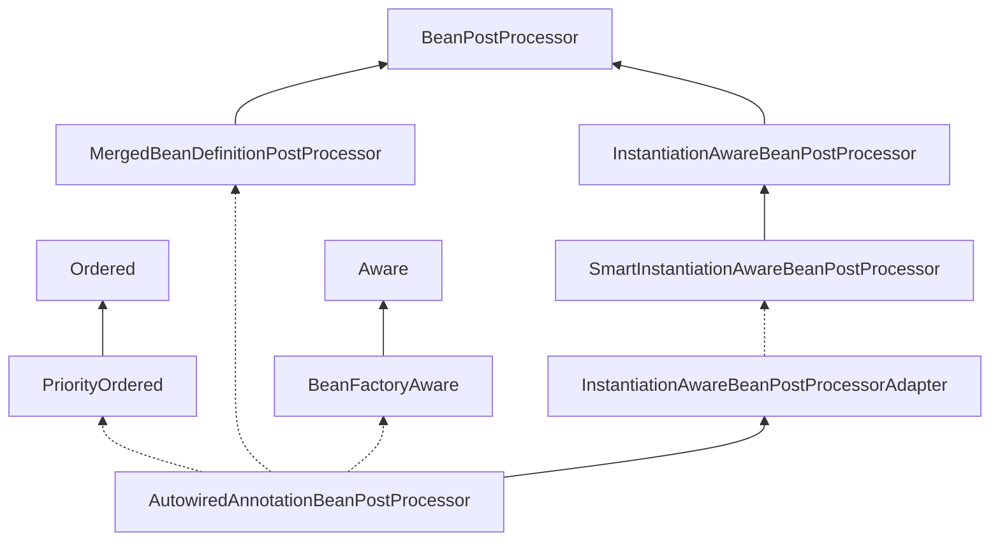
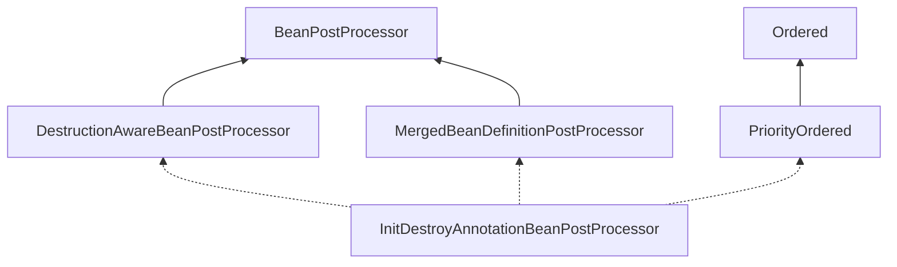

本篇来总结汇总Spring各种类型后置处理器的使用。

### bean定义后置处理器

bean定义后置处理器是Spring框架提供的第一个扩展点。其中有两个接口，一个是`BeanFactoryPostProcessor`接口，一个是`BeanDefinitionRegistryPostProcessor`接口。

#### BeanFactroyPostProcessor接口

`BeanFactoryPostProcessor`接口提供的扩展功能：


> **允许用户修改容器中的bean定义信息，调整bean定义属性值。容器会在所有bean定义信加载完毕之后回调此接口，用以修改容器中的bean定义信息**。但是不要在此接口直接通过`getBean`实例化bean，这样会导致bean过早实例化，违反容器规则导致不可预知的副作用。
>
> 如果要实现bean实例化请通过`BeanPostProcessor`接口实现。
>
> 如果有多个`BeanFactoryPostProcessor`接口并且需要执行它们的执行顺序可以同时实现`PriorityOrdered`接口或者`Ordered`接口。
>
> 简单讲就是，我们可以通过实现此接口获取到`BeanFactory`对象（就是参数），操作`BeanFactory`对象，修改里面的`BeanDefinition`。
> **但是不要去实例化bean**。
>
> 接口的一个典型应用就是`PropertySourcesPlaceholderConfigurer`。

##### 接口源码

Spring框架`BeanFactoryPostProcessor`接口源码如下：

```java
package org.springframework.beans.factory.config;

import org.springframework.beans.BeansException;

/**
 * 允许自定义修改容器中的bean定义信息，调整bean定义属性值。
 * 容器会在所有bean定义信息加载完毕之后回调此接口，用以修改容器中的bean定义信息。
 * 但是不要在此接口直接通过getBean实例化bean，这样会导致bean过早实例化，违反容器规则导致不可预知的副作用。
 * 如果要实现bean实例化请通过BeanPostProcessor接口。
 * 如果有多个BeanFactoryPostProcessor接口并且需要执行它们的执行顺序可以同时实现PriorityOrdered接口或者Ordered接口。
 *
 * 简单讲就是，我们可以通过实现此接口获取到BeanFactory对象（就是参数），操作BeanFactory对象，修改里面的BeanDefinition。
 * 但是不要去实例化bean。
 * 
 * 另外有一点需要注意的是此接口的实现类会忽略懒加载设置，即使你显式设置了实现类懒加载也是不生效的。
 * 因为Spring需要保证BeanFactoryPostProcessor实现类优先实例化，如果实现类都懒加载了，那么你又如何能修改容器的bean定义呢。。。
 *
 * @author Juergen Hoeller
 * @author Sam Brannen
 * @since 06.07.2003
 * @see BeanPostProcessor
 * @see PropertyResourceConfigurer
 */
@FunctionalInterface
public interface BeanFactoryPostProcessor {

	/**
	 * 在所有的bean定义被加载到容器中后，并且是在所有bean实例化之前就会回调这个接口，
	 * 这个接口可以修改容器中的所有bean定义信息，包括重写某些bean的定义属性信息。
	 * 比如修改MyServiceImpl为懒加载：beanFactory.getMergedBeanDefinition(MyServiceImpl.class.getName()).setLazyInit(true);
	 * 另外一个很典型的应用就是修改bean定义中属性的占位符（PropertySourcesPlaceholderConfigurer），比如读取配置文件把配置文件的配置值注入到类属性上
	 * 最常见的就是@Value("${xxxx}")
	 *
	 * 注意：不要在此接口中实例化bean（就是不要调getBean()方法），提前实例化bean会导致不可预知的结果，
	 * 因为目前还处在解析完所有bean定义阶段，bean的实例化（实例化就是根据bean的定义信息创建实例对象）还在后面的阶段。
	 */
	void postProcessBeanFactory(ConfigurableListableBeanFactory beanFactory) throws BeansException;

}
```

##### 使用案例

自定义一个实现类，验证。

1. 修改某个bean的定义信息
2. 接口实现来显式设置为懒加载，看是否有效果（正常情况下应该是无效果的，Spring需要保证实现类提前初始化，否则谈何能修改bean定义）。容器启动的过程中就会打印构造方法的日志

```java
package com.ubuntuvim.spring.beanfactorypostprocessor;


import org.springframework.beans.BeansException;
import org.springframework.beans.factory.config.BeanFactoryPostProcessor;
import org.springframework.beans.factory.config.ConfigurableListableBeanFactory;
import org.springframework.context.annotation.Lazy;
import org.springframework.stereotype.Component;

/**
 * 使用Spring的一个扩展点，实现BeanFactoryPostProcess接口。
 * 1. 修改某个bean的定义信息
 * 2. 接口实现来显式设置为懒加载，看是否有效果（正常情况下应该是无效果的，Spring需要保证实现类提前初始化，否则谈何能修改bean定义）
 *		容器启动的过程中就会打印构造方法的日志
 *
 * 运行结果：
 * com.ubuntuvim.spring.processor.MyBeanFactoryPostProcessorImpl被加载了。。。
 * com.ubuntuvim.spring.bean.LazyLoadingBean被设置成懒加载了。
 *
 * 没有看到LazyLoadingBean被加载的日志，把beanFactory.getBeanDefinition(beanName).setLazyInit(true);改成false再运行：
 * com.ubuntuvim.spring.processor.MyBeanFactoryPostProcessorImpl被加载了。。。
 * com.ubuntuvim.spring.bean.LazyLoadingBean被设置成懒加载了。
 *
 * com.ubuntuvim.spring.bean.LazyLoadingBean被加载了。。。
 *
 * 可以看到LazyLoadingBean被加载了，完美的验证了前面的两点描述
 *
 * @Author: ubuntuvim
 * @Date: 2020/9/23 下午9:17
 */
@Component
@Lazy  // 显式指定为懒加载
public class MyBeanFactoryPostProcessorImpl implements BeanFactoryPostProcessor {
	public MyBeanFactoryPostProcessorImpl() {
		System.out.println("\n" + this.getClass().getName() + "被加载了。。。\n");
	}

	@Override
	public void postProcessBeanFactory(ConfigurableListableBeanFactory beanFactory) throws BeansException {
		// @Component注解没有指定名称，所有是默认首字母小写名字
		String beanName = "lazyLoadingBean";
		System.out.println("\n" + beanName + "被设置成懒加载了。\n");
		beanFactory.getBeanDefinition(beanName).setLazyInit(true);
	}
}
```

再定义一个普通bean。

```java
package com.ubuntuvim.spring.beanfactorypostprocessor;


import org.springframework.stereotype.Component;

/**
 * 这个bean在MyBeanFactoryPostProcessorImpl中被设置懒加载了，所以容器启动完毕也会不打印构造方法的日志
 * @Author: ubuntuvim
 * @Date: 2020/9/23 下午10:32
 */
@Component
public class LazyLoadingBean {
	public LazyLoadingBean() {
		System.out.println("\n" + this.getClass().getName() + "被加载了。。。\n");
	}
}
```

运行结果：

```shell
com.ubuntuvim.spring.beanfactorypostprocessor.MyBeanFactoryPostProcessorImpl被加载了。。。

lazyLoadingBean被设置成懒加载了。
```

`MyBeanFactoryPostProcessorImpl`被加载了，`LazyLoadingBean`没有被加载，把`beanFactory.getBeanDefinition(beanName).setLazyInit(true);`改成`false`再运行：

```shell
com.ubuntuvim.spring.beanfactorypostprocessor.MyBeanFactoryPostProcessorImpl被加载了。。。

lazyLoadingBean被设置成懒加载了。

com.ubuntuvim.spring.beanfactorypostprocessor.LazyLoadingBean被加载了。。。
```

可以看到`MyBeanFactoryPostProcessorImpl`被加载了，`LazyLoadingBean`也被加载了，完美符合预期。


#### 待跟进

学习`PropertyResourceConfigurer`是如何替换类中的占位符`@Value("${xxx}")`。


#### BeanDefinitionRegistryPostProcessor接口

`BeanDefinitionRegistryPostProcessor`接口的提供的扩展功能是：

> `BeanDefinitionRegistryPostProcessor`接口是`BeanFactoryPostProcessor`接口的子类，它在父类的基础上增加了`postProcessBeanDefinitionRegistry()`方法。允许用户获取`BeanDefinitionRegistry`对象，从而可以**通过编码方式动态修改、新增**`BeanDefinition`。
>
> 此接口一个非常重要的实现类就是`ConfigurationClassPostProcessor`，这个类用于解析`@Component`，`@Service`，`@ComponentScan`，`@Configuration`等注解，把注解对应的类转换成`BeanDefinition`然后注册到IoC容器中。

##### 接口源码

```java
package org.springframework.beans.factory.support;

import org.springframework.beans.BeansException;
import org.springframework.beans.factory.config.BeanFactoryPostProcessor;

/**
 * Extension to the standard {@link BeanFactoryPostProcessor} SPI, allowing for
 * the registration of further bean definitions <i>before</i> regular
 * BeanFactoryPostProcessor detection kicks in. In particular,
 * BeanDefinitionRegistryPostProcessor may register further bean definitions
 * which in turn define BeanFactoryPostProcessor instances.
 *
 * 扩展标准的BeanFactoryPostProcessor SPI，
 * 允许在常规BeanFactoryPostProcessor检测开始之前注册其他的bean定义，特别是，
 * BeanDefinitionRegistryPostProcessor可以注册其他的bean定义，
 * 这些定义反过来可以用于定义BeanFactoryPostProcessor实例。
 * （也就是说可以借此方法往容器中注入bean定义）一个典型的使用就是ConfigurationClassPostProcessor，
 * 这个类用于解析@Component，@Services，@ComponentScan，@Configuration等注解，把注解对应的类转换成BeanDefinition然后注册到IoC容器中。
 *
 * @author Juergen Hoeller
 * @since 3.0.1
 * @see org.springframework.context.annotation.ConfigurationClassPostProcessor
 */
public interface BeanDefinitionRegistryPostProcessor extends BeanFactoryPostProcessor {

	/**
	 * Modify the application context's internal bean definition registry after its
	 * standard initialization. All regular bean definitions will have been loaded,
	 * but no beans will have been instantiated yet. This allows for adding further
	 * bean definitions before the next post-processing phase kicks in.
	 * 
	 * 在标准bean初始化前修改、新增bean定义。
	 * @param registry the bean definition registry used by the application context
	 * @throws org.springframework.beans.BeansException in case of errors
	 */
	void postProcessBeanDefinitionRegistry(BeanDefinitionRegistry registry) throws BeansException;

}
```

##### 使用案例

自定义一个实现类，通过编码的方式往容器注入一个bean定义。

```java
package com.ubuntuvim.spring.beanfactorypostprocessor;


import org.springframework.beans.BeansException;
import org.springframework.beans.factory.config.ConfigurableListableBeanFactory;
import org.springframework.beans.factory.support.BeanDefinitionRegistry;
import org.springframework.beans.factory.support.BeanDefinitionRegistryPostProcessor;
import org.springframework.beans.factory.support.RootBeanDefinition;
import org.springframework.context.annotation.Lazy;
import org.springframework.stereotype.Component;

/**
 * 通过编程方式注册InjectBeanFromPostProcessor
 * 同样的本类设置成懒加载也是无效的
 * @Author: ubuntuvim
 * @Date: 2020/7/17 20:43
 */
@Component
@Lazy
public class MyBeanDefinitionRegistryPostProcessor implements BeanDefinitionRegistryPostProcessor {
	public MyBeanDefinitionRegistryPostProcessor() {
		System.out.println("\n" + this.getClass().getName() + "被加载了。。。\n");
	}
	@Override
	public void postProcessBeanDefinitionRegistry(BeanDefinitionRegistry registry) throws BeansException {
		//编程方式注入一个bean定义
		registry.registerBeanDefinition(InjectBeanFromPostProcessor.class.getName(),
				new RootBeanDefinition(InjectBeanFromPostProcessor.class));
	}

	@Override
	public void postProcessBeanFactory(ConfigurableListableBeanFactory beanFactory) throws BeansException {
    // 本方法的功能和BeanFactoryPostProcessor一样。本来就是从BeanFactoryPostProcessor继承过来的。
	}
}
```

`InjectBeanFromPostProcessor`并没有使用任何注解，也没有通过其他方式导入。

```java
package com.ubuntuvim.spring.beanfactorypostprocessor;


/**
 * 通过BeanDefinitionRegistryPostProcessor接口注入本类到容器中。
 * 并没有在类上使用任何注解，也没有通过其他方式导入容器，期望效果是容器启动完毕之后会打印构造方法的日志
 * @Author: ubuntuvim
 * @Date: 2020/9/23 下午11:00
 */
public class InjectBeanFromPostProcessor {
	public InjectBeanFromPostProcessor() {
		System.out.println("\n" + this.getClass().getName() + "被加载了。。。\n");
	}
}
```

运行结果：

```java
com.ubuntuvim.spring.beanfactorypostprocessor.MyBeanDefinitionRegistryPostProcessor被加载了。。。

com.ubuntuvim.spring.beanfactorypostprocessor.InjectBeanFromPostProcessor被加载了。。。

```

结果符合预期，`InjectBeanFromPostProcessor`成功注册到IoC容器中，并且可以被IoC容器实例化。

以上两个接口就是Spring框架提供的第一个扩展点，用于修改为实例化之前的bean定义信息。

#### ConfigurationClassPostProcessor接口

##### 接口源码

##### 使用案例


#### ConfigurationClassPostProcessor接口

##### 接口源码

##### 使用案例


####  SmartInitializingSingleton接口

**这个接口Spring4.1之后才有**

> `SmartInitializingSingleton`是spring 4.1中引入的新特效，与`InitializingBean`的功能类似，都是**bean实例化后执行自定义初始化**，都是属于[spring bean生命周期](https://blog.csdn.net/alex_xfboy/article/details/51211054)的增强。但是，`SmartInitializingSingleton`的**定义及触发方式方式上有些区别**，它的定义不在当前的bean中（a bean's local construction phase），它是回调接口（针对**非lazy单例Bean**），回调的操作是由spring事件`ContextRefreshedEvent`触发。


##### 接口源码

```java
package org.springframework.beans.factory;

/**
 * 实现该接口后，当所有单例 bean 都初始化完成以后， 容器会回调该接口的方法 afterSingletonsInstantiated。
 * 主要应用场合就是在所有单例 bean 创建完成之后，可以在该回调中做一些事情。
 * @PostConstruct是最先被执行的，然后是InitializingBean，最后是SmartInitializingSingleton
 *
 * 为什么是在当所有单例 bean 都初始化完成以后才执行这个接口的原因直接看源码就知道了：
 * AbstractApplicationContext.refresh() -> finishBeanFactoryInitialization() -> ConfigurableListableBeanFactory.preInstantiateSingletons()
 *
 * 但是需要注意：不要再次接口中提前使用容器管理的bean对象，
 * 因为此时直接通过getBean()方法获取到的实例还没通过IoC容器的其他初始化后置处理的增强。
 *
 * @since 4.1
 */
public interface SmartInitializingSingleton {

	/**
	 * 所有单例对象都是实例化完成之后就会回调这个接口实现类的此方法。
	 */
	void afterSingletonsInstantiated();

}
```

`SmartInitializingSingleton`接口的实现主要是Spring框架内部使用，目前Spring框架内部已经有差不多30个实现类。


一个很典型的应用是`EventListenerMethodProcessor`类，这个类的作用的是用来对 `@EventListener` 提供支持.

主要是标注了`@EventListener` 的方法进行解析, 然后转换为一个 `ApplicationListener`。解析的方法就是实现了`SmartInitializingSingleton`接口的`afterSingletonsInstantiated()`方法，在这个方法中处理。

##### 使用案例

定义一个实现类，同时实现了`SmartInitializingSingleton`接口和`InitializingBean`接口，并且在类中使用`@PostConstruct`注解。验证这几种方式的初始化执行顺序。

```java
package com.ubuntuvim.spring.beanpostprocess;

import org.springframework.beans.BeansException;
import org.springframework.beans.factory.InitializingBean;
import org.springframework.beans.factory.SmartInitializingSingleton;
import org.springframework.context.ApplicationContext;
import org.springframework.context.ApplicationContextAware;
import org.springframework.stereotype.Component;

import javax.annotation.PostConstruct;

/**
 * 在所有bean实例化之后（初始化前）回调这个接口afterSingletonsInstantiated
 * 初始化操作执行顺序：@PostConstruct是最先被执行的，然后是InitializingBean，最后是SmartInitializingSingleton
 */
@Component
public class MySmartInitializingSingletonImpl implements SmartInitializingSingleton, ApplicationContextAware, InitializingBean {

	ApplicationContext applicationContext;

	@PostConstruct
	public void invokePostConstruct() {
		System.out.println("1. @PostConstruct注释方法被执行");
	}

	@Override
	public void afterSingletonsInstantiated() {
		System.out.println("3. SmartInitializingSingleton接口的afterSingletonsInstantiated()方法被执行了");
		InitBean initBean = applicationContext.getBean(InitBean.class);
		initBean.f();
	}

	@Override
	public void setApplicationContext(ApplicationContext applicationContext) throws BeansException {
		this.applicationContext = applicationContext;
	}

	@Override
	public void afterPropertiesSet() throws Exception {
		System.out.println("2. InitializingBean接口的afterPropertiesSet()方法被执行了");
	}
}
```

执行结果：

```shell
1. @PostConstruct注释方法被执行
2. InitializingBean接口的afterPropertiesSet()方法被执行了
3. SmartInitializingSingleton接口的afterSingletonsInstantiated()方法被执行了
com.ubuntuvim.spring.beanpostprocess.InitBean的方法f()被调用
```


<<<<<<< HEAD
#### InstantiationAwareBeanPostProcessor接口

此接口主要的作用于目标对象实例化过程需要处理的事情，包括实例化对象前后过程以及实例化属性的设置。`InstantiationAwareBeanPostProcessor`是Spring框架非常非常重要的接口，不亚于`BeanPostProcessor`接口。特别是Spring框架内部，非常多的扩展功能都是通过实现`InstantiationAwareBeanPostProcessor`接口完成的。比如：`AutowiredAnnotationBeanPostProcessor`就是实现这个接口的实现了`@Autowire`和`@Value`注解的处理，这个接口还有一个很重要的子接口`SmartInstantiationAwareBeanPostProcessor`。

对于Spring框架的用户，Spring推荐使用它的一个适配器类`InstantiationAweraBeanPostProcessorAdapter`。

##### 接口源码

```java
package org.springframework.beans.factory.config;

import org.springframework.beans.BeansException;
import org.springframework.beans.PropertyValues;
import org.springframework.lang.Nullable;

import java.beans.PropertyDescriptor;


public interface InstantiationAwareBeanPostProcessor extends BeanPostProcessor {

	/**
	 * 它在目标对象实例化之前调用，该方法的返回值类型是Object，我们可以返回任何类型的值。
	 * 由于这个时候目标对象还未实例化，所以这个返回值可以用来代替原本该生成的目标对象的实例(比如代理对象)。
	 * 如果该方法的返回值代替原本该生成的目标对象，后续只有postProcessAfterInitialization方法会调用，其它方法不再调用；否则按照正常的流程走
	 */
	@Nullable
	default Object postProcessBeforeInstantiation(Class<?> beanClass, String beanName) throws BeansException {
		return null;
	}

	/**
	 * 在目标对象实例化之后调用，这个时候对象已经被实例化，但是该实例的属性还未被设置，都是null。
	 * 因为它的返回值是决定要不要调用postProcessPropertyValues方法的其中一个因素（因为还有一个因素是mbd.getDependencyCheck()）；
	 * 如果该方法返回false,并且不需要check，那么postProcessPropertyValues就会被忽略不执行；如果返回true，postProcessPropertyValues就会被执行
	 */
	default boolean postProcessAfterInstantiation(Object bean, String beanName) throws BeansException {
		return true;
	}

	/**
	 * 和postProcessPropertyValues方法同样的作用，Spring5.1之后新增的方法，用于替换postProcessPropertyValues。
	 */
	@Nullable
	default PropertyValues postProcessProperties(PropertyValues pvs, Object bean, String beanName)
			throws BeansException {

		return null;
	}

	/**
	 * 属性值进行修改；如果postProcessAfterInstantiation方法返回false，该方法不会被调用。
	 * 声明为过程，Spring5.1之后推荐使用postProcessProperties()方法
	 */
	@Deprecated
	@Nullable
	default PropertyValues postProcessPropertyValues(
			PropertyValues pvs, PropertyDescriptor[] pds, Object bean, String beanName) throws BeansException {

		return pvs;
	}

}
```

此接口的主要作用在**目标对象的实例化过程中需要处理的事情**，包括实例化对象的前后过程以及实例的属性设置。此接口是Spring框架内部使用的非常重要的接口，它是`BeanPostProcessor`的一个子接口，总共有6个方法。

1. `postProcessBeforeInitialization()`方法，继承至父类`BeanPostProcessor`接口中的方法,在Bean**实例化完成且初始化方法执行之前**执行

2. `postProcessAfterInitialization()`方法，继承至父类`BeanPostProcessor`接口中的方法，在Bean**实例化完成且初始化方法执行完成之后**执行
3. `postProcessBeforeInstantiation()`方法，自身方法，是最先执行的方法，它在目标对象**实例化之前**调用，该方法的返回值类型是`Object`，我们可以返回任何类型的值。
由于这个时候目标对象还未实例化，所以这个返回值可以用来代替原本该生成的目标对象的实例(比如代理对象)。
如果该方法的返回值代替原本该生成的目标对象，后续只有`postProcessAfterInitialization()`方法会调用，其它方法不再调用；否则按照正常的流程走
4. `postProcessAfterInstantiation()`方法，在目标对象**实例化之后**调用，这个时候对象已经被实例化，但是该实例的属性还未被设置，都是null。
因为它的返回值是决定要不要调用`postProcessPropertyValues()`方法的其中一个因素（因为还有一个因素是`mbd.getDependencyCheck()`）；
如果该方法返回`false`,并且不需要check，那么`postProcessPropertyValues()`方法就会被忽略不执行；如果返回`true`，`postProcessPropertyValues()`方法就会被执行
5. `postProcessPropertyValues()`方法（已经声明为过时，5.1版本之后推荐使用`postProcessPropertyValues()`方法），自身方法，对属性值进行修改；如果`postProcessAfterInstantiation()`方法返回false，该方法不会被调用。可以在该方法内对属性值进行修改
6. `postProcessProperties()`方法，此方法和`postProcessPropertyValues()`方法是同样的作用。5.1版本之后推荐使用的方法。


这个几个方法执行顺序如下图：


##### 使用案例

接下来，通过学习Spring框架内部使用的实现类来学习这个接口的使用场景。

##### 实现类之一AutowiredAnnotationBeanPostProcessor

此后置处理器是一个集大成者，它做了非常非常多的事情。是Spring框架非常重要第一个后置处理器，首先看下类结构。



从类继承关系可以看到，它继承两个非常重要的后置处理器，第一个是`MergedBeanDefinitionBeanPostProcessor`，第二个是`InstantiationAwareBeanPostProcessor`。第一个在下一篇将会为你解析，第二个后置处理器在前面介绍过，`AutowiredAnnotationBeanPostProcessor`就是它的一个很重要的实现。

那么`AutowiredAnnotationBeanPostProcessor`重新实现这两个接口之后有做了什么呢？？

首先大概介绍它的功能：

1. 处理`@Value`注解
2. `处理@Autowired`注解
3. 处理`@Inject`注解
4. 处理构造方法属性注入

**注意**：如果一个属性同时使用了`@Autowired`注解，也使用xml方式注入。那么注解注入的值会被xml注入的值覆盖，也就是说xml方式的注入是在注解注入之后执行。

另外`AutowiredAnnotationBeanPostProcessor`这个后置处理器在框架内部不是必须加载的，只有在项目中使用了`@ComponentScan`注解或者使用了`<context:component-scan>`标签或者使用`<context:annotation-config>`标签，Spring容器会自动加载此后置处理器。如果你自定义了或者重写了它，在项目加载时请把它排除，以免冲突。

摘其中2个很重要的方法讲下，一个是`postProcessMergedBeanDefinition()`方法，此方法用于查找出bean中使用了`@Autowired`注解的属性和使用此注解的方法，并且把属性名和方法名缓存起来；另一个方法是`postProcessProperties()`，这个方法用于属性值的注入，直接从缓存中获取到属性名或者方法名，然后通过反射注入值。

#### postProcessMergedBeanDefinition方法

查找出bean中使用了`@Autowired`注解的属性和使用此注解的方法。

```java
/**
	 * 实现接口MergedBeanDefinitionPostProcessor的方法：
	 *  查询bean定义中是否有使用@Autowired注解的属性并设置到缓存injectionMetadataCache中
	 * @param beanDefinition the merged bean definition for the bean
	 * @param beanType the actual type of the managed bean instance
	 * @param beanName the name of the bean
	 */
@Override
public void postProcessMergedBeanDefinition(RootBeanDefinition beanDefinition, Class<?> beanType, String beanName) {
  // 查询bean实例的属性中使用@Autowired注解的属性或者方法并缓存好。
  InjectionMetadata metadata = findAutowiringMetadata(beanName, beanType, null);
  // 检查属性是否已经被注入过，如果没有则把属性设置到缓存externallyManagedConfigMembers中。
  metadata.checkConfigMembers(beanDefinition);
}

private InjectionMetadata findAutowiringMetadata(String beanName, Class<?> clazz, @Nullable PropertyValues pvs) {
		// Fall back to class name as cache key, for backwards compatibility with custom callers.
		String cacheKey = (StringUtils.hasLength(beanName) ? beanName : clazz.getName());
		// Quick check on the concurrent map first, with minimal locking.
		InjectionMetadata metadata = this.injectionMetadataCache.get(cacheKey);
		if (InjectionMetadata.needsRefresh(metadata, clazz)) {
			synchronized (this.injectionMetadataCache) {
				metadata = this.injectionMetadataCache.get(cacheKey);
				if (InjectionMetadata.needsRefresh(metadata, clazz)) {
					if (metadata != null) {
						metadata.clear(pvs);
					}
					metadata = buildAutowiringMetadata(clazz);
					this.injectionMetadataCache.put(cacheKey, metadata);
				}
			}
		}
		return metadata;
	}
```

这个方法是在创建bean的过程中回调方法。调用位置在：

```
AbstractAutowireCapableBeanFactory#doCreateBean
  > AbstractAutowireCapableBeanFactory#applyMergedBeanDefinitionPostProcessors
```

详细调用代码：

```java
// Allow post-processors to modify the merged bean definition.
synchronized (mbd.postProcessingLock) {
  if (!mbd.postProcessed) {
    try {
      // 执行后置处理器接口MergedBeanDefinitionPostProcessor，bean实例化之后，就可以通过反射获取到类或者属性上的注释信息
      // 处理@Resource、@Autowired、@Value注解的定义信息，并把这些注解的定义信息放在缓存中。待后续属性填充的时候使用。
      // 如果有则吧注解信息转换成AutowiredFieldElement对象或者AutowiredMethodElement对象或者ResourceElement对象
      // 实现类有：AutowiredAnnotationBeanPostProcessor、CommonAnnotationBeanPostProcessor等
      applyMergedBeanDefinitionPostProcessors(mbd, beanType, beanName);
    }
    catch (Throwable ex) {
      throw new BeanCreationException(mbd.getResourceDescription(), beanName,
                                      "Post-processing of merged bean definition failed", ex);
    }
    mbd.postProcessed = true;
  }
}
```

调用的时机是：bean实例化之后，属性填充之前（当然也是在初始化之前，属性填充完成才到初始化回调）。

通过方法`findAutowiringMetadata()`把使用`@Autowired`属性或者方法都找到并缓存到`injectionMetadataCache`里面，然后在填充属性的时候使用。


#### postProcessProperties方法

此方法用于注入属性值。

```java
public PropertyValues postProcessProperties(PropertyValues pvs, Object bean, String beanName) {
  // 扫描查找到bean实例里面使用@Autowired的属性或者方法，
  // 但是在postProcessMergedBeanDefinition()方法中已经完成了属性或者方法是查找，并且缓存起来了
  // 所以再调此方法时直接从缓存里面获取。
  InjectionMetadata metadata = findAutowiringMetadata(beanName, bean.getClass(), pvs);
  try {
    /**
			 * 通过反射完成属性注入：field.set(target, value)
			 * @see org.springframework.beans.factory.annotation.InjectionMetadata#inject
			 */
    metadata.inject(bean, beanName, pvs);
  }
  catch (BeanCreationException ex) {
    throw ex;
  }
  catch (Throwable ex) {
    throw new BeanCreationException(beanName, "Injection of autowired dependencies failed", ex);
  }
  return pvs;
}
```

`postProcessProperties()`方法的调用时机是在`postProcessMergedBeanDefinition()`方法之后，调用外置也是在创建bean的时候。调用位置如下：

```
AbstractAutowireCapableBeanFactory#doCreateBean
    >AbstractAutowireCapableBeanFactory#populateBean 
```

调用时机：bean实例化完成之后，初始化之前，而且是在`postProcessAfterInstantiation()`方法之后。如果不记得请回到文章开头的调用顺序图。Spring框架内部的后置处理器回调时机是非常重要的。

调用代码：

```java
protected void populateBean(String beanName, RootBeanDefinition mbd, @Nullable BeanWrapper bw) {
  // ………… 篇幅有限省略其他代码
  PropertyDescriptor[] filteredPds = null;
  if (hasInstAwareBpps) {
    // 依赖注入模式不是byType或者byName的情况有可能为空，这两种情况执行了pvs = newPvs不会为null
    if (pvs == null) {
      pvs = mbd.getPropertyValues();
    }
    for (BeanPostProcessor bp : getBeanPostProcessors()) {
      if (bp instanceof InstantiationAwareBeanPostProcessor) {
        /**
					 * 属性注入，包括依赖对象注入，依赖集合注入，
					 * 比如下面这3种写法，都会在此完成属性注入
					 * <pre>
					 * @Autowired
					 * private Fruit apple;
					 *
					 * @Autowired
					 * private List<InterfaceA> interfaceAList;
					 *
					 * 同理，Map也是一样的
					 * @Autowired
					 * private Map<String, InterfaceA> interfaceAMap;
					 * key就是实现类的beanName，value就是实现类实例对象。
					 * </pre>
					 * 其中AutowiredAnnotationBeanPostProcessor这个后置处理器用于给@Autowired注解或者@Value注解定义的属性注入值，
					 * 注入的步骤：1. 扫描bean实例中使用@Autowired注解的属性和方法，2. 根据注入的类型从IoC容器中在匹配的bean；3. 通过反射执行赋值操作
					 * @see org.springframework.beans.factory.annotation.AutowiredAnnotationBeanPostProcessor#postProcessProperties
					 * @see org.springframework.beans.factory.annotation.AutowiredAnnotationBeanPostProcessor#postProcessPropertyValues
					 *
					 * 其中CommonAnnotationBeanPostProcessor这个后置处理器用于给@Resource注解定义的属性注入值
					 * 同时这个类还处理了@PostConstruct/@PreDestroy这两个注解
					 * @see org.springframework.context.annotation.CommonAnnotationBeanPostProcessor#postProcessProperties
					 */
        InstantiationAwareBeanPostProcessor ibp = (InstantiationAwareBeanPostProcessor) bp;
        // postProcessProperties()方法已经声明为过时。推荐使用postProcessPropertyValues()方法
        PropertyValues pvsToUse = ibp.postProcessProperties(pvs, bw.getWrappedInstance(), beanName);
        if (pvsToUse == null) {
          if (filteredPds == null) {
            filteredPds = filterPropertyDescriptorsForDependencyCheck(bw, mbd.allowCaching);
          }
          pvsToUse = ibp.postProcessPropertyValues(pvs, filteredPds, bw.getWrappedInstance(), beanName);
          // 如果返回的属性值为null直接退出当前方法，说明没有可填充的属性
          // 在实现后置处理器的时候特别要注意接口方法的返回值已经执行顺序，如果第一个后置处理器就返回了null，
          // 那么同一类型的其他排在后面的就不会执行了
          if (pvsToUse == null) {
            return;
          }
        }
        pvs = pvsToUse;
      }
    }
  }
  // ………… 篇幅有限省略其他代码
}
```

代码的逻辑是比较简单的，获取到后置处理器后执行对应的回调完成的。详细的解释也可以看源码的注释。

到此通过Spring框架内部的`AutowiredAnnotationBeanPostProcessor`类学习了`InstantiationAwareBeanPostProcessor`这个后置处理器的使用。

如果你在开发过程中也需要用到一些自定义的注解，而又不知道该在什么时候让自定义的注解生效。那么你可以参考`AutowiredAnnotationBeanPostProcessor`的实现，来完成自定义注解的解析、应用。


=======
#### InstantiationAwareBeanPostProcessor接口或者InstantiationAwareBeanPostProcessorAdapter

##### 接口源码

##### 使用案例

>>>>>>> 8acc8492f5f2286c54fa6be583a14cccfeed7585

#### MergedBeanDefinitionPostProcessor接口

##### 接口源码

##### 使用案例


#### SmartInstantiationAwareBeanPostProcessor接口

<<<<<<< HEAD
同`InstantiationAwareBeanPostProcessorAdapter`
=======
##### 接口源码

##### 使用案例

>>>>>>> 8acc8492f5f2286c54fa6be583a14cccfeed7585


#### BeanFactoryAware/ApplicationContextAware/BeanNameAware接口

##### 接口源码

##### 使用案例

#### CommonAnnotationBeanPostProcessor

<<<<<<< HEAD
同`InitDestoryAnnotationBeanPostProcessor`


#### AutowiredAnnotationBeanPostProcessor

同前面的`InstantiationAwareBeanPostProcessor`


#### InitDestroyAnnotationBeanPostProcessor类

单从类名字看就大概能猜到它的作用。此类就是用于处理初始化注解`@PostConstruct`和销毁注解`PreDestroy`。这两个注解在平常的Spring项目中也是非常采用的注解，特别是前者，通常用于自定义初始化逻辑。

首先看下类结构，看下它实现哪些后置处理器接口。



从类层级结构更加清晰的看到这个后置处理的功能。 它首先是一个后置处理器，也是可设置顺序的；并且它还实现bean定义接口，也就是说这个类也是可以修改bean定义信息的。

其中核心的方法源码如下：

##### 接口源码

```java
public class InitDestroyAnnotationBeanPostProcessor
		implements DestructionAwareBeanPostProcessor, MergedBeanDefinitionPostProcessor, PriorityOrdered, Serializable {
  /**
	 * 实现 MergedBeanDefinitionBeanPostProcessor接口的方法。
	 * 方法调用入口：
	 * @see AbstractAutowireCapableBeanFactory#applyMergedBeanDefinitionPostProcessors(RootBeanDefinition, Class, String) 
	 * @param beanDefinition the merged bean definition for the bean
	 * @param beanType the actual type of the managed bean instance
	 * @param beanName the name of the bean
	 */
	@Override
	public void postProcessMergedBeanDefinition(RootBeanDefinition beanDefinition, Class<?> beanType, String beanName) {
		// 查找bean定义中是否有使用@PostConstruct注解或者@PreDestory注解的方法，如果有则缓存到lifecycleMetadataCache
		// 然后在postProcessBeforeInitialization()方法中使用缓存起来的信息
		LifecycleMetadata metadata = findLifecycleMetadata(beanType);
		metadata.checkConfigMembers(beanDefinition);
	}
  /**
	 * 实现BeanPostProcessor接口的方法。
	 * 执行@PostConstruct注解声明的方法，用于自定义初始化内容。
	 * 调用入口：
	 * @see AbstractAutowireCapableBeanFactory#applyBeanPostProcessorsBeforeInitialization(Object, String)
	 * @param bean the new bean instance
	 * @param beanName the name of the bean
	 * @return
	 * @throws BeansException
	 */
	@Override
	public Object postProcessBeforeInitialization(Object bean, String beanName) throws BeansException {
		// 前面的postProcessMergedBeanDefinition()方法已经把@PostConstruct注解或者@PreDestory注解定义的方法缓存了。
		// 这里就直接从缓存里面获取
		LifecycleMetadata metadata = findLifecycleMetadata(bean.getClass());
		try {
			metadata.invokeInitMethods(bean, beanName);
		}
		catch (InvocationTargetException ex) {
			throw new BeanCreationException(beanName, "Invocation of init method failed", ex.getTargetException());
		}
		catch (Throwable ex) {
			throw new BeanCreationException(beanName, "Failed to invoke init method", ex);
		}
		return bean;
	}

	@Override
	public Object postProcessAfterInitialization(Object bean, String beanName) throws BeansException {
		return bean;
	}

	@Override
	public void postProcessBeforeDestruction(Object bean, String beanName) throws BeansException {
		LifecycleMetadata metadata = findLifecycleMetadata(bean.getClass());
		try {
			// 执行@PreDestroy注解的销毁回调方法，如果一个类中多个方法都是用了这个注解，会遍历执行所有的注解方法
			metadata.invokeDestroyMethods(bean, beanName);
		}
		catch (InvocationTargetException ex) {
			String msg = "Destroy method on bean with name '" + beanName + "' threw an exception";
			if (logger.isDebugEnabled()) {
				logger.warn(msg, ex.getTargetException());
			}
			else {
				logger.warn(msg + ": " + ex.getTargetException());
			}
		}
		catch (Throwable ex) {
			logger.warn("Failed to invoke destroy method on bean with name '" + beanName + "'", ex);
		}
	}

	private LifecycleMetadata findLifecycleMetadata(Class<?> clazz) {
		if (this.lifecycleMetadataCache == null) {
			// Happens after deserialization, during destruction...
			return buildLifecycleMetadata(clazz);
		}
		// Quick check on the concurrent map first, with minimal locking.
		LifecycleMetadata metadata = this.lifecycleMetadataCache.get(clazz);
		if (metadata == null) {
			synchronized (this.lifecycleMetadataCache) {
				metadata = this.lifecycleMetadataCache.get(clazz);
				if (metadata == null) {
					// 通过反射获取到使用@PostConstruct注解或者@PreDestory注解的方法，并包装成LifecycleMetadata
					metadata = buildLifecycleMetadata(clazz);
					this.lifecycleMetadataCache.put(clazz, metadata);
				}
				return metadata;
			}
		}
		return metadata;
	}

	/**
	 * 找出目标类中的初始化方法（使用@PostConstruct注解的方法）和销毁方法（使用@PreDestory注解的方法）
	 * 最后封到LifecycleMetadata对象里面
	 * @param clazz 目标类
	 * @return
	 */
	private LifecycleMetadata buildLifecycleMetadata(final Class<?> clazz) {
		if (!AnnotationUtils.isCandidateClass(clazz, Arrays.asList(this.initAnnotationType, this.destroyAnnotationType))) {
			return this.emptyLifecycleMetadata;
		}

		List<LifecycleElement> initMethods = new ArrayList<>();
		List<LifecycleElement> destroyMethods = new ArrayList<>();
		Class<?> targetClass = clazz;

		do {
			final List<LifecycleElement> currInitMethods = new ArrayList<>();
			final List<LifecycleElement> currDestroyMethods = new ArrayList<>();

			// 通过反射获取到目标类的方法列表，然后遍历这些方法判断是否有使用@PostConstruct注解以及@PreDestroy注解
			// 如果有则保存到currInitMethods
			ReflectionUtils.doWithLocalMethods(targetClass, method -> {
				// 查找使用@PostConstruct注解的方法
				if (this.initAnnotationType != null && method.isAnnotationPresent(this.initAnnotationType)) {
					LifecycleElement element = new LifecycleElement(method);
					currInitMethods.add(element);
					if (logger.isTraceEnabled()) {
						logger.trace("Found init method on class [" + clazz.getName() + "]: " + method);
					}
				}
				// 查找使用@PreDestroy注解的方法
				if (this.destroyAnnotationType != null && method.isAnnotationPresent(this.destroyAnnotationType)) {
					currDestroyMethods.add(new LifecycleElement(method));
					if (logger.isTraceEnabled()) {
						logger.trace("Found destroy method on class [" + clazz.getName() + "]: " + method);
					}
				}
			});

			initMethods.addAll(0, currInitMethods);
			destroyMethods.addAll(currDestroyMethods);
			targetClass = targetClass.getSuperclass();
		}
		while (targetClass != null && targetClass != Object.class);

		return (initMethods.isEmpty() && destroyMethods.isEmpty() ? this.emptyLifecycleMetadata :
				new LifecycleMetadata(clazz, initMethods, destroyMethods));
	}
}
```

下面逐个介绍这几个核心方法的使用。

#### postProcessMergedBeanDefinition方法

此方法是实现`MergedBeanDefinitionBeanPostProcessor`接口的方法。

方法执行入口：

```
AbstractAutowireCapableBeanFactory#doCreateBean()
  > AbstractAutowireCapableBeanFactory#applyMergedBeanDefinitionPostProcessors()
```

方法执行时机：

bean实例化之后，初始化之前。bean实例化之后就可以通过反射获取到类信息，然后遍历类里面的方法，逐个校验方法是否有使用`@PostConstruct`或者`@PreDestroy`注解。

实现逻辑是通过`findLifecycleMetadata(beanType)`方法实现。这个方法的代码和之前两篇初始化后置处理、实例化后置处理器的逻辑非常相似。查找到符合的方法之后封装成`LifecycleMetadata`对象，然后在缓存到`lifecycleMetadataCache`这个`ConcurrentHashMap`中。

#### postProcessBeforeInitialization方法

此方法是实现于`BeanPostProcessor`接口的。

此方法用于执行使用`@PostConstruct`的方法。底层也是通过反射执行。

方法执行入口：

```
AbstractAutowireCapableBeanFactory#doCreateBean()
  > AbstractAutowireCapableBeanFactory#initializeBean()
    > AbstractAutowireCapableBeanFactory#applyBeanPostProcessorsBeforeInitialization()
```

方法执行时机：bean实例化后，且bean定义修改之后（postProcessMergedBeanDefinition()方法之后），且在属性填充之后。在bean初始化逻辑里面执行的。

执行的时机可以从Spring的源码摘出来，有兴趣的可以自行阅读`AbstractAutowireCapableBeanFactory`的`doCreateBean()`方法逻辑，这个方法可以说是Spring框架实现bean生命周期的最最最核心的方法。

这个方法逻辑也不复杂，就是从缓存里面获取使用`@PostConstruct`的方法，然后通过反射执行方法。核心的执行逻辑也就是如下两行。

```java
ReflectionUtils.makeAccessible(this.method);
this.method.invoke(target, (Object[]) null);
```

`this.method`就是被执行的方法，`target`就是目标bean，执行方法时参数是`null`。从这里`(Object[]) null`也可以看到，`@PostConstruct`注解定义的方法都是不接受参数的。


#### postProcessBeforeDestruction方法

此方法实现于`DestructionAwareBeanPostProcessor`接口。
作用是用于执行使用`@PreDestroy`注解的方法。它的底层也是通过反射执行，和`@PostConstruct`注解的执行原理是一样的。
但是这个方法的执行比较特殊，它的执行是依赖于容器的关闭事件的。也就是必须手动调用`AbstractApplicationContext.close()`方法才会触发调用。
很容易理解，销毁的方法不可能也是在`doCreateBean()`方法中执行，这个方法是用于创建、初始化bean。不能初始化完就销毁了，销毁了那么还用什么呢？

方法执行入口举例：
```
main方法
  > new AnnotationConfigApplicationContext(Config.class).close();
    > AbstractApplicationContext#close()
      > AbstractApplicationContext#doClose()
        > AbstractApplicationContext#destroyBeans()
          > DefaultListableBeanFactory#destroySingletons()
            > DefaultSingletonBeanRegistry#destroySingletons()
              > DefaultSingletonBeanRegistry#destroyBean()的bean.destroy()这行代码
                > DisposableBeanAdapter#destroy()  
```
整个调用层次比较深，你可以打个断点到最后一个方法，然后在`main()`方法中debug模式运行。
最后的`DisposableBeanAdapter.destroy()`方法是所有销毁回调的执行入口，包括自定义的销毁方法。

```java
@Override
public void destroy() {
  if (!CollectionUtils.isEmpty(this.beanPostProcessors)) {
    for (DestructionAwareBeanPostProcessor processor : this.beanPostProcessors) {
      /**
				 * 执行后置处理器的销毁回调方法
				 * @PreDestroy注释的方法就是在这里执行的。默认实现有
				 * @see InitDestroyAnnotationBeanPostProcessor#postProcessBeforeDestruction(Object, String)
				 */
      processor.postProcessBeforeDestruction(this.bean, this.beanName);
    }
  }

  if (this.invokeDisposableBean) {
    if (logger.isTraceEnabled()) {
      logger.trace("Invoking destroy() on bean with name '" + this.beanName + "'");
    }
    // 执行DisposableBean接口的destory()方法。
    try {
      if (System.getSecurityManager() != null) {
        AccessController.doPrivileged((PrivilegedExceptionAction<Object>) () -> {
          ((DisposableBean) this.bean).destroy();
          return null;
        }, this.acc);
      }
      else {
        ((DisposableBean) this.bean).destroy();
      }
    }
    catch (Throwable ex) {
      String msg = "Invocation of destroy method failed on bean with name '" + this.beanName + "'";
      if (logger.isDebugEnabled()) {
        logger.warn(msg, ex);
      }
      else {
        logger.warn(msg + ": " + ex);
      }
    }
  }
  // 1. 执行自定义的销毁方法，比如下面自定义的销毁方法就是beanDestoryCallbackMethod()
  // 		@Bean(destroyMethod = "beanDestoryCallbackMethod")
  // 2. 执行实现Closable接口的close()方法。
  if (this.destroyMethod != null) {
    invokeCustomDestroyMethod(this.destroyMethod);
  }
  else if (this.destroyMethodName != null) {
    Method methodToInvoke = determineDestroyMethod(this.destroyMethodName);
    if (methodToInvoke != null) {
      invokeCustomDestroyMethod(ClassUtils.getInterfaceMethodIfPossible(methodToInvoke));
    }
  }
}
```

到此，`InitDestroyAnnotationBeanPostProcessor`初始、销毁后置处理器也介绍完了，不知道你看明白了吗？如果有疑问可以给我留言，我把演示的案例代码发给你。篇幅有限就在文章中直接贴代码了。

总结下来，最最最重要的一点就是要搞懂`doCreateBean()`方法，这个方法是Spring bean生命周期的实现。里面的后置处理器执行顺序决定了bean的实例化、bean定义合并、bean属性填充，bean初始化顺序。并且每个步骤都是通过执行对应的后置处理器来完成的。
=======
##### 接口源码

##### 使用案例

#### AutowiredAnnotationBeanPostProcessor

##### 接口源码

##### 使用案例


#### InitDestroyAnnotationBeanPostProcessor接口

##### 接口源码

##### 使用案例


#### 参考资料

https://fangjian0423.github.io/2017/06/20/spring-bean-post-processor/
>>>>>>> 8acc8492f5f2286c54fa6be583a14cccfeed7585

