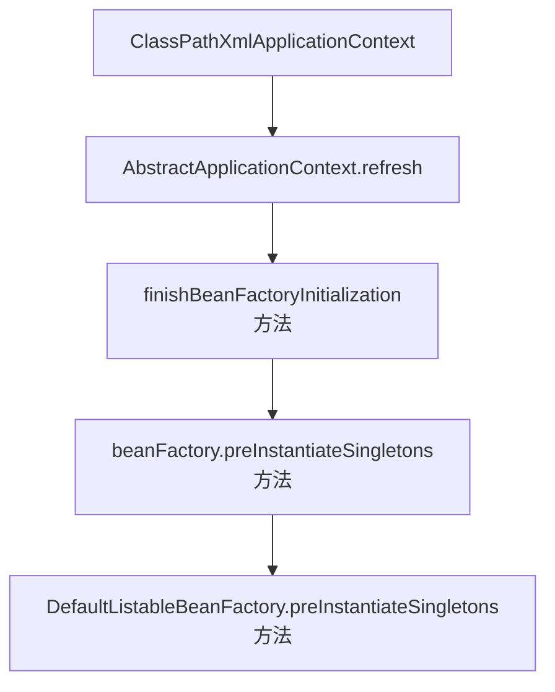

## 懒加载的几个疑问？？

说明:
本篇是基于Spring5.x版本做的演示。不同的版本可能效果不一样，比如@Lazy注解在3.1版本是不支持在属性、构造方法、参数上使用的。


- 对于使用了@Component注解的类如何统一做延迟加载，是否可以通过Bean定义的后置处理器`BeanDefinitionRegistryPostProcessor`做统一设置？
> 答案是做不到，`BeanDefinitionRegistryPostProcessor`并未提供便利bean定义的方法，即使有也不好控制那些bean设置成懒加载

- BeanB依赖BeanA，当BeanB还未使用的时候BeanA是否会被加载？
> 答案是BeanA会被加载，因为BeanB在设置属性的时候需要先加载BeanA。所以即使BeanB还未被使用BeanA也会被加载。


```java
/**
 * @Author: ubuntuvim
 * @Date: 2020/7/17 20:46
 */
@Component
@Lazy
public class BeanOne {
	public BeanOne() {
		System.out.println("\n\nbeanFactory开始加载BeanOne");
	}

	public void sayHelloBeanOne() {
		System.out.println("调用BeanOne的方法");
	}
}

/**
 * @Author: ubuntuvim
 * @Date: 2020/7/17 20:47
 */
@Component
@Lazy
public class BeanTwo {
	public BeanTwo() {
		System.out.printf("开始加载BeanTwo");
	}

	@Resource
	BeanOne beanOne;

	public void invokeBeanOneMethod() {
		System.out.println("在BeanTwo里面调用BeanOne的方法");
		beanOne.sayHelloBeanOne();
	}
}

/**
 * @Author: ubuntuvim
 * @Date: 2020/7/17 20:54
 */
@Configuration
@ComponentScan("com.ubuntuvim.spring.lazyloading")
public class BeanLoadingConfig {
}
```

验证如下。


```java
package com.ubuntuvim.spring.lazyloading;


import org.springframework.context.ApplicationContext;
import org.springframework.context.annotation.AnnotationConfigApplicationContext;

/**
 * @Author: ubuntuvim
 * @Date: 2020/7/17 20:53
 */
public class LazyLoadingTest {
	public static void main(String[] args) {
		ApplicationContext ac = new AnnotationConfigApplicationContext(BeanLoadingConfig.class);
		BeanTwo beanTwo = (BeanTwo) ac.getBean("beanTwo");
		// 未调beanTwo 的方法之后，不应该加载BeanOne。
		System.out.println("未调beanTwo 的方法之后，不应该加载BeanOne（但事与愿违）");
		beanTwo.invokeBeanOneMethod();
		/*
		执行结果：
			开始加载BeanTwo

			beanFactory开始加载BeanOne  ---- 因为BeanTwo里面引用了BeanOne，所以BeanOne在BeanTwo加载的时候也被加载了，不然无法初始化属性。
			未调beanTwo 的方法之后，不应该加载BeanOne
			在BeanTwo里面调用BeanOne的方法
		 */

		// 只使用BeanOne时，BeanTwo不会被加载
		BeanOne beanOne = (BeanOne) ac.getBean("beanOne");
		/*
		执行结果：
			beanFactory开始加载BeanOne
		 */
	}
}

```

* 对于实现了Spring初始化方法的bean，设置`lazy-init`属性为`true`是否能起到延迟加载的效果？？

> 实现了`InitializingBean`的bean本身使用了`@Lazy`注解是可以延迟加载的。但是如果是父类实现了`InitializingBean`的方法，但是没有使用`@Lazy`注解，而是在子类中使用了`@Lazy`注解，那么父类的spring初始化方法是会被执行的，`@Lazy`注解只是对当前类起效果，并不能控制父类的懒加载。

```java
/**
 * @Author: ubuntuvim
 * @Date: 2020/7/17 21:26
 */
@Component
@Lazy
public class MyInitializingBean implements InitializingBean {
	@Override
	public void afterPropertiesSet() throws Exception {
		System.out.println("实现了InitializingBean的afterPropertiesSet()方法被调用了");
	}
}

/**
 * 未使用@Lazy注解，但是子类使用@Lazy注解，是否可以实现延迟加载呢？答案是不行，@Lazy只对当前类起效果。
 * @Author: ubuntuvim
 * @Date: 2020/7/17 21:26
 */
@Component
public class MyInitializingBeanNoLazy implements InitializingBean {
	public MyInitializingBeanNoLazy() {
		System.out.println("MyInitializingBeanNoLazy被加载了");
	}
	@Override
	public void afterPropertiesSet() throws Exception {
		System.out.println("===== MyInitializingBeanNoLazy的afterPropertiesSet()方法被调用了 =====");
		// 即使子类使用了@Lazy注解父类的afterPropertiesSet方法也会被调用的。
	}
}

/**
 * 本类使用了延迟加载注解，并不能对父类的加载起作用
 * @Author: ubuntuvim
 * @Date: 2020/7/17 21:35
 */
@Component
@Lazy
public class MyInitializingBeanSubClass extends MyInitializingBeanNoLazy {
	public MyInitializingBeanSubClass() {
		System.out.println("MyInitializingBeanNoLazy的子类使用@Lazy注解，子类被加载了");
	}
}

```

执行效果，MyInitializingBeanNoLazy一开始就被加载了。

```
MyInitializingBeanNoLazy被加载了
===== MyInitializingBeanNoLazy的afterPropertiesSet()方法被调用了 =====
开始加载BeanTwo未调beanTwo 的方法之后，不应该加载BeanOne（但事与愿违）
在BeanTwo里面调用BeanOne的方法
beanFactory开始加载BeanOne
调用BeanOne的方法
在未使用MyInitializingBean之前，如果bean使用了@Lazy注解，即使这个bean实现了InitializingBean的接口也不会被加载
实现了InitializingBean的afterPropertiesSet()方法被调用了

BUILD SUCCESSFUL in 9s
80 actionable tasks: 2 executed, 78 up-to-date
21:42:01: Task execution finished 'LazyLoadingTest.main()'.

```

* 使用XML方式定义使用Spring初始化方法的类是否可以实现懒加载？？

定义一个实现了Spring初始化方法的Bean。

```java
/**
 * 未使用@Lazy注解，但是子类使用@Lazy注解，是否可以实现延迟加载呢？答案是不行，@Lazy只对当前类起效果。
 * <p>
 * xml方式定义bean可以实现懒加载，因为不是继承方式，这种方式就是别名的方式，MyInitializingBeanSubClassUseLazy instanceOf MyInitializingBeanNoLazy => true
 * <bean name="myInitializingBeanSubClassUseLazy" class="com.ubuntuvim.spring.lazyloading.MyInitializingBeanNoLazy" lazy-init="true">
 * <property name="name" value="使用了Lazy-init=true，父类的afterPropertiesSet方法也会被调用" />
 * </bean>
 * <p>
 * 但是，当另外一个类BeanA里面引用了myInitializingBeanSubClassUseLazy，也不能实现懒加载，因为BeanA在设置属性的时候会先初始化myInitializingBeanSubClassUseLazy。
 *
 * @Author: ubuntuvim
 * @Date: 2020/7/17 21:26
 */
@Component
public class MyInitializingBeanNoLazy implements InitializingBean {

	public MyInitializingBeanNoLazy() {
		System.out.println(this.getClass().getName() + "被加载了");
	}

	@Override
	public void afterPropertiesSet() throws Exception {
		System.out.println("===== MyInitializingBeanNoLazy的afterPropertiesSet()方法被调用了 =====");
		// 即使子类使用了@Lazy注解父类的afterPropertiesSet方法也会被调用的。
		System.out.println("name的值是：" + this.name + "\n");
	}

	/**
	 * 通过xml注入
	 */
	String name;

	public String getName() {
		return name;
	}

	public void setName(String name) {
		this.name = name;
	}
}
```

```xml
<?xml version="1.0" encoding="UTF-8"?>
<beans xmlns="http://www.springframework.org/schema/beans"
	   xmlns:xsi="http://www.w3.org/2001/XMLSchema-instance"
	   xmlns:context="http://www.springframework.org/schema/context"
	   xsi:schemaLocation="http://www.springframework.org/schema/beans
	   http://www.springframework.org/schema/beans/spring-beans.xsd
	   http://www.springframework.org/schema/context
	   http://www.springframework.org/schema/context/spring-context.xsd ">

	<context:component-scan base-package="com.ubuntuvim.spring.lazyloading" />

	<!-- 使用了lazy-init可以做到懒加载类本身懒加载，就相当于在com.ubuntuvim.spring.lazyloading.MyInitializingBeanNoLazy上使用@Lazy注解 -->
	<bean name="myInitializingBeanSubClassUseLazy" class="com.ubuntuvim.spring.lazyloading.MyInitializingBeanNoLazy" lazy-init="true">
		<property name="name" value="使用了Lazy-init=true" />
	</bean>

	<!-- 使用了lazy-init可以做到懒加载类本身懒加载，就相当于在com.ubuntuvim.spring.lazyloading.MyInitializingBeanNoLazy上使用@Lazy注解
	 但是如果有另外一个类引用了myInitializingBeanSubClassUseLazyByOtherRef，那么即使引用的类设置了懒加载，myInitializingBeanSubClassUseLazyByOtherRef也会被加载
	 因为引用类在初始化设置属性的时候会先初始化依赖的属性。
	 有一种方式可以做到懒加载，就是在引用的属性上同时使用@Lazy注解。
	 @Resource
	 @Lazy
	 MyInitializingBeanNoLazy myInitializingBeanSubClassUseLazyByOtherRef;
	 -->
	<bean name="myInitializingBeanSubClassUseLazyByOtherRef" class="com.ubuntuvim.spring.lazyloading.MyInitializingBeanNoLazy" lazy-init="true">
		<property name="name" value="使用了Lazy-init=true，但是被另外的类引用了。也会被加载。如果在引用的属性上使用了@Lazy注解，那么也可以实现懒加载！" />
	</bean>

	<bean name="myInitializingBeanSubClassNotUseLazy" class="com.ubuntuvim.spring.lazyloading.MyInitializingBeanNoLazy">
		<property name="name" value="未使用lazy-init=false" />
	</bean>

</beans>
```

验证结果

```java
package com.ubuntuvim.spring.lazyloading;


import org.springframework.context.ApplicationContext;
import org.springframework.context.support.ClassPathXmlApplicationContext;

/**
 * @Author: ubuntuvim
 * @Date: 2020/7/17 22:03
 */
public class LazyLoadingXmlContextTest {

	public static void main(String[] args) {
		ApplicationContext ac = new ClassPathXmlApplicationContext("classpath*:lazy-loading-test.xml");
		// 容器加载，MyInitializingBeanSubClassUseLazy和MyInitializingBeanSubClassNotUseLazy都交给容器管理。
		/*
		执行结果可见，afterPropertiesSet()方法被调用了。
		MyInitializingBeanNoLazy被加载了，name =
		===== MyInitializingBeanNoLazy的afterPropertiesSet()方法被调用了 =====
		name的值是：未使用lazy-init=true
		*/
//		MyInitializingBeanNoLazy myInitializingBeanNoLazy = (MyInitializingBeanNoLazy) ac.getBean("myInitializingBeanSubClassUseLazy");
//		System.out.println(myInitializingBeanNoLazy instanceof MyInitializingBeanNoLazy);

		// 即使没用使用BeanRef，但是由于在类中引用了myInitializingBeanSubClassUseLazyByOtherRef，
		// 即使myInitializingBeanSubClassUseLazyByOtherRef定义成lazy-init=true也会被加载。
		BeanRef beanRef = (BeanRef) ac.getBean("beanRef");
		// 在没用使用到myInitializingBeanSubClassUseLazyByOtherRef属性之前，不会加载这个属性类。
		System.out.println("\n\n没有使用到BeanRef中引用的属性，属性类不会被加载");
		// 使用myInitializingBeanSubClassUseLazyByOtherRef
		beanRef.useProp();
		/*
		执行结果：
		开始使用属性myInitializingBeanSubClassUseLazyByOtherRef
		MyInitializingBeanNoLazy被加载了sun.misc.Launcher$AppClassLoader@2a139a55    --> 属性类被加载
		===== MyInitializingBeanNoLazy的afterPropertiesSet()方法被调用了 =====        --> 属性类的初始化方法被调用
		name的值是：使用了Lazy-init=true，但是被另外的类引用了。也会被加载。					--> BeanRef本身被加载
		使用属性并调用其方法完毕														--> 调用BeanRef方法，触发加载
		 */

		System.out.println("执行完毕");
	}
}
```

> 如果引用的类属性上也使用了`@Lazy`注解，那么被引用的类也是可以实现懒加载的，即使是被引用的类实现了Spring的初始化方法也可以实现。比如例子中的`BeanRef`这个类，在类中引用的属性上也使用了`@Lazy`注解，可以实现懒加载。

```java
@Resource
@Lazy
MyInitializingBeanNoLazy myInitializingBeanSubClassUseLazyByOtherRef;
```


* 使用XML方式定义使用Spring初始化方法的类`InitializingBean`，并且类实现了`FactoryBean`接口是否可以实现懒加载？？

>  答案是做不到，由于在afterPropertiesSet方法中调用了工厂bean的生成方法，使得当前类必须被实例化，否则无法实现工厂bean功能无法创建有工厂bean创建的对象。无论getObject方法做什么操作本类都会被实例化。
即使在类上使用@Lazy注解，在getObject方法上使用@Lazy注解，在afterPropertiesSet方法上使用@Lazy注解都是无效的。
因为FactoryBean是用于向容器注册bean的，它自己必须先实例化了才能执行getObject，才能向容器注册bean。
简单讲，只要是实现了FactoryBean的类都无法做到懒加载。
需要注意的是通过FactoryBean.getObject()方法创建的bean不会在容器启动的时候就实例化。当创建的bean用到的时候才实例化，也就是说同FactoryBean.getObject()方法创建的bean默认是懒加载的,但是一个同时实现了InitializingBean, FactoryBean这两个接口，并且在afterPropertiesSet方法里再调用了getObject()方法就可以做到在容器启动的时候就做初始化，因为实现FactoryBean接口的类会在容器启动的时候实例化，由于被实例化了所以afterPropertiesSet方法就会被容器自动调用。
组合起来就实现了实时加载。

例子如下：

```java
package com.ubuntuvim.spring.lazyloading;


import org.springframework.beans.factory.FactoryBean;
import org.springframework.beans.factory.InitializingBean;

/**
 * 同时实现了Bean初始化方法和FactoryBean方法的类，是否可以做到懒加载？？
 * 答案是做不到，由于在afterPropertiesSet方法中调用了工厂bean的生成方法，使得当前类必须被实例化，否则无法实现工厂bean功能无法创建有工厂bean创建的对象。
 * 无论getObject方法做什么操作本类都会被实例化。
 * 即使在类上使用@Lazy注解，在getObject方法上使用@Lazy注解，在afterPropertiesSet方法上使用@Lazy注解都是无效的。
 * 因为FactoryBean是用于向容器注册bean的，它自己必须先实例化了才能执行getObject，才能向容器注册bean。
 * 简单讲，只要是实现了FactoryBean的类都无法做到懒加载。
 *
 * 需要注意的是通过FactoryBean.getObject()方法创建的bean不会在容器启动的时候就实例化。当创建的bean用到的时候才实例化，
 * 也就是说同FactoryBean.getObject()方法创建的bean默认是懒加载的
 * 但是一个同时实现了InitializingBean, FactoryBean这两个接口，并且在afterPropertiesSet方法里再调用了getObject()方法
 * 就可以做到在容器启动的时候就做初始化，因为实现FactoryBean接口的类会在容器启动的时候实例化，由于被实例化了所以afterPropertiesSet方法就会被容器自动调用。
 * 组合起来就实现了实时加载。
 *
 * @Author: ubuntuvim
 * @Date: 2020/7/17 23:58
 */
//@Lazy  // 无效
public class MyInitializingBeanNoLazyAndBeanFactoryImpl implements InitializingBean, FactoryBean<InitFromGetObjectMethodBean> {

	public MyInitializingBeanNoLazyAndBeanFactoryImpl() {
		System.out.println(this.getClass().getName() + "被加载了");
	}

	//	@Lazy  // 无效
	@Override
	public void afterPropertiesSet() throws Exception {
		System.out.println(this.getClass().getName() + " afterPropertiesSet()方法被调用了 =====");
		// 即使子类使用了@Lazy注解父类的afterPropertiesSet方法也会被调用的。
		// 但是如果本类被另外一个类引用了，但是在引用的属性上也使用了@Lazy注解，那么本类可是懒加载
		System.out.println("name的值是：" + this.name + "\n");
		getObject();  // 即使不调用getObject方法也做不到懒加载，容器在启动的时候就会实例化当前类
	}

	/**
	 * 通过xml注入
	 */
	String name;

	public String getName() {
		return name;
	}

	public void setName(String name) {
		this.name = name;
	}

	/**
	 * 无论这个方法做什么操作都会在容器启动的时候初始化，无法做到延迟加载
	 *
	 * @return
	 * @throws Exception
	 */
//	@Lazy  // 无效
	@Override
	public InitFromGetObjectMethodBean getObject() throws Exception {
		System.out.println(this.getClass().getName() + "的getObject方法被调用");
		return new InitFromGetObjectMethodBean();
	}

	@Override
	public Class<?> getObjectType() {
		return InitFromGetObjectMethodBean.class;
	}

	@Override
	public boolean isSingleton() {
		return true;
	}
}
```

```xml
<?xml version="1.0" encoding="UTF-8"?>
<beans xmlns="http://www.springframework.org/schema/beans"
	   xmlns:xsi="http://www.w3.org/2001/XMLSchema-instance"
	   xmlns:context="http://www.springframework.org/schema/context"
	   xsi:schemaLocation="http://www.springframework.org/schema/beans
	   http://www.springframework.org/schema/beans/spring-beans.xsd
	   http://www.springframework.org/schema/context
	   http://www.springframework.org/schema/context/spring-context.xsd ">

	<context:component-scan base-package="com.ubuntuvim.spring.lazyloading" />


	<!--
	在没有使用过bean之前，通过FactoryBean.getObject创建的bean不会直接在容器启动的时候实例化。比如InitBeanFromGetObject2不会在容器启动的时候实例化。
	-->
	<bean name="myInitializingBeanNoLazyAndBeanFactoryImplByOtherRef" class="com.ubuntuvim.spring.lazyloading.MyInitializingBeanNoLazyAndBeanFactoryImpl"
		  lazy-init="true">
		<property name="name" value="我是一个同时实现了Bean初始化方法和FactoryBean方法的类，我即使被定义为lazy-init=true也会在启动时被实例化。
		因为FactoryBean实现类必须先被实例化才能调用getObject方法向容器注册bean" />
	</bean>
</beans>
```

即使没有测试类中调用这个类，容器启动时也会加载，验证结果如下：

```language
使用属性并调用其方法完毕

在未使用InitFromGetObjectMethodBean之前，这个InitFromGetObjectMethodBean类不会在容器启动的时候实例化
com.ubuntuvim.spring.lazyloading.MyInitializingBeanNoLazyAndBeanFactoryImpl afterPropertiesSet()方法被调用了 =====
name的值是：我是一个同时实现了Bean初始化方法和FactoryBean方法的类，我即使被定义为lazy-init=true也会在启动时被实例化。   因为FactoryBean实现类必须先被实例化才能调用getObject方法向容器注册bean

com.ubuntuvim.spring.lazyloading.MyInitializingBeanNoLazyAndBeanFactoryImpl的getObject方法被调用


com.ubuntuvim.spring.lazyloading.InitFromGetObjectMethodBean这个bean是通过FactoryBean.getObject方法创建的


com.ubuntuvim.spring.lazyloading.MyInitializingBeanNoLazyAndBeanFactoryImpl的getObject方法被调用


com.ubuntuvim.spring.lazyloading.InitFromGetObjectMethodBean这个bean是通过FactoryBean.getObject方法创建的


com.ubuntuvim.spring.lazyloading.InitFromGetObjectMethodBean@64cd705f
执行完毕

BUILD SUCCESSFUL in 20s
80 actionable tasks: 1 executed, 79 up-to-date
02:53:15: Task execution finished 'LazyLoadingXmlContextTest.main()'.

```

按照XML的配置顺序，这个类在最后面被加载了。

更深入的原因我们从Spring源码层级分析。按照如下流程找到方法，



DefaultListableBeanFactory.preInstantiateSingletons方法是最后的核心方法。这个方法内部实例化了实现FactoryBean的类并调用getObject方法向容器注册bean，并且这个方法只有非懒加载的bean能进入到这里。。

```java
// 实例化所有除了Spring内部的单例（懒加载的除外）
@Override
public void preInstantiateSingletons() throws BeansException {
    if (logger.isTraceEnabled()) {
        logger.trace("Pre-instantiating singletons in " + this);
    }

    // Iterate over a copy to allow for init methods which in turn register new bean definitions.
    // While this may not be part of the regular factory bootstrap, it does otherwise work fine.
    // 创建BeanDefinitionName副本，用于后续遍历，以允许init等方法注册新的bean定义
    List<String> beanNames = new ArrayList<>(this.beanDefinitionNames);

    // Trigger initialization of all non-lazy singleton beans...
    // 遍历所有的beanName，通过beanName获取到对应的bean实例
    for (String beanName : beanNames) {
        // 根据bean名称拿到bean定义
        RootBeanDefinition bd = getMergedLocalBeanDefinition(beanName);
        // bean定义非抽象类，是单例，非懒加载
        if (!bd.isAbstract() && bd.isSingleton() && !bd.isLazyInit()) {
            // 判断是否是FactoryBean
            // Spring有两种类型的Bean，一种普通Bean，一种是工厂Bean即FactoryBean，FactoryBean和普通Bean不同，
            // 它返回的对象不是一个指定类型的对象，而是根据FactoryBean<T>.geteObject()返回对象，返回的对象就是T类型的，
            // 创建出来的对象是否为单例是根据Bean定义中的isSingleton属性决定的（默认是单例）
            if (isFactoryBean(beanName)) {
                // 通过getBean(&beanName)拿到是FactoryBean本身，FACTORY_BEAN_PREFIX=&
                // 通过getBean(beanName)拿到的是FactoryBean创建的bean实例
                // 比如  MyInitializingBeanNoLazyAndBeanFactoryImpl implements FactoryBean<Object>
                // 拿到的就是myInitializingBeanNoLazyAndBeanFactoryImpl这个bean实例。
                Object bean = getBean(FACTORY_BEAN_PREFIX + beanName);
                if (bean instanceof FactoryBean) {
                    final FactoryBean<?> factory = (FactoryBean<?>) bean;
                    // 判断bean是否需要急切初始化，实现了FactoryBean的类isEagerInit都是false，
                    // 只有SmartFactoryBean的实现类可以控制这个属性值，但是这个接口是提供给Spring框架本身内部使用的不建议开发者使用
                    boolean isEagerInit;
                    if (System.getSecurityManager() != null && factory instanceof SmartFactoryBean) {
                        isEagerInit = AccessController.doPrivileged((PrivilegedAction<Boolean>)
                                        ((SmartFactoryBean<?>) factory)::isEagerInit,
                                getAccessControlContext());
                    }
                    else {
                        isEagerInit = (factory instanceof SmartFactoryBean &&
                                ((SmartFactoryBean<?>) factory).isEagerInit());
                    }
                    if (isEagerInit) {
                        // 通过beanName获取bean实例
                        getBean(beanName);
                    }
                }
            }
            else {
                // 普通的bean直接通过beanName获取bean实例
                getBean(beanName);  // 转到AbstractBeanFactory
            }
        }
    }
    //  方面后面的代码省略。。。。
```

经过上述代码之后， MyInitializingBeanNoLazyAndBeanFactoryImpl就被实例化好了。但是也只是FactoryBean实现类本身被实例化了，还没真正调用getObject方法注册bean，只有在使用到被注册的bean的时候才会执行getObject方法，也就是说通过FactoryBean.getObject()方法创建的bean默认是懒加载的。
